## Agenda

</br></br>

1.  Introduction to Data Science
2.  Three Principles of Data Visualization
3.  Storytelling for Data Visualization
4.  General Advice for Effective Presentations

# Introduction to Data Science

## Data science is ...

a multidisciplinary field that uses scientific methods, processes, algorithms and systems to extract knowledge and insights from vast amounts of structured and unstructured data.

. . .

:::::: center
::::: columns
::: {.column width="40%"}
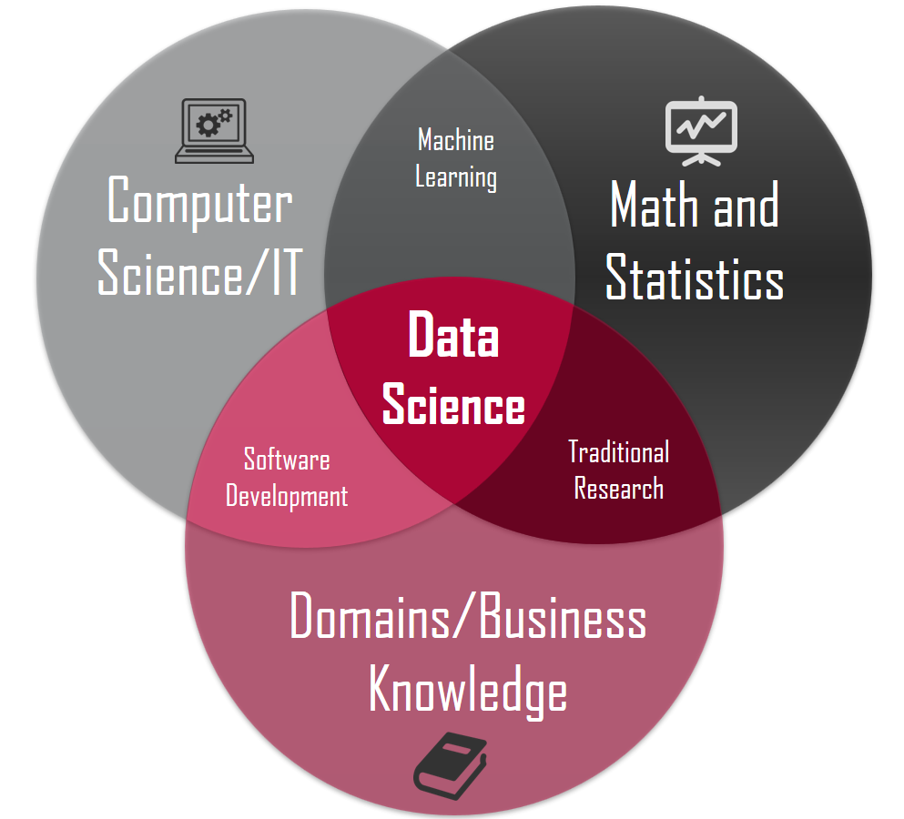{fig-align="center" width="377"}
:::

::: {.column width="50%"}
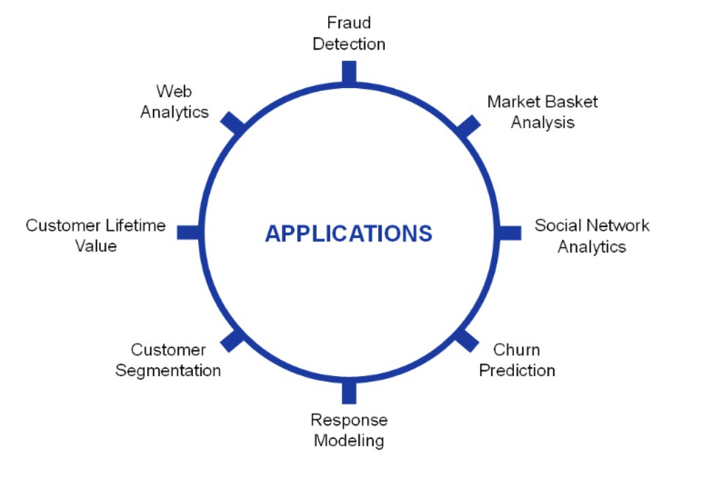{fig-align="center" width="485"}
:::
:::::
::::::

## The scheme of data science

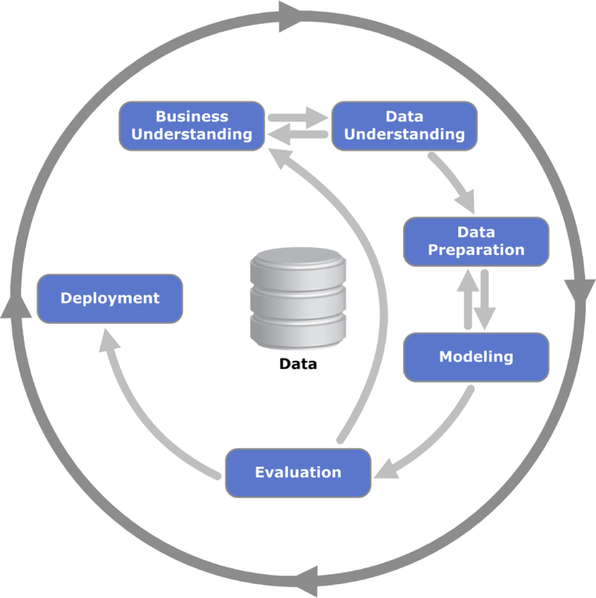{fig-align="center"}

::: {style="font-size: 50%;"}
Provost, F., & Fawcett, T. (2013). [Data Science for Business: What you need to know about data mining and data-analytic thinking](https://www.amazon.com.mx/Data-Science-Business-Data-Analytic-Thinking/dp/1449361323). O'Reilly Media, Inc.
:::

## Business understanding

</br>

- Business understanding refers to defining the business problem to be solved.

- The goal is to reframe the business problem as a data science problem.

- Often, reframing the problem and designing a solution is an iterative process.

## Data understanding

::: incremental
- If the goal is to solve a business problem, the data that makes up the raw material available from which the solution will be built.

- The available data rarely matches the problem.

- For example, historical data is often collected for purposes unrelated to the current business problem or for no explicit purpose at all.
:::

. . .

> Our goal is to turn data into information that answers useful questions.

## Data types

::::::: center
:::::: columns
::: {.column width="30%"}
[**Text**]{style="color:green;"}

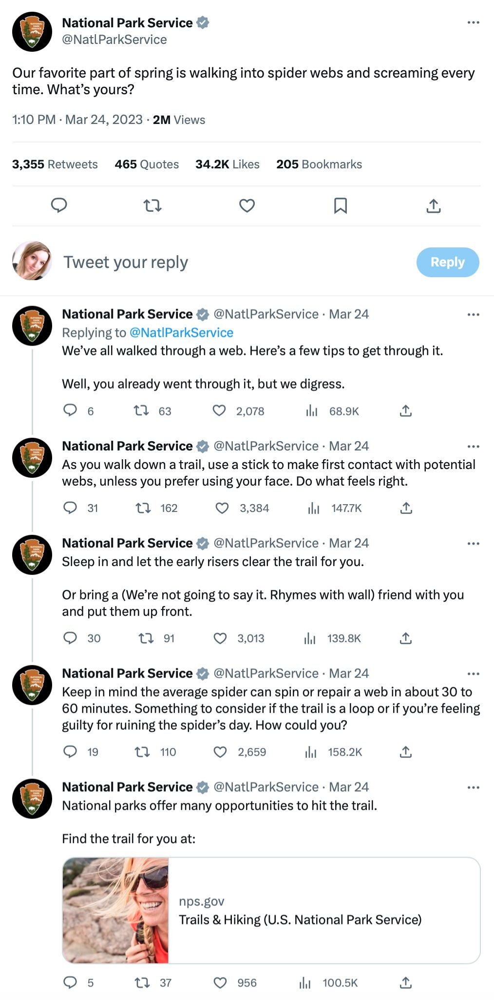{width="511"}
:::

::: {.column width="30%"}
[**Images**]{style="color:orange;"}

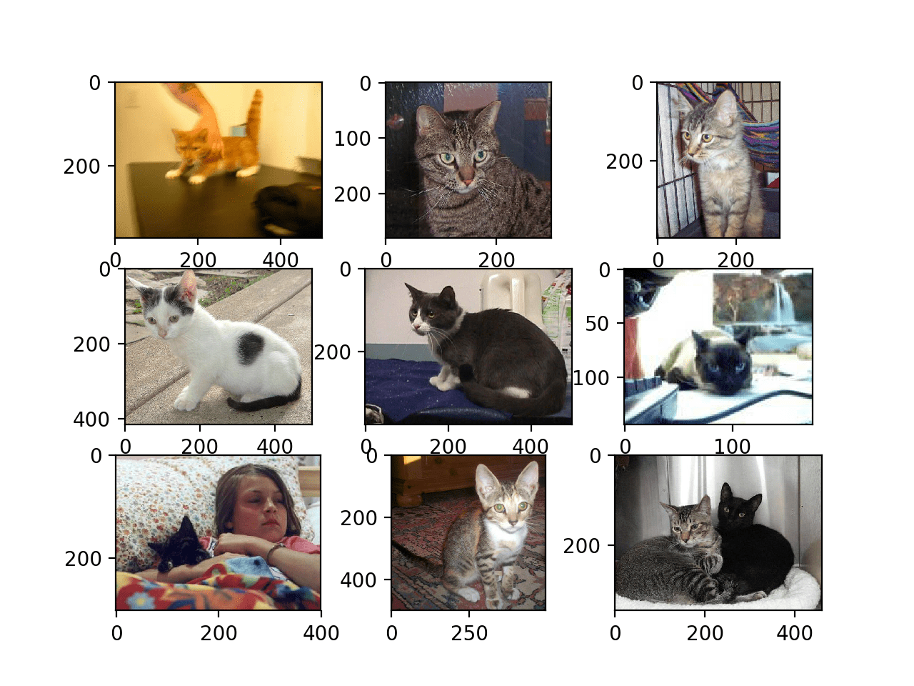{width="527"}

[**Video**]{style="color:lightblue;"}

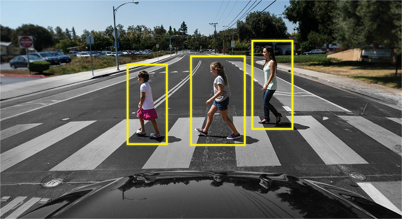{width="401"}
:::

::: {.column width="30%"}
[**Audio**]{style="color:green;"}


:::
::::::
:::::::

## Numerical data

</br>

Data science methodology is based on numerical data given in tables.

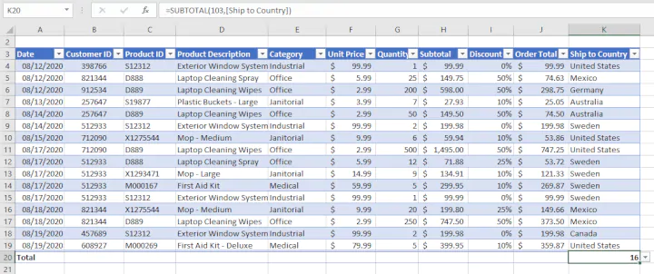{fig-align="center"}

> In fact, texts, images, videos or audios are transformed into this format to process them.

. . .

[***In this course, we will assume that the data is in a table.***]{style="color:#023562;"}

# The Three Principles of Data Visualization

## What is data visualization?

> “A visualization \[of data\] is any visual presentation intended to reveal evidence, making the invisible visible.” Alberto Cairo (2015).

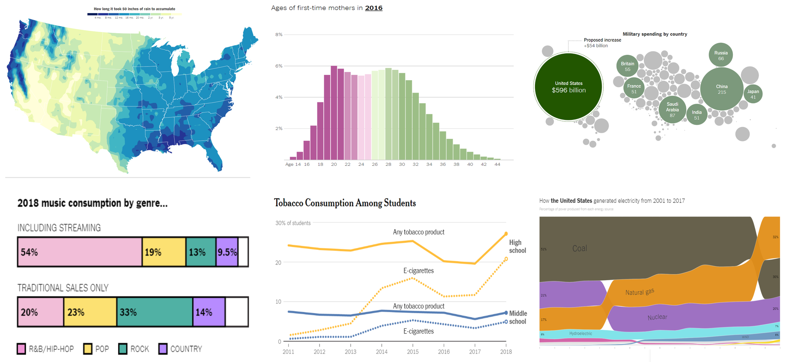{fig-align="center" width="814"}

## 

</br>

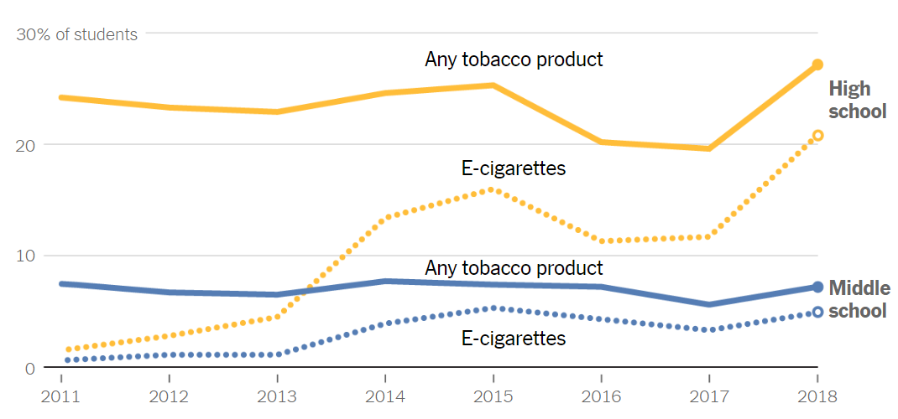{fig-align="center"}

::: {style="font-size: 50%;"}
<https://www.nytimes.com/2019/02/28/learning/whats-going-on-in-this-graph-march-6-2019.html>
:::

## 

</br>

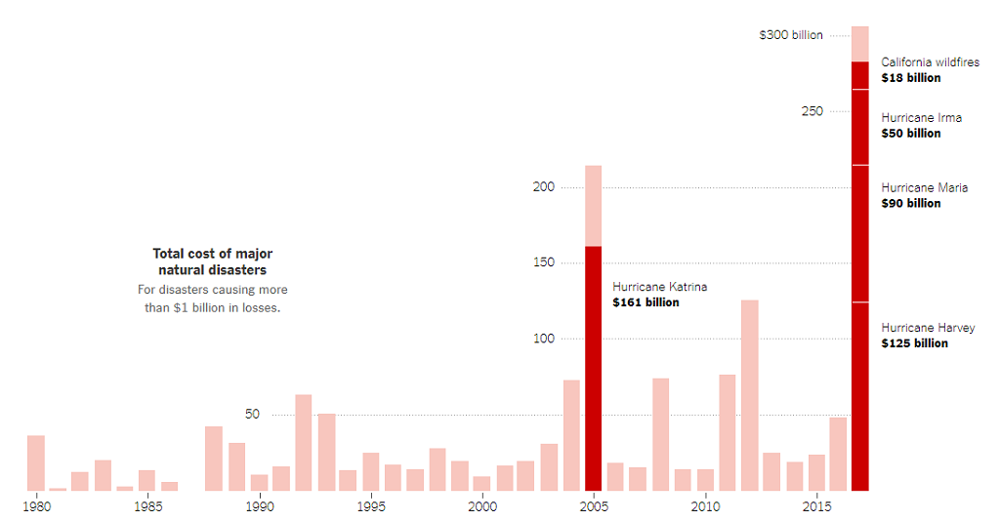{fig-align="center"}

::: {style="font-size: 50%;"}
<https://www.nytimes.com/2018/09/18/learning/whats-going-on-in-this-graph-sept-19-2018.html>
:::

## 

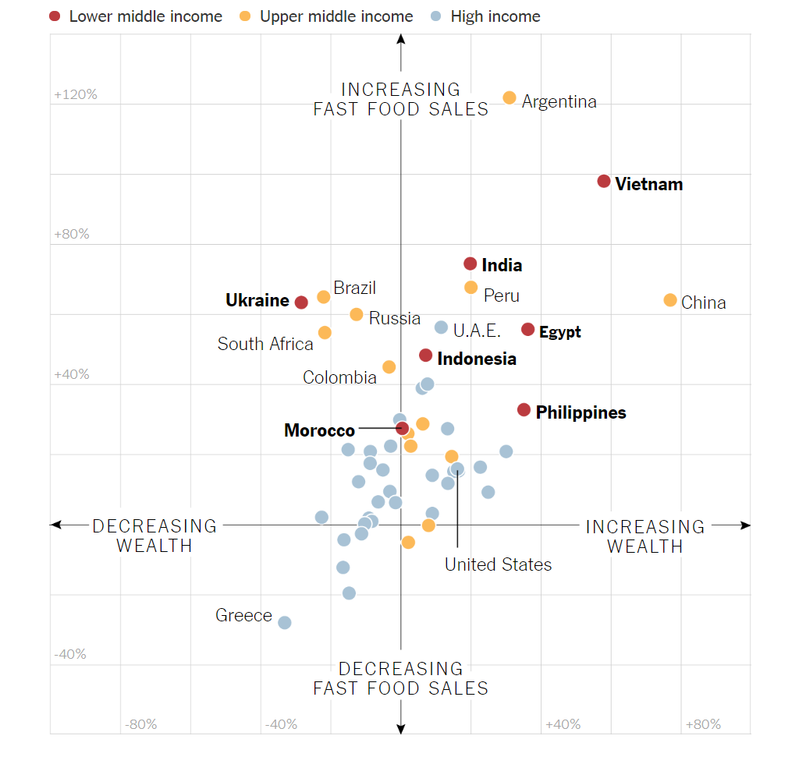{fig-align="center"}

::: {style="font-size: 50%;"}
<https://www.nytimes.com/2018/10/16/learning/whats-going-on-in-this-graph-oct-17-2018.html>
:::

## 

</br>

At its core, data visualization allows you to delve into complex datasets to extract meaningful insights using graphical displays.

</br>

Data visualizations are primarily concerned with providing evidence and enabling the audience to explore and draw their own conclusions about what the visualizations reveal about the data.

</br>

. . .

[***Data visualization has 3 key principles...***]{style="color:#023562;"}

::: notes
As data scientists, we create data visualizations in order to understand our data and explain our analyses to other people. A plot should have a message, and it’s our job to communicate this message as clearly as possible.
:::

## ***Principle 1*****: Define the Message or Question**

</br>

Formulate the question of interest or the message you want to convey.

::::::: center
:::::: columns
::: {.column width="33%"}
{width="499"}
:::

::: {.column width="33%"}
[{alt="Be ready to lose all your money on bitcoin, FCA tells consumers\" Financial newspaper  headline in Guardian 12 January 2021 Great Britain UK Europe Stock Photo -  Alamy"}](https://www.google.com/url?sa=i&url=https%3A%2F%2Fwww.alamy.com%2Fbe-ready-to-lose-all-your-money-on-bitcoin-fca-tells-consumers-financial-newspaper-headline-in-guardian-12-january-2021-great-britain-uk-europe-image399276404.html&psig=AOvVaw1j_DY1hqJ8N6YDmcJrt7O4&ust=1706894768727000&source=images&cd=vfe&opi=89978449&ved=0CBIQjRxqFwoTCNiE4-PUioQDFQAAAAAdAAAAABAD)
:::

::: {.column width="33%"}
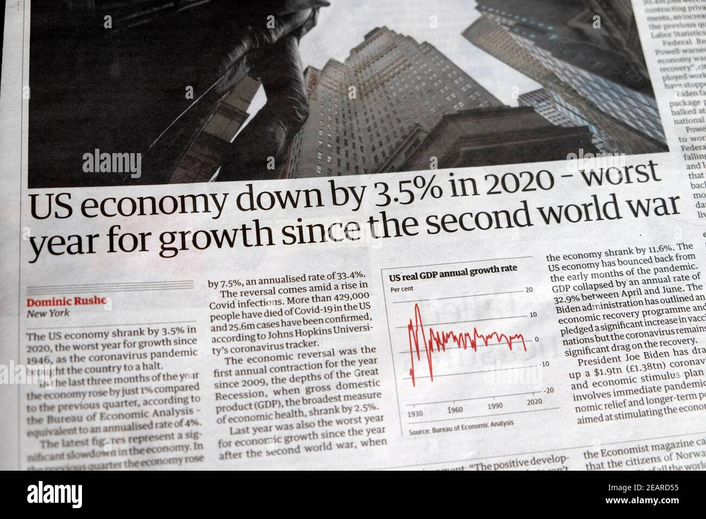
:::
::::::
:::::::

::: notes
El mensaje puede ser una pregunta

- What is the key comparison?
- How do we emphasize it?
- Do you have reason to expect that one group/observation might be different?
- Why might your finding about shape matter?
- What additional comparison might add value to the investigation?
- Are there any potentially important features to compare against?
:::

## ***Principle 2*****: *Turn Data into Information***

Your graph should use data to convey the message or answer the question. In other words, it should transform data into information.

{fig-align="center"}

::: {style="font-size: 85%;"}
Enhance your graph with color symbols and text to convey additional information.
:::

## *Principle 3: Apply Graphic Design Principles*

</br>

:::::::: center
::::::: columns
::::: {.column width="55%"}
:::: {style="font-size: 75%;"}
::: incremental
1.  Objects are easily identifiable by color.
2.  Use direct labels instead of a legend.
3.  Elements such as text, lines, and shapes of the same nature should look similar.
4.  Balance graphics and text.
5.  Be cautious with default settings in visualization software.
6.  Use a grid-based layout to organize your visualization.
:::
::::
:::::

::: {.column width="45%"}
{fig-align="center"}
:::
:::::::
::::::::

::: notes
Don’t limit yourself to simple elements. Enhance your graph with color symbols to convey additional information. If possible, add context with markers and reference labels.

Additionally, include a legend in the graph that describes key features and summarizes its conclusions.
:::

## Example

::: {style="font-size: 75%;"}
[**Principle 1**]{style="color:#023562;"}: It is cheaper to take Uber than to own a car in four of the five largest cities in the USA.
:::

::::: columns
::: {.column width="70%"}
| City            | Uber | Car |
|-----------------|------|-----|
| New York City   | 142  | 218 |
| Washington D.C. | 96   | 130 |
| Chicago         | 77   | 116 |
| Los Angeles     | 62   | 89  |
| Dallas          | 181  | 65  |

: Weekly cost (in USD) of daily commuting
:::

::: {.column width="30%"}

:::
:::::

::: notes
The estimated costs are based on a twice-daily 10.4 mile one-way commute at peak times over the course of a week using either the UberPool option (where available) or alternatively UberX vs the cost of using a personal vehicle (including any associated costs of ownership). Study conducted in February 2017.
:::

## 

</br></br>

[**Principle 2**]{style="color:#023562;"}: Turn data into information.

```{r}
#| echo: false
#| output: true
#| fig-height: 4
#| fig-align: center

library(ggplot2)
library(ggformula)
# Sample data
uber <- data.frame(
  City = rep(c("New York City", "Washington D.C.", "Chicago", "Los Angeles", "Dallas"), each = 2),
  Type = rep(c("Uber", "Car"), times = 5),
  Cost = c(142, 218, 96, 130, 77, 116, 62, 89, 181, 65)
)

slp_plot = ggplot(data = uber, aes(x = Type, y = Cost, group = City, color = factor(City))) 
slp_plot = slp_plot + geom_line(size = 2, alpha = 0.5) 
slp_plot = slp_plot + geom_point(size = 3)
slp_plot = slp_plot + labs(title = "It is cheaper to take Uber than own a car in four of the five largest U.S. cities.", x = "", y = "Cost (USD)", color = "City")
slp_plot
```

## 

</br></br>

[**Principle 3**]{style="color:#023562;"}: Apply Graphic Design Principles.

```{r}
#| echo: false
#| output: true
#| fig-height: 4
#| fig-align: center

library(ggplot2)
library(ggformula)
# Sample data
uber <- data.frame(
  City = rep(c("New York City", "Washington D.C.", "Chicago", "Los Angeles", "Dallas"), each = 2),
  Type = rep(c("Uber", "Car"), times = 5),
  Cost = c(142, 218, 96, 130, 77, 116, 62, 89, 181, 65)
)

slp_plot = ggplot(data = uber, aes(x = Type, y = Cost, group = City, color = factor(City))) 
slp_plot = slp_plot + geom_line(size = 2, alpha = 0.5) 
slp_plot = slp_plot + geom_point(size = 3)
slp_plot = slp_plot + labs(title = "It is cheaper to take Uber than own a car in four of the five largest U.S. cities.", x = "", y = "Cost (USD)", color = "City")
slp_plot = slp_plot + scale_color_manual(values = c("Chicago" = "#619CFF", "Dallas" = "red", "Los Angeles" = "#619CFF", "New York City" = "#619CFF", "Washington D.C." = "#619CFF"))
slp_plot + theme_minimal() + theme(text = element_text(size = 15),
        axis.text.x = element_text(size = 20), axis.text.y = element_text(size = 15))
```

## 

</br>

::::: columns
::: {.column width="70%"}
> "*The greatest value of a picture is when it forces us to notice what we never expected to see.*" – John W. Tukey.
:::

::: {.column width="30%"}
{alt="John Tukey - Wikipedia"}
:::
:::::

. . .

<https://www.storytellingwithdata.com/> is an excellent guide on data visualization.

## Activity 1.1 (*cooperative* mode)

</br></br>

1.  Get together with a classmate

2.  Aanalyze the five data visualizations in this <a href="https://docs.google.com/presentation/d/1qBh3Lh7eMuXG9iaFZm44ucS4ihMX8nkgpb-1zGE6ZxE/edit?usp=sharing" target="_blank">Google Slides</a> file

3.  For each graph, write a short critique (3-4 sentences) using the three principles of data visualization.

4.  Upload your document in PDF with your critiques to Canvas.

# Storytelling for Data Visualization

## Why storytelling matters in data visualization?

- Raw data alone is not enough—insights must be communicated effectively.

- Decision-makers rely on clear, engaging, and meaningful presentations of data.

- Good storytelling connects data to real-world problems and solutions.

. . .

For example, a simple bar chart can be enhanced by context and narrative to explain a business trend or social issue.

## 

</br></br></br>

::::: columns
::: {.column width="70%"}
> “The most powerful person in the world is the storyteller.” – Steve Jobs
:::

::: {.column width="30%"}

:::
:::::

## Four Components of a Data Story

</br>

1.  Introduction (What's the problem?)

- Define the problem or question you’re addressing.
- Provide relevant background or context.

. . .

2.  Data (How will you solve it?)

- Collected, cleaned, and arranged analyzed data.
- Provides objective evidence to support claims.

## 

3.  Visuals (What's your solution?)

- Graphs, charts, and maps help translate numbers into meaningful insights (histograms, box plots, line charts, scatter plots, etc.).
- Highlight key trends, comparisons, and relationships.
- Good design guides the audience to the key message.

. . .

4.  Narrative (Why does it matter?)

- Puts data into context—explains the significance of findings.
- Answers: Why does this matter? Who is affected? What should be done?

## Best practices for storytelling

::: incremental
- **Know Your Audience** – Tailor the message to decision-makers, engineers, or the public.

- **Keep it Simple** – Avoid unnecessary complexity; [**clarity is key**]{style="color:darkblue;"}.

- **Use the Right Visuals** – Choose the best chart type for your message.

- **Emphasize Key Takeaways** – Bold the most important insights.

- **Create a Narrative Flow** – Guide the audience through the story step by step.
:::

# General Advice for Effective Presentations

## The advice is based on

{fig-align="center"}

::: {style="font-size: 50%;"}
<https://www.amazon.com/Even-Geek-Speak-Joey-Asher/dp/0978577604>
:::

## 1. Avoid jargon overload

Speak in plain, everyday language your audience understands.

</br>

. . .

For example:

::::::::: columns
::::: {.column width="50%"}
:::: callout-tip
## Clear and Engaging

::: {style="font-size: 90%;"}
[**What Is Lean Manufacturing?**]{style="color:darkblue;"}

Lean Manufacturing is about finding smarter ways to work. The goal is to make products using **less time, less waste, and fewer resources**, while keeping customers happy.
:::
::::
:::::

::::: {.column width="50%"}
:::: callout-warning
## Jargon Overload

::: {style="font-size: 90%;"}
[**What Is Lean Manufacturing?**]{style="color:darkblue;"}

Lean Manufacturing is a **systematic approach to process optimization** that utilizes **value stream mapping** to identify and eliminate **non–value-added activities**.
:::
::::
:::::
:::::::::

## 2. State the main objective

Start your speech with "By \[insert what you want to accomplish\] you will \[insert what your listener wants\]."

. . .

::: {style="font-size: 95%;"}
For example, start with

- *"In this presentation, I’ll show you how sensors and data can help you detect problems before they cause failures, keeping your production line running smoothly."*

Instead of

- *"In this presentation, I will explain how I used a random forest algorithm to predict when a machine will fail. I’ll describe my model, the data preprocessing steps, and my evaluation metrics."*
:::

## 3. Present the “so what.”

Don’t dive straight into details — explain *why it matters* first.

. . .

::: {style="font-size: 95%;"}
For example, is better to start with

- *"When a natural disaster disrupts production, companies lose millions of dollars and fail to deliver on time. Supply chain resilience is about designing systems that can recover quickly from these disruptions, keeping customers satisfied."*

than

- *"In this project, I analyzed supplier diversification, lead time variability, and network centrality. We used simulation models to measure disruption propagation in the supply chain network."*
:::

## 

4.  **Limit your slides.** One main idea per slide keeps your message clear and focused.

::: incremental
5.  **Use the 3-points structure.** Come up with no more than three points in support of your main objective. Support each of the points with facts or examples.

6.  **Practice for clarity, not memorization.** Rehearse enough to sound natural and confident.

7.  **You are the presentation.** Visuals in PowerPoint reinforce a speaker's message and help the audience key points. However, the presenter should always be the focus of the presentation, not the visuals.
:::

## 4 End with a call to action

Tell your audience *what you want them to do next.*

</br>

. . .

:::: callout-tip
## Example

::: {style="font-size: 95%;"}
[**Let’s Make Our Plant More Efficient**]{style="color:darkblue;"}

We’ve seen that improving energy efficiency saves costs, reduces emissions, and strengthens competitiveness.

**Now it’s your turn:**

1.  Identify one process in your area that wastes energy.

2.  Propose one small improvement this week.

3.  Share your idea in next Monday’s team meeting.
:::
::::

## Activity 1.2 (*Solo* mode and take-home)

Prepare a short presentation (up to 3 minutes) about any topic you’re passionate about.

**Guidelines**:

- Use slides (PowerPoint, Google Slides, or Canva).\
- Upload your slides to **CANVAS** before next class.\
- A few students will be randomly selected to present live.

We won't judge your topic. We’re looking for **clarity, connection, and passion**.

# [Return to main page](https://alanrvazquez.github.io/TEC-IN2039-EN/)
