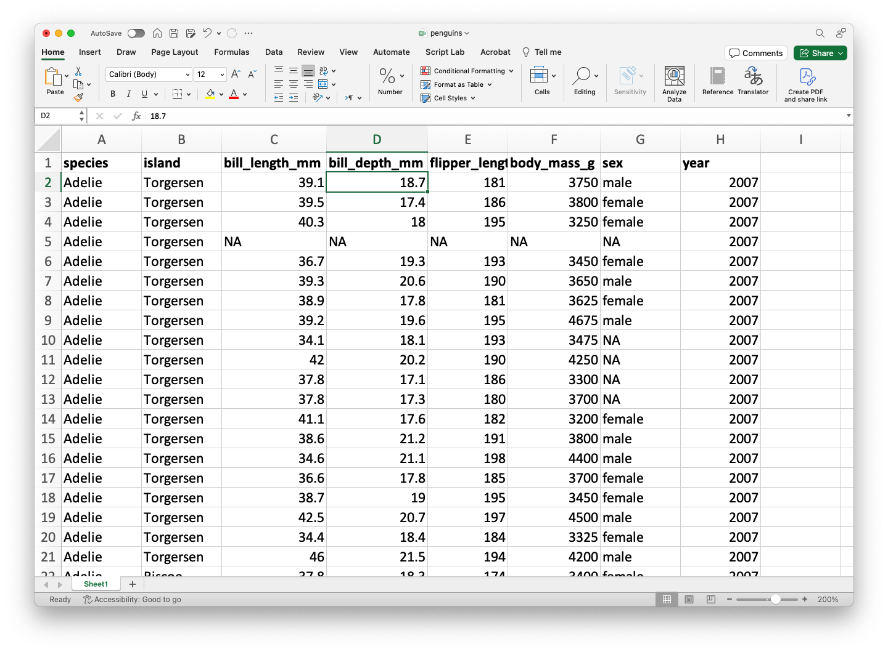
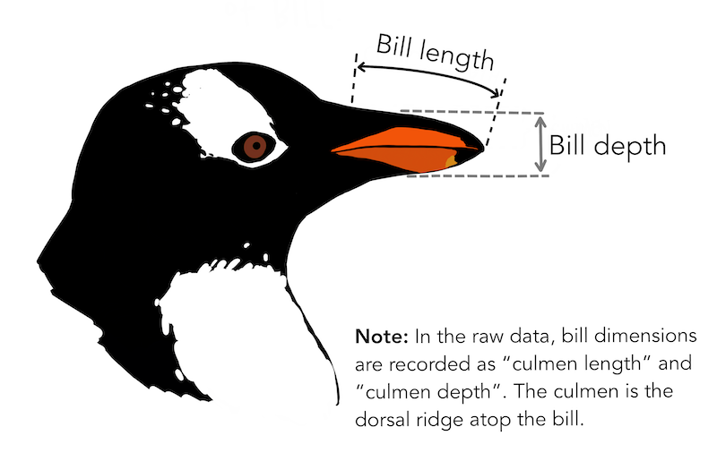
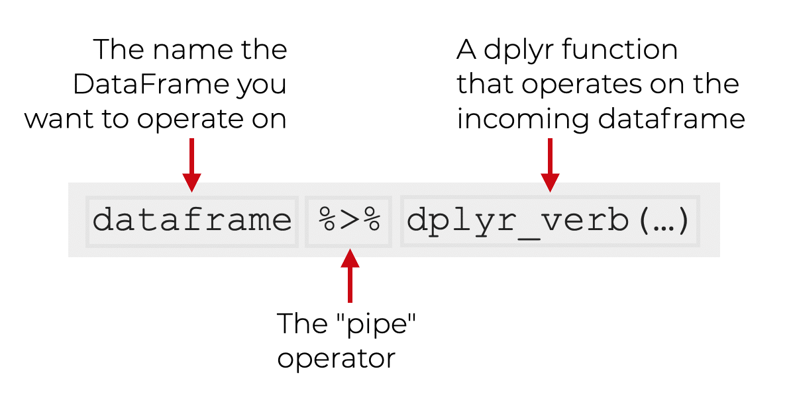
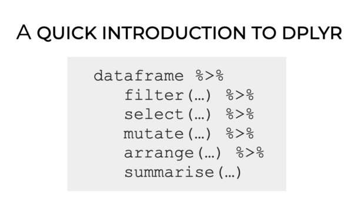
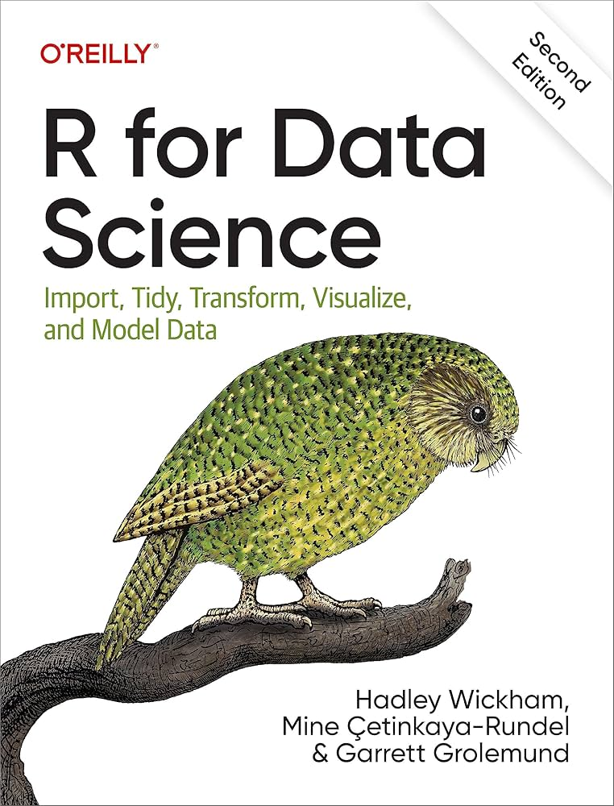

## Agenda

</br>

1.  Introduction to R
2.  Reading data with **readxl**
3.  Data manipulation with **dplyr**

# Introduction to R

## R

</br>

::::: columns
::: {.column width="70%"}
-   A versatile programming language.

-   It is free!

-   It is widely used for data cleaning, data visualization, and data modelling.

-   It can be extended with packages (libraries) developed by other users.
:::

::: {.column width="30%"}
{fig-align="center" width="324"}
:::
:::::

## Google Colab

*Google's free cloud collaboration platform for creating R documents.*

-   Run R and collaborate on Jupyter notebooks for free.

-   Harness the power of GPUs for free to accelerate your data science projects.

-   Easily save and upload your notebooks to Google Drive.

{fig-align="right" width="2560"}

## Let's try a command in R

</br></br>

What do you think will happen if we run this command?

```{r}
#| echo: true
#| output: false

print("Hello world!")
```

. . .

```{r}
#| echo: false
#| output: true

print("Hello world!")
```

## Let's try another command

</br></br>

What do you think will happen if we run this command?

```{r}
#| echo: true
#| output: false

sum(1, 5, 10)
```

. . .

```{r}
#| echo: false
#| output: true

sum(1, 5, 10)
```

## Use R as a basic calculator

</br></br>

```{r}
#| echo: true
#| output: true

5 + 1
```

```{r}
#| echo: true
#| output: true

10 - 3
```

```{r}
#| echo: true
#| output: true

2 * 4
```

```{r}
#| echo: true
#| output: true

9 / 3
```

## Comments

</br>

Sometimes we write things in the coding window that we want R to ignore. These are called comments and start with `#`.

</br>

R will ignore the comments and just execute the code.

```{r}
#| echo: true
#| output: true

# you can put whatever after #
# for example... blah blah blah
```

::: notes
Si desea escribir un comentario que ocupe más de una línea, es una buena idea poner un \# al principio de cada línea.
:::

## Introduction to functions in R

</br>

One of the cool things about R is that there are many built-in commands you can use. These are called *functions*.

. . .

Functions have two basic parts:

::: incremental
-   The first part is the name of the function (for example, `sum`).

-   The second part is the input to the function, which goes inside the parentheses (`sum(1, 5, 15)`).
:::

## R is strict

R, like all programming languages, is very strict. For example, if you write

```{r}
#| echo: true
sum(1, 100)
```

it will tell you the answer, 101.

. . .

But if you write

```{r}
#| echo: true
#| error: true
Sum(1, 100)
```

with the “s” capitalized, R will act like it has no idea what we are talking about!

::: notes
lo mismo si olvidas incluir un parentesis
:::

## Save your work in R objects

</br>

Virtually anything, including the results of any R function, can be saved in an *object*.

This is accomplished by using an assignment operator, which can be an equal symbol (`=`) or a leftward symbol (`<-`).

. . .

You can make up any name you want for a R object. However, there are two basic rules for this:

::: incremental
1.  It has to be different from a function name in R.
2.  It has to be specific possible yet succinct.
:::

## For example

</br>

```{r}
#| echo: true

# This code will assign the number 18
# to the object called my_favorite_number

my_favorite_number = 18
```

After running this code, nothing happens. But if we run the object on its own, we can see what's inside it.

```{r}
#| echo: true

my_favorite_number
```

You can also use `print(my_favorite_number)`.

## Vectors

</br>

So far we have used R objects to store a single number. But in data visualization we are dealing with multiple numbers or observations.

. . .

A R object can also store a complete set of numbers, called a ***vector***.

You can think of a list as a vector of numbers (or values).

. . .

The `c()` command can be used to combine several individual values into a list.

::: notes
puedes pensar que el c es por combinar
:::

## For example

</br>

This code creates two vectors:

```{r}
#| echo: true

my_vector = c(1, 2, 3, 4, 5)
my_vector_2 = c(10, 10, 10, 10, 10)
```

. . .

Let's see their content:

```{r}
#| echo: true
my_vector
```

```{r}
#| echo: true
my_vector_2
```

## Operations

</br>

We can do simple operations with vectors. For example, we can sum all the elements of a list.

```{r}
#| echo: true

my_vector = c(1, 2, 3, 4, 5)
sum(my_vector)
```

## Indexing

</br>

We can index a position in the vector using square brackets with a number like this: `[1]`.

So, if we wanted to print the contents of the first position in `my_vector`, we could write

```{r}
#| echo: true

my_vector[1]
```

. . .

</br>

[In contrast with Python, the first element of an R vector is indexed using 1.]{style="color:darkblue;"}

## A little more about R objects

</br>

You can think of R objects as containers that hold values.

A R object can hold a single value, or it can hold a group of values (as in a vector).

So far, we've only put numbers into R objects.

. . .

<br/>

***R objects can actually contain three types of values: numbers, characters, and booleans.***

## Character values

</br>

Characters are made up of text, such as words or sentences. An example of a list with characters as elements is:

. . .

```{r}
#| echo: true

many_greetings = c("hi", "hello", "hola", "bonjour", "ni hao", "merhaba")
many_greetings
```

. . .

It is important to know that numbers can also be treated as characters, depending on the context.

For example, when 20 is enclosed in quotes (`"20"`) it will be treated as a character value, even though it encloses a number in quotes.

## Boolean values

</br></br>

Boolean values are `True` or `False`.

We may have a question like:

-   Is the first element of the vector `many_greetings` `"hola"`?

. . .

We can ask R to find out and return the answer `True` or `False`.

```{r}
#| echo: true

many_greetings[1] == "hola"
```

## Logical operators

</br>

Most of the questions we ask R to answer with `True` or `False` involve comparison operators like `>`, `<`, `>=`, `<=`, and `==`.

The double `==` sign checks whether two values are equal. There is even a comparison operator to check whether values are *not* equal: `!=`.

For example, `5 != 3` is a `True` statement.

## Common logical operators

</br>

-   `>` (*larger than*)

-   `>=` (*larger than or equal to*)

-   `<` (*smaller than*)

-   `<=` (*smaller than or equal to*)

-   `==` (*equal to*)

-   `!=` (*not equal to*)

## Programming culture: Trial and error

</br>

The best way to learn programming is to try things out and see what happens. Write some code, run it, and think about why it didn't work.

There are many ways to make small mistakes in programming (for example, typing a capital letter when a lowercase letter is needed).

We often have to find these mistakes through trial and error.

## R libraries

</br>

Libraries are the fundamental units of reproducible R code. They include reusable R functions, documentation describing how to use them, and sample data.

In this course, we will be working mostly with the following libraries for data manipulation:

-   `readxl` for reading data.
-   `dplyr` for data manipulation and wrangling
-   `tidyr` for structuring data.

# Reading data with **readxl**

## Loading data in R

In this course, we will assume that data is stored in an Excel file. As an example, let's use the file `penguins.xlsx`.

::::: columns
::: {.column width="50%"}
{width="418"}
:::

::: {.column width="50%"}
{width="396"}
:::
:::::

::: {style="font-size: 85%;"}
[***The file must be previously uploaded to Google Colab.***]{style="color:red;"}
:::

## 

The dataset `penguins.xlsx` contains data from penguins living in three islands.

{fig-align="center"}

## Alan Vazquez with a gentoo penguin

{fig-align="center"}

## readxl library

</br>

::::: columns
::: {.column width="70%"}
To load data into R, we'll use the library called **readxl**. Fortunately, this library comes pre-installed in Google Colab.
:::

::: {.column width="30%"}
{fig-align="right" width="244"}
:::
:::::

However, we need to inform Google Colab that we want to use **readxl** and its functions. We load the library into R using the following command.

```{r}
#| echo: true

library(readxl)
```

## Loading data using readxl

</br>

The following code shows how to read the data in the file "penguins.xlsx" into R.

```{r}
#| echo: true

# Load the Excel file into R.
penguins_data = read_excel("penguins.xlsx")
```

## The function `head()`

</br>

The function `head()` allows you to print the first 6 rows of a data frame.

```{r}
#| echo: true
# Print the first 4 rows of the dataset.
head(penguins_data)
```

## Mini-activity (*solo* mode)

</br></br>

1.  Open the following <a href="https://drive.google.com/file/d/1kS1_M-wLRc9BDRAadV_K6yosNK0XF9qi/view?usp=sharing" target="_blank">Google Colab</a> link: <https://drive.google.com/file/d/1kS1_M-wLRc9BDRAadV_K6yosNK0XF9qi/view?usp=sharing>

2.  Copy the notebook to your drive.

3.  Answer the questions.

# Data manipulation with **dplyr**

## A New Library: dplyr

::::: columns
::: {.column width="50%"}
{fig-align="center" width="465" height="375"}
:::

::: {.column width="50%"}
-   **dplyr** allows you to manipulate data and generate statistical summaries.

-   It is part of a collection of data science packages called **tidyverse**.

-   <https://dplyr.tidyverse.org/>
:::
:::::

Load it to Google Colab with the following code.

```{r}
#| echo: true
#| output: false

library(dplyr)
```

## pipe

One of the most important commands of **dplyr** is `pipe`, which is executed using the operator `%>%`. This operator sends an object to a calling function or expression.

The grammar for using pipe is as follows:

{fig-align="center"}

## dplyr's verbs

**dplyr** is a data manipulation grammar that provides a set of verbs (functions) to solve the most common data manipulation challenges:

::: incremental
-   `filter()` selects observations based on their values.

-   `select()` selects variables based on their names.

-   `mutate()` adds new variables that are functions of existing variables.

-   `arrange()` changes the order of rows.

-   `summarise()` reduces multiple values to a single numerical summary.
:::

## 

{fig-align="center"}

To practice, we will use the dataset `penguins_data`.

## Filter observations with `filter()`

We can filter the data to obtain penguins with a body mass greater than 5000.

```{r}
#| eval: true
#| echo: true

penguins_data %>% filter(body_mass_g > 5000) %>% head()
```

> Recall that `head()` prints the first 5 rows of a dataframe. We **must** remove it to have the entire new dataframe.

## 

</br></br>

We can also filter the observations for the species "Gentoo."

```{r}
#| eval: true
#| echo: true

penguins_data %>% filter(species == "Gentoo") %>% head()
```

## Select columns with `select()`

</br></br>

Select the columns `species`, `body_mass_g` and `sex`.

```{r}
#| eval: true
#| echo: true

penguins_data %>% select(species, body_mass_g, sex) %>% head()
```

## `select()` and `filter()`

</br>

Select the columns `species`, `body_mass_g`, and `sex`. Then, filter the data for the species "Gentoo."

```{r}
#| eval: true
#| echo: true

penguins_data %>% 
  select(species, body_mass_g, sex) %>% 
  filter(species == "Gentoo") %>% 
  head()
```

## Create new columns with `mutate()`

With `mutate()`, we can add new columns (variables) that are functions of the columns in the data. For example, we can calculate the division of `bill_length_mm` and `bill_depth_mm`.

```{r}
#| eval: true
#| echo: true

penguins_data %>% 
  mutate("RadioLengthDepth" = bill_length_mm/bill_depth_mm) %>% 
  select(species, body_mass_g, sex, RadioLengthDepth) %>%
  head()
```

## Sort the observations with `arrange()`

</br>

We can sort the data based on a column, say `bill_length_mm`.

```{r}
#| eval: true
#| echo: true

penguins_data %>% 
  arrange(bill_length_mm) %>% 
  head()
```

## 

</br></br>

To sort in descending order we use `desc(bill_length_mm)` in `arrange()`.

```{r}
#| eval: true
#| echo: true

penguins_data %>% 
  arrange(desc(bill_length_mm)) %>% 
  head()
```

## Summarize with `summarise()`

We can calculate the average of the `bill_length_mm`, `bill_depth_mm`, and `body_mass_g` columns.

```{r}
#| eval: true
#| echo: true

penguins_data %>% 
  select(bill_length_mm, bill_depth_mm, body_mass_g) %>%
  summarise(PromLength = mean(bill_length_mm, na.rm = TRUE), 
            PromDepth = mean(bill_depth_mm, na.rm = TRUE),
            PromMass = mean(body_mass_g, na.rm = TRUE))
```

> The argument `na.rm == TRUE` allows us to ignore the missing data.

## Saving results in new objects

After performing operations on our data, we can save the modified dataset as a new object.

```{r}
#| eval: true
#| echo: true

summary_penguins_data = penguins_data %>%
  select(bill_length_mm, bill_depth_mm, body_mass_g) %>%
  summarise(PromLength = mean(bill_length_mm, na.rm = TRUE),
            PromDepth = mean(bill_depth_mm, na.rm = TRUE),
            PromMass = mean(body_mass_g, na.rm = TRUE))
```

</br>

And apply the **dplyr** verbs to the new object.

```{r}
#| eval: true
#| echo: true

summary_penguins_data %>% head()
```

## More on dplyr

{fig-align="center"}

::: {style="font-size: 50%;"}
<https://r4ds.hadley.nz/>
:::

## Final remarks

</br>

-   **dplyr** is a library that allows us to manipulate data in R.

-   Variable types help specify the operations and visualizations we can apply to the data.

-   There are appropriate or designed graphs for visualizing numeric or categorical variables.

-   In this course, we will see several graphs for each variable type and their combinations.

# [Return to main page](https://alanrvazquez.github.io/TEC-IN2039-EN/)
