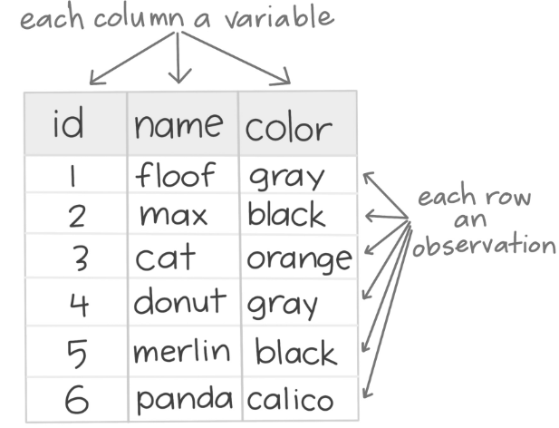

## Agenda

</br>

1.  Tidy Data
2.  **pandas** for Tidy data
3.  Data Wrangling

## Load the libraries

</br></br></br>

Remember to load the Python libraries into Google Colab before we start:

```{python}
#| echo: true
#| output: false

import pandas as pd
```

```{python}
#| echo: false
#| output: false

table1 = pd.read_excel("sample_tables.xlsx", sheet_name = "table1")
table2 = pd.read_excel("sample_tables.xlsx", sheet_name = "table2")
table3 = pd.read_excel("sample_tables.xlsx", sheet_name = "table3")
table4a = pd.read_excel("sample_tables.xlsx", sheet_name = "table4a")
table4b = pd.read_excel("sample_tables.xlsx", sheet_name = "table4b")
```

# Tidy Data

## Data science workflow

{fig-align="center"}

- Every data science project involves [**importing**]{style="color:darkblue;"}, [**tidying**]{style="color:darkblue;"}, [**transforming**]{style="color:darkblue;"}, [**visualizing**]{style="color:darkblue;"}, [**modeling**]{style="color:darkblue;"}, and [**communicating**]{style="color:darkblue;"} data.

## 

</br></br>

1.  [**Import:**]{style="color:darkblue;"} Bring raw data into Python.
2.  [**Tidy:**]{style="color:darkblue;"} Reshape into a consistent format.
3.  [**Transform:**]{style="color:darkblue;"} Create new variables and summaries.
4.  [**Visualize:**]{style="color:darkblue;"} Explore patterns visually.
5.  [**Model:**]{style="color:darkblue;"} Fit statistical or machine learning models.
6.  [**Communicate:**]{style="color:darkblue;"} Share insights clearly.

## 

</br></br>

1.  [**Import:**]{style="color:darkblue;"} Bring raw data into Python. (**pandas**)
2.  [**Tidy:**]{style="color:darkblue;"} Reshape into a consistent format. (**pandas**)
3.  [**Transform:**]{style="color:darkblue;"} Create new variables and summaries. (**pandas**)
4.  [**Visualize:**]{style="color:darkblue;"} Explore patterns visually.
5.  [**Model:**]{style="color:darkblue;"} Fit statistical or machine learning models.
6.  [**Communicate:**]{style="color:darkblue;"} Share insights clearly.

## Why do we need tidy data?

> “Tidy datasets are easy to manipulate, model, and visualize.” — *Hadley Wickham*

</br>

::: incremental
- Tidy data make Python tools work together smoothly.
- Each tidy dataset is like a well-organized spreadsheet.
- Making your data tidy allows you to avoid common errors that occurred in the data analysis.
- The **pandas** package has functions to make your data *tidy*.
:::

## Tidy Data

</br>

::::: columns
::: {.column width="50%"}
In tidy data:

- Each variable is in a column
- Each observation is in a row
- Each cell is a single measurement.
:::

::: {.column width="50%"}
{fig-align="center"}
:::
:::::

## 

{fig-align="center"}

::: {style="font-size: 50%;"}
<https://openscapes.org/blog/2020-10-12-tidy-data/>
:::

## Example 1

::: {style="font-size: 90%;"}
Consider four datasets with the same values of four variables `country`, `year`, `population`, and `cases`. First, this is *tidy* version.
:::

```{python}
#| echo: false

table1
```

## 

</br>

This is *tidy* data because each variable is in a column , each observation is in a row, and each cell is a single measurement.

```{python}
#| echo: false

table1
```

## 

Consider another version:

```{python}
#| echo: false

table2.head(6)
```

[Not *tidy* because the last column is a summary statistic (`count`) of two variables.]{style="color:purple;"}

## 

Consider another version:

```{python}
#| echo: false

table3
```

[Not *tidy* because the last column is a summary statistic (`rate`) of two variables, or there are two measurements involved in this column.]{style="color:purple;"}

## 

Consider one last version involving two datasets.

```{python}
#| echo: false

table4a
```

```{python}
#| echo: false

table4b
```

[Not *tidy* data!]{style="color:purple;"}

# pandas for Tidy Data

## The role of the pandas library

</br>

::: incremental
- **pandas** provides functions to manipulate both the structure and the contents of a dataset.\
- It includes tools for filtering, reshaping, cleaning, and combining data.\
- Together with visualization and machine learning libraries, **pandas** prepares your data for analysis.
:::

## Common functions for tidy data

The **pandas** library provides several functions for reshaping, organizing, and completing datasets.

</br>

Here, we will discuss some of the most common ones:

| Purpose                   | Function 1    | Function 2  |
|:--------------------------|:--------------|:------------|
| **Pivoting**              | `melt()`      | `pivot()`   |
| **Splitting / Combining** | `str.split()` | `str.cat()` |
| **Missing values**        | `fillna()`    | `dropna()`  |
| **Combining tables**      | `merge()`     | `concat()`  |

## Example 2

</br>

Consider the data in the file "spotify.xlsx". This dataset contains the global daily plays of the five most popular songs on the Spotify music streaming service in 2017.

</br>

Let's read the dataset using the `read_excel()` function from the **pandas** library.

```{python}
#| echo: true

spotify_data = pd.read_excel("spotify.xlsx")
```

## 

Let's preview the dataset.

```{python}
#| echo: true

spotify_data.head(3)
```

## `melt()`

A common problem is a dataset where some of the column names are not names of variables, but *values* of a variable.

The `melt()` function transforms columns into rows (converts data from **wide** to **long** format). Let's apply it to `spotify_data`.

```{python}
#| echo: true

spotify_long = (spotify_data
                .melt(id_vars=["Date"],
                value_vars=["Shape of You", "Despacito", 
                "Something Just Like This", "HUMBLE.", "Unforgettable"],
                var_name="Song",
                value_name="Plays")
                )
```

## Remark on column names

</br></br>

Python allows column names to contain spaces and special characters because they are stored as **strings**.

For example, columns such as `"Shape of You"` or `"Something Just Like This"` can be referenced directly inside quotation marks.

> When using **pandas**, column names are almost always written as strings enclosed in quotation marks.

## The long version of the data

- A `Song` column with the names of the songs.
- A `Plays` column with the number of plays for each song and date.

```{python}
#| echo: true

spotify_long.head(4)
```

## `pivot()`

</br></br>

The `pivot()` function is the opposite of `melt()`. We use it when an observation is scattered across multiple rows and we want to convert the dataset back to a *wide* format.

</br>

```{python}
#| echo: true

spotify_wide = (spotify_long
                .pivot(index="Date", columns="Song", values="Plays")
                .reset_index()
                )
```

## The result

```{python}
#| echo: true

spotify_wide.head()
```

## 

We can also apply `pivot()` to the `table2` dataset from the previous section.

```{python}
#| echo: true

table2
```

## 

The wider version of `table2` is:

```{python}
#| echo: true

(table2
.pivot(index = ["country", "year"], columns = "type", values = "count")
.reset_index()
)
```

## Example 3

</br>

Consider an industrial engineer who receives a messy Excel file from a manufacturing client. The data file is called "industrial_dataset.xlsx", which file includes data about machine maintenance logs, production output, and operator comments.

```{python}
#| echo: true

client_data = pd.read_excel("industrial_dataset.xlsx")
```

</br>

We use this dataset to illustrate the functions `str.split()` and `str.cat()`.

## Let's preview the data.

```{python}
#| echo: true

client_data.head()
```

## `str.split()`

The `str.split()` function separates the contents of one column into multiple columns by splitting the text wherever a separator appears. Consider the `Comment` column.

```{python}
#| echo: true

client_data['Comment']
```

## 

</br>

The column has some values such as "Requires part: valve" and "Delay: maintenance\n" that we may want to split into columns.

```{python}
#| echo: false
#| output: true

client_data['Comment']
```

## 

We can split the values in the column according to ":".

</br>

That is, everything before the colon will be in a column. Everything after the colon will be in another column. To achieve this, we use the function `str.split()`.

</br>

One input of the function is the symbol or character for which we cant to make a split. The other input, `expand = True` tells Python that we want to create new columns.

```{python}
#| echo: true
#| output: false

client_data['Comment'].str.split(':', expand = True)
```

## 

</br></br>

The result is two columns.

```{python}
#| echo: true
#| output: true

split_column = client_data['Comment'].str.split(':', expand = True)
split_column.head()
```

## 

We can assign them to new columns in the dataset using the following code.

```{python}
#| echo: true
#| output: true

augmented_data = (client_data
                  .assign(First_comment = split_column.filter([0]),
                  Second_comment = split_column.filter([1]))
                  )
augmented_data.head(4)
```

## `str.cat()`

</br>

The `str.cat()` function performs the opposite operation. It combines multiple text columns into a single column.

```{python}
#| echo: true

combined_column = (augmented_data["First_comment"]
                  .str.cat(augmented_data["Second_comment"], sep=": ")
                  )

combined_data = (augmented_data
                .assign(Comment = combined_column)
                .drop(["First_comment", "Second_comment"], axis = 1)
                )
```

The first object is the column that starts the concatenation, and the remaining columns are added using `str.cat()`.

## 

The result.

```{python}
#| echo: true

(combined_data
.filter(["Comment"], axis = 1)
)
```

# Basic data wrangling

## Data wrangling

</br>

- Data wrangling is the process of transforming raw data into a clean and structured format.

- It involves merging, reshaping, filtering, and organizing data for analysis.

- Here, we illustrate some special functions of the **pandas** for cleaning common issues with a dataset.

## Remove duplicate rows

</br></br>

Duplicate or identical rows are rows that have the same entries in every column in the dataset.

If only one row is needed for the analysis, we can remove the duplicates using the `.drop_duplicates()` function.

```{python}
#| echo: true

client_data_single = (client_data
                     .drop_duplicates()
                      )
```

## 

The `client_data_single` does not have duplicate rows.

```{python}
#| echo: true

client_data_single.head()
```

## Fill blank cells

Sometimes there are columns with missing values. If we would like to fill them with a value or text, we use the `.fillna()` function. In this function, we use the syntaxis `'Variable': 'Replace'`, where the `Variable` is the column in the dataset and `Replace` is the text or number to fill the entry in.

Let's fill in the missing entries of the columns `Operator`, `Maintenance Date`, and `Comment`.

```{python}
#| echo: true

complete_data = (client_data_single
                .fillna({'Operator': 'Unknown', 
                'Maintenance Date': '2023-01-01',
                'Comment': 'None'})
                ) 
```

## 

```{python}
#| echo: true

complete_data.head()
```

## Replace values

</br>

There are some cases in which columns have some undesired or unwatned values. Consider the `Output (units)` as an example.

```{python}
#| echo: true

complete_data['Output (units)'].head()
```

The column has the numbers of units but also text such as "error".

## 

</br>

We can replace the "error" in this column by a user-specified value, say, 0. To this end, we use the function `.replace()`. The function has two inputs. The first one is the value to replace and the second one is the replacement value.

</br>

```{python}
#| echo: true

complete_data['Output (units)'] = complete_data['Output (units)'].replace('error', 0)
```

## 

</br>

Let's check the new column.

```{python}
#| echo: true

complete_data['Output (units)']
```

Note that the new column is now numeric.

## Remove characters

</br>

Something that we notice is that the column `First_Comment` has some extra characters like "\n" that may be useless when working with the data.

We can remove them using the function `str.strip()`. The input of the function is the character to remove.

```{python}
#| echo: true

augmented_data['First_comment'] = augmented_data['First_comment'].str.strip("\n")
```

## 

</br>

Let's see the cleaned column.

```{python}
#| echo: true

augmented_data['First_comment']
```

## 

</br>

We can also remove other characters.

```{python}
#| echo: true

augmented_data['First_comment'].str.strip("!")
```

## Transform text case

When working with text columns such as those containing names, it might be possible to have different ways of writing. A common case is when having lower case or upper case names or a combination thereof.

For example, consider the column `Operator` containing the names of the operators.

```{python}
#| echo: true

complete_data['Operator'].head()
```

## Remove extra spaces

</br>

To deal with names, we first use the `.str.strip()` to remove leading and trailing characters from strings.

```{python}
#| echo: true

complete_data['Operator'] = complete_data['Operator'].str.strip()
complete_data['Operator']
```

## Change to lowercase letters

</br>

We can turn all names to lowercase using the function `str.lower()`.

```{python}
#| echo: true

complete_data['Operator'].str.lower()
```

## Change to uppercase letters

</br>

We can turn all names to lowercase using the function `str.upper()`.

```{python}
#| echo: true

complete_data['Operator'].str.upper()
```

## Capitalize the first letter

</br>

We can convert all names to title case using the function `str.title()`.

```{python}
#| echo: true

complete_data['Operator'].str.title()
```

## More functions of pandas

{fig-align="center"}

::: {style="font-size: 50%;"}
<https://wesmckinney.com/book/>
:::

# [Return to main page](https://alanrvazquez.github.io/TEC-IN2039-EN/)
