## Agenda

</br>

1.  HTML Basics
2.  Web Scraping using **requests** and **BeautifulSoup**
3.  Legal and Ethical Issues with Web Scraping

## Load the libraries

</br></br></br>

Remember to load the Python libraries into Google Colab before we start:

```{python}
#| echo: true
#| output: false

import pandas as pd
```

# HTML Basics

## World Wide Web

</br>

WWW (or the Web) is the information system where documents (web pages) are identified by Uniform Resource Locators (URLs)

A web page consists of:

- **HTML** provides the basic structure of the web page

- **CSS** controls the look of the web page (optional)

- **JS** is a programming language that can modify the behavior of elements of the web page (optional)

## HTML basics

HTML means “HyperText Markup Language” and looks like this

``` html
<html>
<head>
  <title>Page title</title>
</head>
<body>
  <h1 id='first'>A heading</h1>
  <p>Some text &amp; <b>some bold text.</b></p>
  
</body>
</html>
```

HTML has a hierarchical structure formed by elements which consist of a start tag (`<tag>`), optional attributes (`id='first'`), an end tag1 (like `</tag>`), and contents (everything in between the start and end tag).

## Elements

</br></br>

There are over 100 HTML elements. Some of the most important are:

- Every HTML page must be in an `<html>` element, and it must have two children:

  - `<head>` containing document metadata like the page title
  - `<body>` containing the content you see in the browser.

## 

</br>

- Block tags form the overall structure of the page:
  - Header 1: `<h1>content</h1>`
  - Paragraph: `<p>content</p>`
  - Ordered list: `<ol>content</ol>`

. . .

- Inline tags that format text inside block tags:
  - Bold: `<b>content</b>`
  - Italics: `<i>content</i>`
  - Links: `<a>content</a>`

## Other elements

</br></br>

| Element           | HTML syntax                |
|:------------------|:---------------------------|
| Block             | `<div>content</div>`       |
| Inline            | `<span>content</span>`     |
| Header 2          | `<h2>content</h2>`         |
| Emphasized text   | `<em>content</em>`         |
| Strong importance | `<strong>content</strong>` |

## Contents

Most elements can have content (text or more elements) in between their start and end tags. For example, the following HTML contains paragraph of text, with a word in bold.

``` html
<p>Hi! My name is <b>Hadley</b>.</p>
```

::: incremental
- The `<p>` element is the parent node that contains text and one child element, `<b>`.

- The `<b>` element wraps the word Hadley and gives it bold formatting.

- `<b>` has contents (the text “Hadley”) but no children of its own.
:::

## Attributes

</br>

Tags can have named **attributes** which look like `name1='value1'` `name2='value2'`.

</br>

Two of the most important attributes are `id` and `class`, which are used in conjunction with CSS (Cascading Style Sheets) to control the visual appearance of the page.

</br>

These are often useful when scraping data off a page.

## HTML Syntax

</br></br>

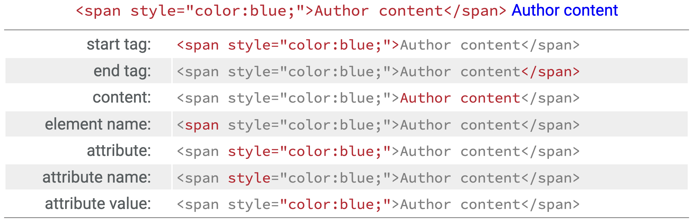{fig-align="center"}

## Example 1

Let's check a Wikipedia page about industrial engineering: <https://en.wikipedia.org/wiki/Industrial_engineering>

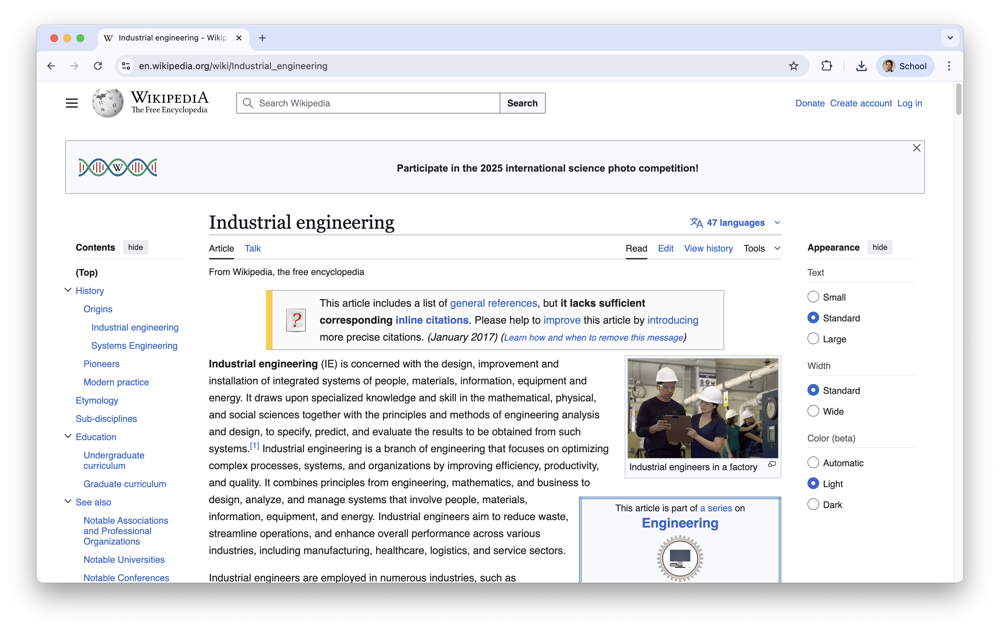{fig-align="center"}

## 

</br>

On the Google Chrome webrowser, you see the HTML used for generating the website by right clicking on any blank part of it and select "**Inspector**".

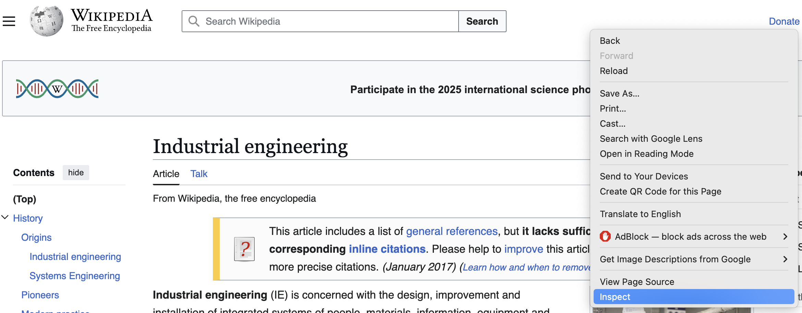{fig-align="center"}

## 

A new section of the website appears.

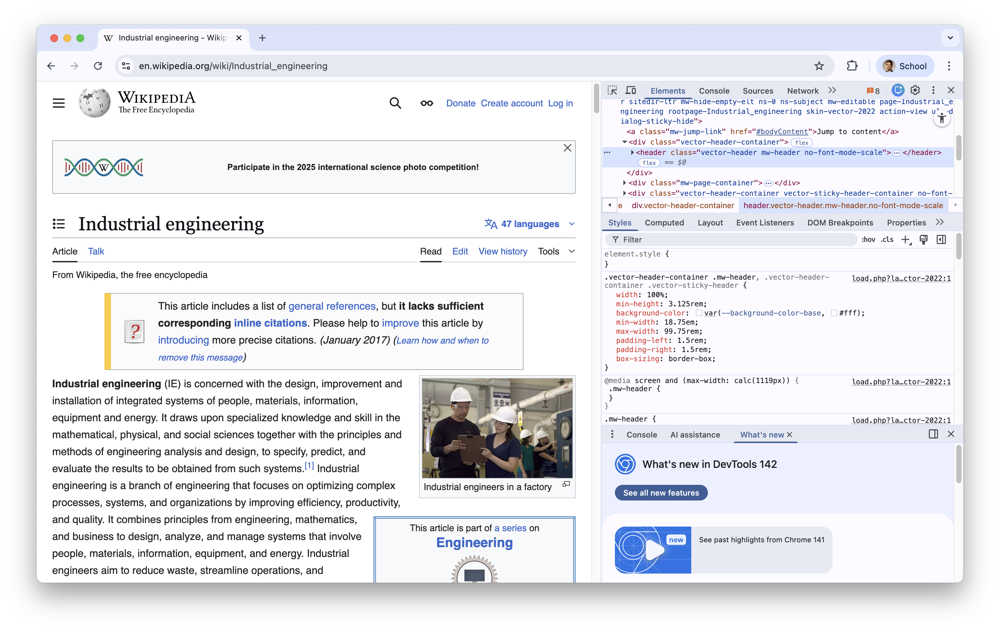{fig-align="center"}

## 

The HTML code is located at the first box.

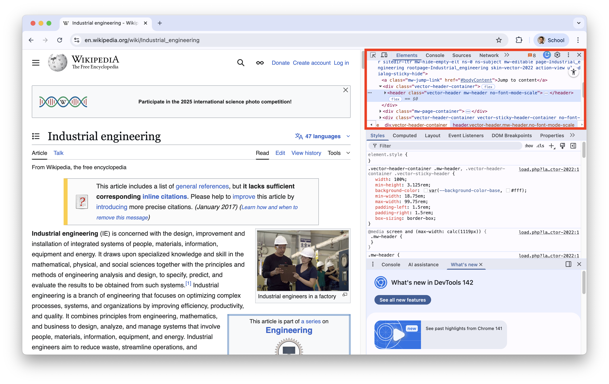{fig-align="center"}

## SelectorGadget

Alternatively, Google Chrome has an extension called [**SelectorGadget**](https://chromewebstore.google.com/detail/selectorgadget/mhjhnkcfbdhnjickkkdbjoemdmbfginb) to inspect specific elements of a website.

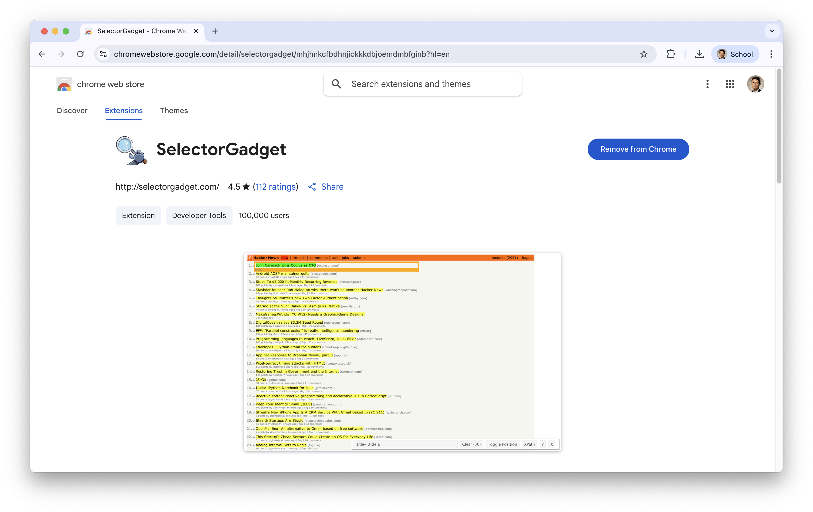{fig-align="center"}

## 

</br></br>

After installing it, it should be next to your search bar.

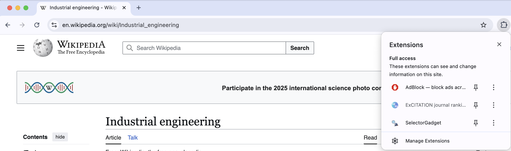{fig-align="center"}

## 

Using the gadget, you can inspect specific elements of the website. For example, we can inspect a the selected paragraph in green.

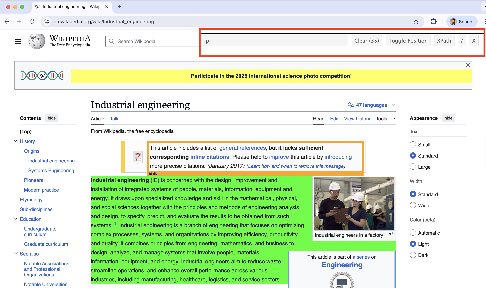{fig-align="center"}

The bar of **SelectorGadget** identifies that the element is a `p` because it is a paragraph.

## 

</br>

**SelectorGadget** identifies that the selected element is a header by displaying `.mw-heeading2` in its bar.

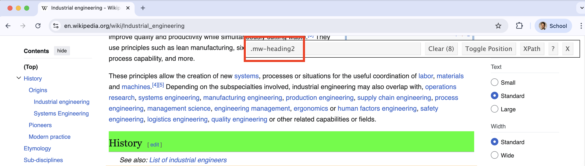{fig-align="center"}

The bar of **SelectorGadget** identifies that the element is a `p` because it is a paragraph.

## Comments

</br></br>

- HTML files have the extension .html.

- They are rendered using a web browser via an URL.

- More information on HTML elements can be found in [MDN Web Docs](https://developer.mozilla.org/en-US/docs/Web/HTML), which are produced by Mozilla, the company that makes the Firefox web browser.

# Web Scraping using **requests** and **BeautifulSoup**

## What is web scraping?

It is the process of extracting data from the web and transform it into an structured (*tidy*) dataset.

It allows you to collect data that is displayed on web pages but not directly available for download.

{fig-align="center" width="600" height="300"}

::: notes
- Common uses include:
  - Collecting product or price information\
  - Gathering research or statistical data\
  - Monitoring online content changes
:::

## A new library: requests

:::::: columns
::: {.column width="30%"}
{fig-align="center" width="264"}
:::

:::: {.column width="70%"}
::: {style="font-size: 95%;"}
- **requests** allows Python to communicate with websites.

- It downloads the HTML code of a webpage so that it can be processed by other libraries.

- It is one of the most widely used libraries for working with web resources in Python.

- <https://requests.readthedocs.io/>
:::
::::
::::::

Load it into Google Colab with the following code.

```{python}
#| echo: true

import requests
```

## Another new library: BeautifulSoup

:::::: columns
::: {.column width="30%"}
{fig-align="center" width="308" height="138"}
:::

:::: {.column width="70%"}
::: {style="font-size: 95%;"}
- **BeautifulSoup** allows you to easily scrape (collect) information from web pages.

- It extracts HTML elements such as tables, links, headings, and text using simple functions.

- BeautifulSoup is one of the most popular web scraping libraries in Python.

- <https://www.crummy.com/software/BeautifulSoup/>
:::
::::
::::::

Load it to Google Colab with the following code.

```{python}
#| echo: true
#| output: false

from bs4 import BeautifulSoup
```

## Example 2

Let's scrape data on the super bowl results and winners. To this end, we will use the website: <https://www.foxsports.com/nfl-super-bowl-winners-and-results>

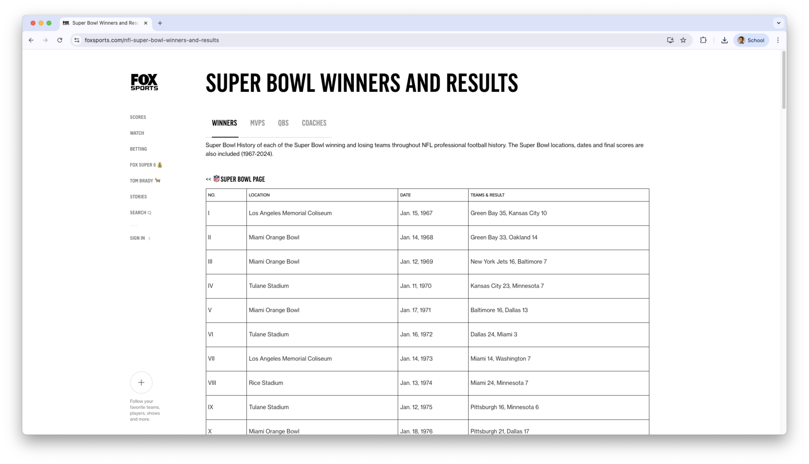{fig-align="center"}

## 

</br></br>

Using **requests**, we first download the HTML code of the webpage.

Then, we use **BeautifulSoup** to parse the HTML document.

```{python}
#| echo: true
#| output: true

url = "https://www.foxsports.com/nfl-super-bowl-winners-and-results"

response = requests.get(url)

superbowl_website = BeautifulSoup(response.text, "html.parser")
```

## The output

```{python}
#| echo: true
#| output: true


superbowl_website
```

## Now, let's inspect the elements using SelectorGadget

</br></br>

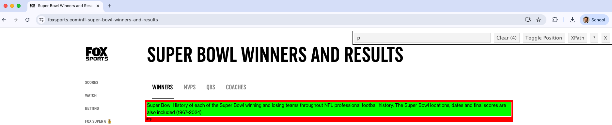{fig-align="center"}

## 

We scrape elements of a website stored in `superbowl_website` using the `select()` function.

For example, we can retrieve all paragraph elements (`<p>content<\p>`). To this end, we set the CSS selector to "p".

```{python}
#| echo: true

sb_web_p = superbowl_website.select("p")

sb_web_p
```

## 

</br>

However, the scraped elements are in HTML code.

To turn them into actual text for Python, we use the `get_text()` function.

```{python}
#| echo: true

# Start a list to store paragraphs
superbowl_web_paragraph = []

# Clean and store each paragraph
for paragraph in sb_web_p:
  cleaned_paragraph = paragraph.get_text(strip=True)
  superbowl_web_paragraph.append(cleaned_paragraph)

superbowl_web_paragraph
```

# 

Now, let's scrape the table with the superbowl data. To this end, we inspect the object using the **SelectorGadget**.

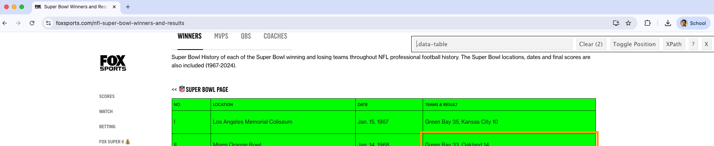{fig-align="center"}

In this case, the CSS element is `.data-table`.

## 

We retrieve the table using the `select()` function.

```{python}
#| echo: true

sb_table_data = superbowl_website.select(".data-table")

sb_table_data
```

Notice that two HTML tables were retrieved.

## 

Again, the tables are in HTML format. We can turn them into pandas DataFrames using the function `pd.read_html()` from **pandas**.

```{python}
#| echo: true

superbowl_tables = pd.read_html(str(sb_table_data))

superbowl_tables
```

## Comments

</br></br>

- The object `superbowl_tables` is not a single table. Instead, it is a Python *list*.

- Unlike a DataFrame, a list can contain many different types of objects, such as numbers, strings, dictionaries, or even other DataFrames.

## 

To retrieve one table from the list, we use square brackets.

For example, the first table is

```{python}
#| echo: true

superbowl_tables[0].head()
```

## 

</br>

The second table is

```{python}
#| echo: true

superbowl_tables[1].head()
```

# 

Let's continue with the table corresponding to the super bowl dates and results.

```{python}
#| echo: true

superbowl_data = superbowl_tables[0]

superbowl_data.head()
```

## Data wrangling

</br></br>

To make the data easier to work with, we will create a separate column for the year.

To do this, we use the `str.split()` function from **pandas**.

```{python}
#| echo: true

superbowl_data_wr = superbowl_data.copy()

superbowl_data_wr[["Day", "Year"]] = (
    superbowl_data_wr["DATE"]
    .str.split(",", expand=True)
)
```

## 

```{python}
#| echo: true
#| output: true

superbowl_data_wr.head()
```

## Be careful...

</br></br>

The new column `Year` is character, so we turn it into numeric using the code below.

```{python}
#| echo: true

superbowl_data_wr["Year"] = (
    pd.to_numeric(superbowl_data_wr["Year"])
)
```

## 

</br></br>

Further, let's separate the column `TEAMS & RESULT` into two columns "W Team" and "L Team".

```{python}
#| echo: true

superbowl_data_wr[["W Team", "L Team"]] = (
    superbowl_data_wr["TEAMS & RESULT"]
    .str.split(",", expand=True)
)
```

## The result

```{python}
#| echo: true

superbowl_data_wr.head()
```

## 

::: {style="font-size: 80%;"}
After that, we can separate the score of each team into corresponding columns. Note that we must also ensure that the new columns are numeric. All these steps are carried out using the pipeline below.
:::

```{python}
#| echo: true

superbowl_data_wr[["W Team", "W Score"]] = (
    superbowl_data_wr["W Team"]
    .str.split(r"(?<=\D)(?=\d)", expand=True)
)

superbowl_data_wr[["L Team", "L Score"]] = (
    superbowl_data_wr["L Team"]
    .str.split(r"(?<=\D)(?=\d)", expand=True)
)

superbowl_data_wr["W Score"] = pd.to_numeric(
    superbowl_data_wr["W Score"]
)

superbowl_data_wr["L Score"] = pd.to_numeric(
    superbowl_data_wr["L Score"]
)
```

## 

</br></br></br>

> The `sep = "(?<=\\D)(?=\\d)"` tells Python that we want to isolate the numbers into a new column.

## The final dataset

```{python}
#| echo: true

superbowl_data_wr.head(4)
```

## The web scraping process

</br>

So, the web scraping process consists of the following steps:

1.  Download the HTML page using `requests.get()` and parse it with **BeautifulSoup**.
2.  Extract the elements of interest using **SelectorGadget** to identify their CSS selectors and functions such as `select()`, `get_text()`, and `pd.read_html()`.
3.  Clean and reshape the extracted data using functions from **pandas**.

# Legal and Ethical Issues with Web Scraping

## `Robots.txt`

When scraping the web you need to be aware of `robots.txt`.

- The robots exclusion standard, also known as the robots exclusion protocol or robots.txt, is a standard used by websites to communicate with web crawlers and other web robots.

- The standard specifies how to inform the web robot about which areas of the website should not be processed or scanned.

- See more at [Wikipedia](https://en.wikipedia.org/wiki/Robots_exclusion_standard).

## Essentially, ...

</br></br>

A website places a plain-text file named robots.txt at the root of its domain (e.g., https://example.com/robots.txt).

This file contains rules that tell bots which pages or directories they are allowed to crawl (`Allow:`) and which ones they should not (`Disallow:`).

It does not enforce security—well-written bots respect the rules, but malicious bots may ignore them.

## robots.txt of wikipedia.com and foxsports.com

::::: columns
::: {.column width="50%"}
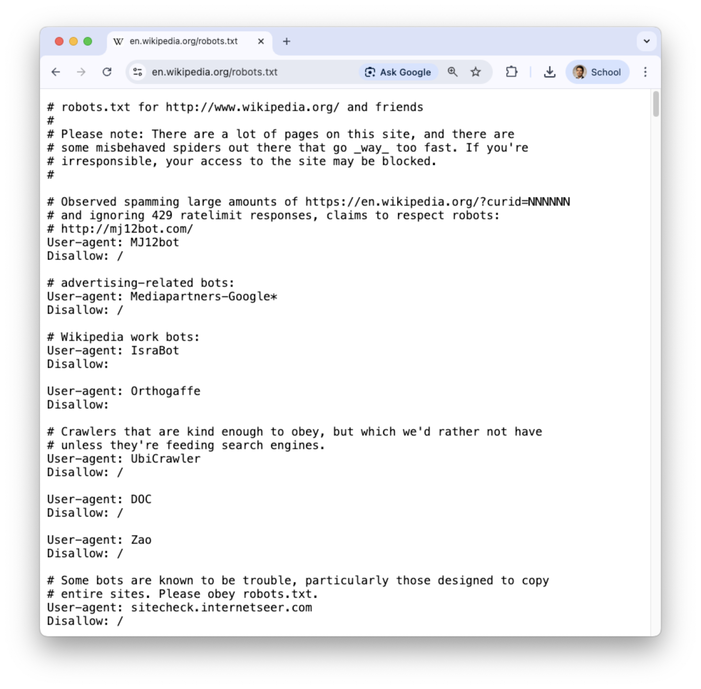{fig-align="center"}
:::

::: {.column width="50%"}
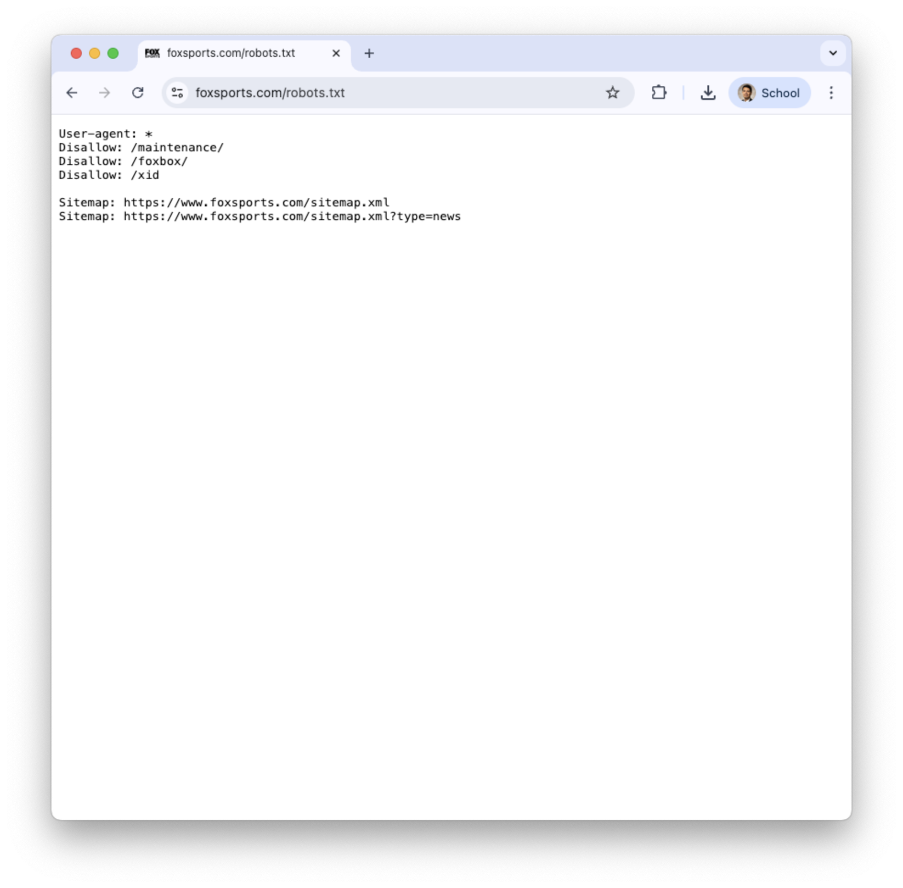{fig-align="center"}
:::
:::::

## The urllib.robotparser package

</br></br>

To check whether scraping or crawling a website is allowed, Python provides the **urllib.robotparser** library.

Let's load it into Google Colab.

```{python}
#| echo: true

from urllib.robotparser import RobotFileParser
```

. . .

The `RobotFileParser` class reads a website's `robots.txt` file. We can then use the `can_fetch()` method to determine whether a webpage can be scraped.

## Example 3

For instance, let's confirm that we can scrape the website <https://www.foxsports.com/nfl-super-bowl-winners-and-results>

```{python}
#| echo: true

robots = RobotFileParser()

robots.set_url("https://www.foxsports.com/robots.txt")

robots.read()

robots.can_fetch(
    "*",
    "https://www.foxsports.com/nfl-super-bowl-winners-and-results"
)
```

## When should we scrape data from a website?

</br></br></br>

- If `can_fetch()` returns `True`, then we **can** scrape data from the webpage.
- If `can_fetch()` returns `False`, then [**we should not scrape data from that webpage.**]{style="color:darkred;"}

## What abut the industrial engineering Wikipedia site?

</br></br>

```{python}
#| echo: true

robots = RobotFileParser()

robots.set_url("https://en.wikipedia.org/robots.txt")

robots.read()

robots.can_fetch(
    "*",
    "https://en.wikipedia.org/wiki/Industrial_engineering"
)
```

The output is `True`, so we are "good" to scrape it.

## Final comments

</br></br>

::: incremental
- A misconception about web data is that if the data is publicly available, it can be scraped.

- Even if `can_fetch()` returns `True`, we must consider the privacy and consent when the data is about human subjects, because it may include sensitive information. For more information, reach the [Institutional Research Ethics Committee](https://comiteinstitucionaletica.tec.mx/en).
:::

## 

</br></br>

- Another thing to consider is the legal aspect of web scraping. Always review the website’s terms of service before collecting data. For example, review the [Wikipedia Terms of Use](https://foundation.wikimedia.org/wiki/Policy:Terms_of_Use) and the [Fox Sports Terms of Use](https://www.foxsports.com/terms-of-use)

. . .

- Scraping without permission can violate intellectual property rights or privacy regulations, depending on the jurisdiction

# [Return to main page](https://alanrvazquez.github.io/TEC-IN2039-EN/)
