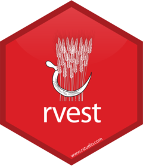

## Agenda

</br>

1.  HTML Basics
2.  Web Scraping with the **rvest** package
3.  Legal and Ethical Issues with Web Scraping 

## Load the libraries

</br></br></br>

Remember to load the R libraries into Google Colab before we start:

```{r}
#| echo: true
#| output: false

library(readxl)
library(dplyr)
library(tidyr)
```

# HTML Basics

## World Wide Web

</br>

WWW (or the Web) is the information system where documents (web pages) are identified by Uniform Resource Locators (URLs)

A web page consists of:

-   **HTML** provides the basic structure of the web page

-   **CSS** controls the look of the web page (optional)

-   **JS** is a programming language that can modify the behavior of elements of the web page (optional)

## HTML basics

HTML stands for “HyperText Markup Language” and looks like this

``` html
<html>
<head>
  <title>Page title</title>
</head>
<body>
  <h1 id='first'>A heading</h1>
  <p>Some text &amp; <b>some bold text.</b></p>
  
</body>
```

HTML has a hierarchical structure formed by elements which consist of a start tag (e.g. `<tag>`), optional attributes (`id='first'`), an end tag1 (like `</tag>`), and contents (everything in between the start and end tag).

## Elements

</br></br>

There are over 100 HTML elements. Some of the most important are:

-   Every HTML page must be in an `<html>` element, and it must have two children:

    -   `<head>` containing document metadata like the page title
    -   `<body>` containing the content you see in the browser.

## 

</br>

-   Block tags form the overall structure of the page:
    -   Header 1: `<h1>content</h1>`
    -   Paragraph: `<p>content</p>`
    -   Ordered list: `<ol>content</ol>`
    
. . . 

-   Inline tags that format text inside block tags:
    -   Bold: `<b>content</b>`
    -   Italics: `<i>content</i>`
    -   Links: `<a>content</a>`

## Other elements

</br></br>

| Element           | HTML syntax                |
|:------------------|:---------------------------|
| Block             | `<div>content</div>`       |
| Inline            | `<span>content</span>`     |
| Header 2          | `<h2>content</h2>`         |
| Emphasized text   | `<em>content</em>`         |
| Strong importance | `<strong>content</strong>` |

## Contents

Most elements can have content (text or more elements) in between their start and end tags. For example, the following HTML contains paragraph of text, with a word in bold.

``` html
<p>Hi! My name is <b>Hadley</b>.</p>
```

::: incremental
-   The `<p>` element is the parent node that contains text and one child element, `<b>`.

-   The `<b>` element wraps the word Hadley and gives it bold formatting.

-   `<b>` has contents (the text “Hadley”) but no children of its own.
::: 

## Attributes

</br>

Tags can have named **attributes** which look like `name1='value1'` `name2='value2'`.

</br>

Two of the most important attributes are `id` and `class`, which are used in conjunction with CSS (Cascading Style Sheets) to control the visual appearance of the page.

</br>

These are often useful when scraping data off a page.

## HTML Syntax

</br>

{fig-align="center"}

## Example 1

Let's check a Wikipedia page about industrial engineering: <https://en.wikipedia.org/wiki/Industrial_engineering>

{fig-align="center"}

## 

</br>

On the Google Chrome webrowser, you see the HTML used for generating the website by right clicking on any blank part of it and select "**Inspector**".

{fig-align="center"}

## 

A new section of the website appears.

{fig-align="center"}

## 

The HTML code is located at the first box.

{fig-align="center"}

## SelectorGadget

Alternatively, Google Chrome has an extension called **SelectorGadget** to inspect specific elements of a website.

{fig-align="center"}

## 

</br></br>

After installing it, it should be next to your search bar.

{fig-align="center"}

## 

Using the gadget, you can inspect specific elements of the website. For example, we can inspect a the selected paragraph in green.

{fig-align="center"}

The bar of **SelectorGadget** identifies that the element is a `p` because it is a paragraph.

## 

</br>

**SelectorGadget** identifies that the selected element is a header by displaying `.mw-heeading2` in its bar.

{fig-align="center"}

The bar of **SelectorGadget** identifies that the element is a `p` because it is a paragraph.

## Comments

</br></br>

-   HTML files have the extension .html.

-   They are rendered using a web browser via an URL.

-   More information on HTML elements can be found in [MDN Web Docs](https://developer.mozilla.org/en-US/docs/Web/HTML), which are produced by Mozilla, the company that makes the Firefox web browser.

# Web Scraping with the **rvest** package

## What is web scraping?

It is the process of automatically extracting information from websites. It allows you to collect data that is displayed on web pages but not directly available for download.  

{fig-align="center" width="700" height="400"}

::: notes
- Common uses include:
  - Collecting product or price information  
  - Gathering research or statistical data  
  - Monitoring online content changes

:::

## A new library: rvest

::::: columns
::: {.column width="30%"}
{fig-align="center" width="200" height="200"}
:::

::: {.column width="70%"}
-   **rvest** allows you to easily scrape (collect) data from web pages.

-   It helps you extract specific information such as tables, links, and text using simple functions.

-   **rvest** is part of the **tidyverse**.

-   <https://rvest.tidyverse.org/>
:::
:::::

Load it to Google Colab with the following code.

```{r}
#| echo: true
#| output: false

library(rvest)
```

## Example 2

Let's scrape data on the super bowl results and winners. To this end, we will use the website: <https://www.foxsports.com/nfl-super-bowl-winners-and-results>

{fig-align="center"}

##

</br></br>

Using **rvest**, we load the HTML code of the website using the function `read_html()`.

```{r}
#| echo: true
#| output: true

superbowl_website = read_html("https://www.foxsports.com/nfl-super-bowl-winners-and-results")
superbowl_website 
```

## Now, let's inspect the elements using SelectorGadget

</br></br>

{fig-align="center"}


## 

We scrape elements of a website stored in `superbowl_website` using the function `html_elements()`.

For example, we can retrieve all paragraph elements  (`<p>content<\p>`). To this end, we set the CSS selector to "p".

```{r}
#| echo: true
#| output: true

sb_web_p = superbowl_website %>% 
  html_elements(css = "p")
sb_web_p
```

## 

</br>

However, the scraped elements are in HTML code. 

To turn them into actual text for R, we use the `html_text2()` function.

```{r}
#| echo: true
#| output: true

superbowl_web_paragraph = sb_web_p %>%
  html_text2()
superbowl_web_paragraph
```

# 

Now, let's scrape the table with the superbowl data. To this end, we inspect the object using the **SelectorGadget**.

{fig-align="center"}

In this case, the element is `.data-table`.

##

</br></br>

We retrieve the data in the table by setting `css = data-table` in the `html_elements()` function.

```{r}
#| echo: true
#| output: true

sb_table_data = superbowl_website %>% 
  html_elements(css = ".data-table")
sb_table_data
```

Note that we have loaded two tables simultaneously.

##

Again, the tables are in HTML format. We can turn them into standard R tables using the function `html_table()`.


```{r}
#| echo: true
#| output: true

superbowl_tables = sb_table_data %>% html_table()
superbowl_tables
```

## 

</br>

However, the output `superbowl_tables` is not a single table, but several objects included in an R `list()`.

A `list()` in R is a data structure that can store elements of different types, such as numbers, strings, vectors, or even other lists.

It’s the most flexible container in R — unlike vectors or data frames, a list can mix various kinds of data in one object.

##

</br>

To retrieve one table, we select the elements of the resulting list `superbowl_tables`. For instance, to display the first table we use...

```{r}
#| echo: true
#| output: true

superbowl_tables[[1]] %>%  head()
```

##

</br>

To retrieve the second table, we use...

```{r}
#| echo: true
#| output: true

superbowl_tables[[1]] %>%  head()
```

#

Let's continue with the table corresponding to the super bowl dates and results.

```{r}
#| echo: true
#| output: true

superbowl_data = superbowl_tables[[1]] 
superbowl_data %>%  head()
```

## Data wrangling

To make the data easier to work, we will create a separate column for year. To this end, we use `separate()` from **tidyr**.

```{r}
#| echo: true
#| output: true

superbowl_data_wr = superbowl_data %>% 
  separate(DATE, into = c("Day", "Year"), sep = ",")
superbowl_data_wr %>% head()
```

## Be careful...

The new column `Year` is character, so we turn it into numeric using the code below.

```{r}
#| echo: true
#| output: true

superbowl_data_wr = superbowl_data_wr %>% 
  mutate(`Year` = as.numeric(`Year`))
superbowl_data_wr %>% head()
```

##

Further, let's separate the column **TEAMS & RESULT** into two columns **W Team** and **L Team**.

```{r}
#| echo: true
#| output: true

superbowl_data_wr = superbowl_data_wr %>% 
  separate(`TEAMS & RESULT`, into = c("W Team", "L Team"), sep = ",")
superbowl_data_wr %>% head()
```

##

</br>

After that, we can separate the score of each team into corresponding columns. Note that we must also ensure that the new columns are numeric. All these steps are carried out using the pipeline below.

```{r}
#| echo: true
#| output: true

superbowl_data_final = superbowl_data_wr %>% 
  separate(`W Team`, into = c("W Team", "W Score"), sep = "(?<=\\D)(?=\\d)") %>% 
  separate(`L Team`, into = c("L Team", "L Score"), sep = "(?<=\\D)(?=\\d)") %>% 
  mutate(`W Score` = as.numeric(`W Score`),
         `L Score` = as.numeric(`L Score`))
```

> The `sep = "(?<=\\D)(?=\\d)"` tells R that we want to isolate the numbers into a new column.

## The final dataset

```{r}
#| echo: true
#| output: true

superbowl_data_final %>% head(10)
```

## Example 2

Consider the plan crashes database.

```{r}
#| echo: true
#| output: true

plane_crashes = read_html("https://www.planecrashinfo.com/2025/2025.htm")
plane_crashes %>%  head()
```

We use the function `html_elements()` from **rvest**.

```{r}
#| echo: true
#| output: true

crashes_table = plane_crashes %>% 
  html_elements(css = "table")

```

## Getting HTML text

```{r}
#| echo: true
#| output: true

crashes_table %>% html_table(header = TRUE)
```

# Legal and Ethical Issues with Web Scraping 

# [Return to main page](https://alanrvazquez.github.io/TEC-IN2039-EN/)
