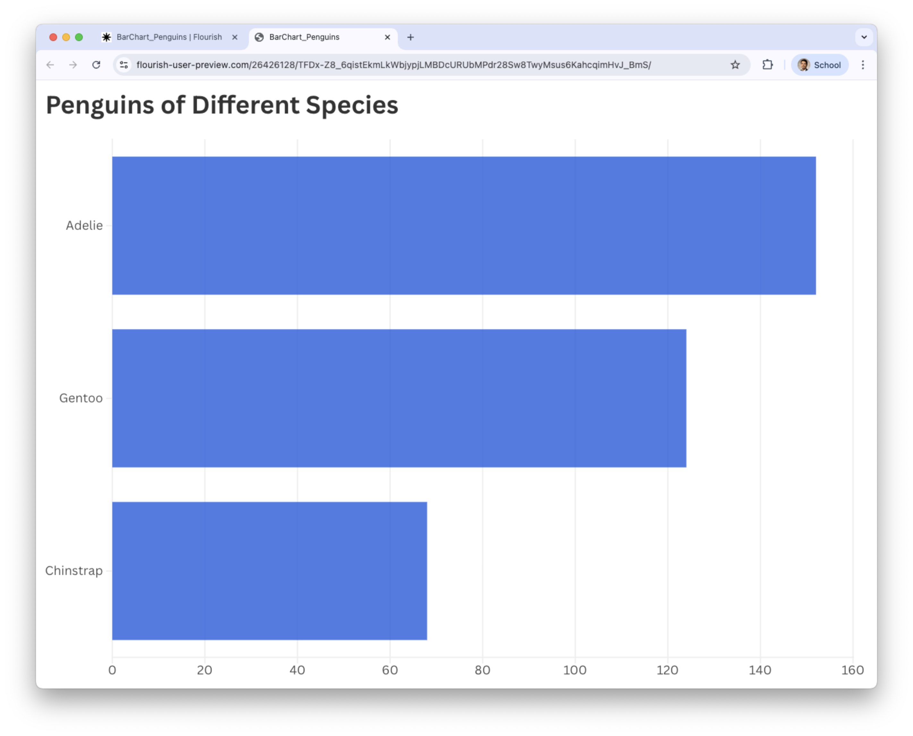
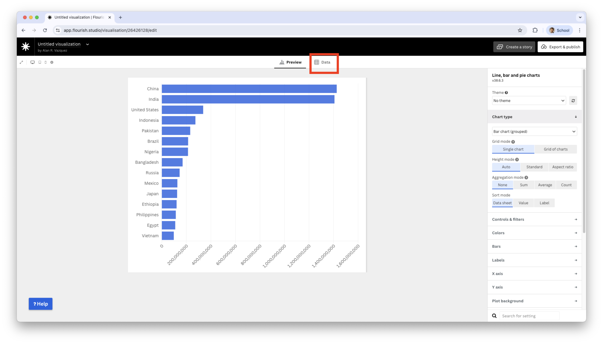
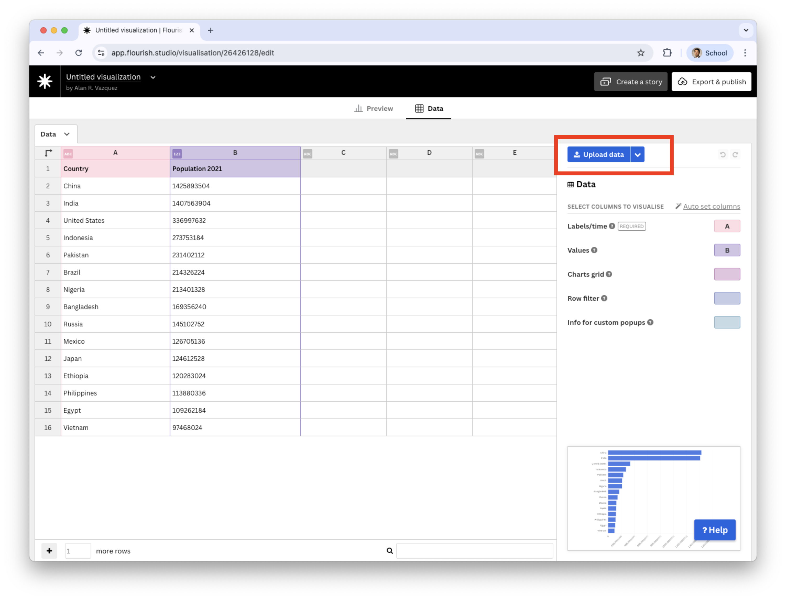
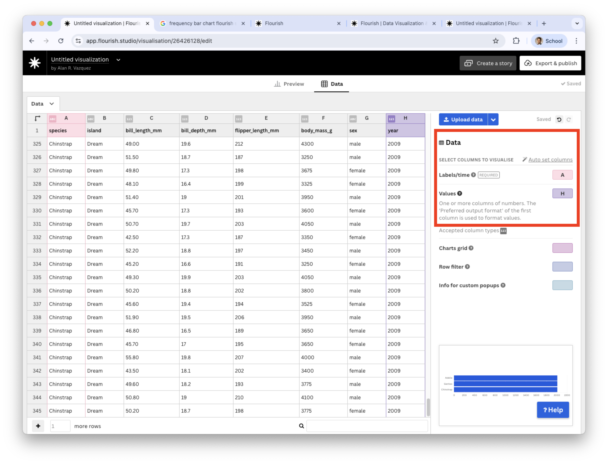
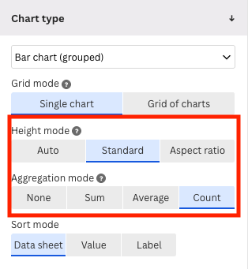
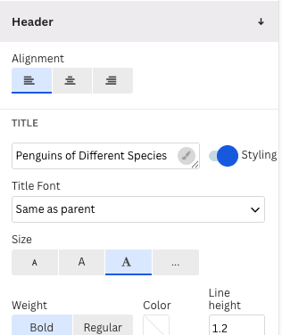
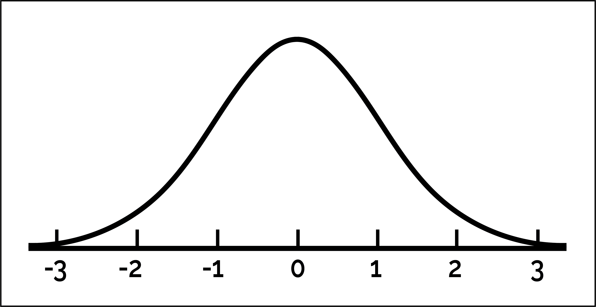
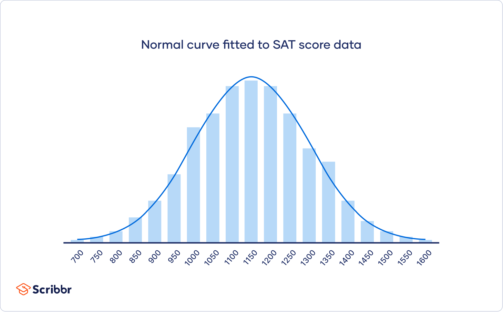

## Agenda

</br>

1.  Types of Variables
2.  One Categorical Variable
3.  One Numerical Variable
4.  Multiple Variables

## Types of variables

</br>

Before creating a graph, we must examine the type of values that our dataset variables take.

. . .

There are two main types of variables:

::: incremental
-   [Numerical variables.]{style="color:darkblue;"}

-   [Categorical variables.]{style="color:darkred;"}
:::

## Numerical variables

</br>

These take values that represent numerical measurements or quantities.

::: incremental
-   Height (in centimeters).
-   Weight (in kilograms).
-   Age (in years).
-   Price (in dollars).
-   Time (in hours or seconds).
-   Exam score (number of points on a 100-point scale).
:::

## Types of numerical variables

</br>

Numerical variables are divided into two types:

-   [*Discrete*]{style="color:darkblue;"}: variables that take integer values.

. . .

Examples:

1.  Number of children (0, 1, 2, or 3)
2.  Number of students in a class (20, 30, or 35)
3.  Number of books in a library (10,000, 15,000, 20,000)

## 

</br>

-   [*Continuous*]{style="color:darkblue;"}: variables that have a large range of possible values.

. . .

Examples:

1.  A person’s height (could be *within the range* of 1.60 m to 1.85 m)
2.  Ambient temperature (could be *within the range* of -30 $^\circ$C to 50 $^\circ$C)
3.  Time for an Uber to arrive (*between* 5 and 60 minutes)

## Categorical variables

</br>

These take values that fall into *categories*.

. . .

> A **category** is a class or division of people or things that share particular characteristics.

. . .

|  |  |
|------------------------------------|------------------------------------|
| **Variable** | **Categories** |
| Amazon review | 1$\bigstar$, 2$\bigstar$, 3$\bigstar$, 4$\bigstar$, 5$\bigstar$ |
| Country of origin | México, Canadá, EUA |
| Postal code | 72703, 90034, 3000, ... |

## Classification of categorical variables

</br>

</br>

Categorical variables are divided into two important types:

-   [*Nominal*]{style="color:darkred;"}
-   [*Ordinal*]{style="color:darkgreen;"}

::: notes
The distinction depends on whether the categories have a meaningful order or not.
:::

## Nominal categorical variables

</br>

A categorical variable is nominal if its categories **do not have** a specific order.

. . .

Examples:

::: incremental
-   Political party affiliation (Democrat or Republican).
-   Dog breed (Shepherd, Hound, Terrier, Other).
-   Computer operating system (Windows, macOS, Linux).
:::

## Ordinal categorical variables

</br>

A categorical variable is ordinal if its categories **do have a meaningful order**.

. . .

Examples:

::: incremental
-   T-shirt size (Small, Medium, Large).
-   Education level (High School, University, Postgraduate).
-   Income level (Less than \$250K, \$250K-\$500K, More than \$500K)
:::

::: notes
It is important to note that with an ordinal variable, the difference between, say, small and medium is not necessarily the same as the difference between medium and large. Additionally, the differences between consecutive categories may not be quantifiable. Think about star ratings in a restaurant review—how much better is one star compared to two stars?
:::

## Interesting fact...

</br>

Integer values (e.g., 1, 2, 3, ..., 5) can represent nominal or ordinal categorical variables.

|                |       |        |        |             |
|----------------|-------|--------|--------|-------------|
| Representation | 1     | 2      | 3      | 4           |
| **Blood Type** | *A*   | *B*    | *AB*   | *O*         |
| **Review**     | *Bad* | *Fair* | *Good* | *Very Good* |

<!-- -->

. . .

In practice, boolean values (`TRUE` and `FALSE`) often represent nominal categories.

## Remember

{fig-align="center" width="397"}

## A general difference is ...

</br>

-   Quantitative variables (discrete or continuous) are those where addition or subtraction makes sense.

-   Categorical variables (nominal or ordinal) are those where addition or subtraction does **NOT** make sense.


# One Categorical Variable

## Example 1: Penguins dataset

</br>

We will illustrate the concepts using the `penguins.xlsx` dataset. We will focus on visualizing the following categorical variables: `species`, `island` y `sex`.

```{r}
#| fig-pos: center
#| echo: false
#| output: true

library(readxl)
library(tidyverse)
library(ggformula)
penguins_data = read_excel("penguins.xlsx")
penguins_data %>% 
  select(species, island, sex) %>%
  head()
```

## Bar chart

It visually represents frequencies or percentages of the categories of a categorical variable. The frequency (or percentage) is represented by a bar of proportional height.

{fig-align="center"}

## Construct a bar chart in Flourish

{fig-align="center"}

## 

In the visualization gallery, choose **Bar Chart**.


{fig-align="center"}

## Replace the data with your own

::: columns
::: {.column width="50%"}
{fig-align="center"}
:::
::: {.column width="50%"}
{fig-align="center"}
:::
:::

{fig-align="center"}

## Select the correct variables

Unfortunately, it is not simple to create a standard bar chart with the counts of each category. To to this, we must select the column with the categories **Species** and an auxiliary column that has complete entries. In this case, we use the **Year**.

{fig-align="center"}

## 

The preview plot has all bars at the same height. To replace the height for the  frequencies of the categories, we change the **Agregation mode** to *Count*.

::: columns
::: {.column width="50%"}
{fig-align="center"}
:::
::: {.column width="50%"}
{fig-align="center"}
:::
:::

We also change the **Height mode** to *Standard* to enhance the visualization.

## Principle 1: Define the message

Following Principle 1 of data visualization, we add a header or title to the plot by going to the section **Header**.

::: columns
::: {.column width="50%"}
{fig-align="center"}
:::
::: {.column width="50%"}
{fig-align="center"}
:::
:::


## Final bar chart

{fig-align="center"}

We see that most penguins are Adelie.


## Example 2: Boston Housing Dataset

This dataset contains information collected by the U.S. Census Bureau on housing in the Boston, Massachusetts area. The dataset is in `Boston_dataset.xlsx`.

::::: columns
::: {.column width="60%"}

:::

::: {.column width="40%"}

:::
:::::

```{r}
#| fig-pos: center
#| echo: false
#| output: true

Boston_dataset = read_excel("Boston_dataset.xlsx")
```

## 

</br>

We concentrate on the following variables:

-   `chas` : Whether the house is next to the Charles River (1: Yes and 0: No)

-   `rad` : Index of accessibility to radial highways (0: Low, 1: Medium, 2: High).

## Data wrangling with R

To create a effective bar plots in Flourish, we must wrangle the variables `chas` and `rad` a little bit. 

Specifically, we must ensure that these variables are categorical and their categories have the appropriate names.

```{r}
#| fig-pos: center
#| echo: true
#| output: true

Boston_dataset = read_excel("Boston_dataset.xlsx")
Boston_dataset %>% select(`chas`, `rad`) %>%  head()
```

##

The variables are numeric because their header shows a `dbl`.

```{r}
#| fig-pos: center
#| echo: false
#| output: true
Boston_dataset %>% select(`chas`, `rad`) %>%  head()
```

To set variables as categorical we use the functions `mutate()` and `as.factor()`.

```{r}
#| fig-pos: center
#| echo: true
#| output: false

Boston_dataset_wr = Boston_dataset %>% 
                    mutate(`chas` = as.factor(`chas`)) %>% 
                    mutate(`rad` = as.factor(`rad`))
```

##

Now the header of the variables show a `fct` indicating that the variables are categorical.

```{r}
#| fig-pos: center
#| echo: true
#| output: true

Boston_dataset_wr  %>% select(`chas`, `rad`) 
```

##

Next, we replace the 0 and 1 of `chas` for the label "No" and "Yes", respectively. To this end, we use the function `mutate()` and `caste_match()`.

```{r}
#| fig-pos: center
#| echo: true
#| output: false

Boston_dataset_wr = Boston_dataset_wr %>% 
  mutate(`chas` = case_match(`chas`, "0" ~ "No", "1" ~ "Yes"))
```

</br>

Using the same functions, we replace the 0, 1, and 2 in the variable `rad` by "Low", "Medium", and "High", respectively.

```{r}
#| fig-pos: center
#| echo: true
#| output: false

Boston_dataset_wr = Boston_dataset_wr %>% 
  mutate(`rad` = case_match(`rad`, "0" ~ "Low", "1" ~ "Medium",
                            "2" ~ "High"))
```

## 

Now, the columns show the actual category labels instead of the coded (or number) labels.

```{r}
#| fig-pos: center
#| echo: true
#| output: true

Boston_dataset_wr  %>% select(`chas`, `rad`) 
```


Finally, we save the new dataset using the function "writexl" from the **writexl** package in R. 

## 

</br>

Let's create a bar chart for `chas`.

```{r}
#| fig-algin: center
#| echo: true
#| output: true

Boston_dataset = Boston_dataset %>% 
  mutate_at(c("chas", "rad"), as.factor) %>% 
  mutate(chas = case_match(chas, "0" ~ "No", "1" ~ "Yes"))
gf_percents( ~ chas, data = Boston_dataset)
```

## 

</br>

Now, let's create a bar chart for `rad`.

```{r}
#| fig-algin: center
#| echo: false
#| output: true

Boston_dataset = Boston_dataset %>% 
      mutate(rad = factor(rad, levels = c("Low", "Medium", "High")))
gf_percents( ~ rad, data = Boston_dataset)
```

## Collapsing

</br>

Some categorical variables tend to have many categories. For example, states in a country or postal codes. In these cases, it can be difficult to visualize all the categories in a single graph.

One strategy for developing an effective visualization is to collapse categories.

For example, in the variable `rad`, we can collapse the categories `Medium` and `High` into a single category called `Other`.

## 

Collapsing categories simplifies the graph

```{r}
#| fig-algin: center
#| echo: false
#| output: true

Boston_dataset_simple = Boston_dataset_wr %>% 
      mutate(rad = case_when(rad != "Low" ~ "Other",
                             rad == "Low" ~ "Low"))
```

It also allows us to emphasize a category like `Low` and see how it compares to the other categories (as a whole).

# One Numerical Variable

## Example 3

::::: columns
::: {.column width="70%"}
A piston is a mechanical device found in most engines.
:::

::: {.column width="30%"}
{width="402"}
:::
:::::

One measure of a piston's performance is the time it takes to complete a cycle, which we call "cycle time" and is measured in seconds.

The file "CYLT.xlsx" contains 50 cycle times of a piston operating under fixed conditions.

```{r}
#| fig-pos: center
#| echo: false
#| output: true

piston_data = read_excel("CYCLT.xlsx") 
```

## Histogram

Visualizes the distribution of observations, indicating regions where observations are concentrated or sparse.

. . .

It is built using a ***frequency table***.

1.  Define a maximum number of intervals or *bins* (from 5 to 30).
2.  Define the ranges of the intervals.
3.  Group the observations in the interval to which they belong.

. . .

R automatically calculates the frequency table for numerical data. The histogram is a visualization of this table.

## 

</br>

```{r}
#| fig-align: center
#| echo: false
#| output: true

gf_histogram( ~ cycle_time, data = piston_data, color = "black",
            fill = "pink") + labs(title = "Histogram of cycle time", 
            x = "Cycle Time (sec)", y = "Frequency", 
            caption = "Data of 50 cycle times of a pisto") + theme_bw() 
```

::: notes
The bars of the histogram touch each other. A gap indicates that there are no observations in that interval.
:::

## It is not the same as a bar chart

</br>

With categorical data, a bar chart looks similar to a histogram because it displays the frequency of categories.

However, we cannot interpret the shape of a bar chart in the same way as a histogram.

1.  The frequency of a category is represented by the height of the bar, and the width does not contain any information.

2.  A bar chart will not highlight outliers.

::: notes
Tails and symmetry do not make sense in this setting.
:::

## Number of bins

-   The number of bins is a parameter of the histogram that affects its appearance.

```{r}
#| fig-algin: center
#| echo: false
#| output: true

gf_histogram( ~ cycle_time, data = piston_data, bins = 5, color = "black", 
              fill = "pink") + labs(title = "Using Five Bins", 
            x = "Cycle Time (sec)", y = "Frequency", 
            caption = "Data of 50 cycle times of a pisto") + theme_bw() 
```

## 

</br></br>

[The left histogram uses 5 bins, and the right histogram uses 30 bins]{style="font-size: 100%;"}

::::: columns
::: {.column width="50%"}
```{r}
#| fig-pos: center
#| echo: false
#| output: true

gf_histogram( ~ cycle_time, data = piston_data, bins = 5, 
              color = "black", fill = "pink") + labs(title = "Using Five Bins", 
            x = "Cycle Time (sec)", y = "Frequency", 
            caption = "Data of 50 cycle times of a pisto") + theme_bw() 
              
```
:::

::: {.column width="50%"}
```{r}
#| fig-pos: center
#| echo: false
#| output: true

gf_histogram( ~ cycle_time, data = piston_data, bins = 30, 
              color = "black", fill = "pink") + labs(title = "Using 30 Bins", 
            x = "Cycle Time (sec)", y = "Frequency", 
            caption = "Data of 50 cycle times of a pisto") + theme_bw() 
```
:::
:::::

My recommendation is to use the default number of `bins`.

::: notes
A histogram is a familiar type of plot that involves smoothing. A histogram aggregates data values by placing points into bins and plotting one bar for each bin. Smoothing here means that we cannot differentiate the location of individual points within a bin: the points are smoothly distributed across their bins.
:::

## What to look for in a histogram?

</br>

-   Symmetry and asymmetry of the distribution.
-   The number, location, and size of high-frequency regions (bins).
-   Gaps where no values are observed.
-   Unusually large or anomalous values.
-   A [**bell-shaped**]{style="color:#1e3f5a;"} form.

## The obsession with bell curves

</br>

::::: columns
::: {.column width="50%"}
The **normal distribution** is a very important probability distribution in statistics.
:::

::: {.column width="50%"}

:::
:::::

It is characterized by a symmetric bell-shaped curve centered around its mean, with the highest probability density at the mean and decreasing symmetrically towards the extremes

## 

Basically, if your observations follow a normal distribution, you can use statistical methods to draw conclusions based on mathematical theory.

{fig-align="center" width="554" height="278"}

[*What many people don't know is that this condition is only needed if you have few observations (less than 50).*]{style="color:darkred;"}

# Multiple Variables

## Multivariate data

</br>

Multivariate data consists of datasets that contain observations of two or more variables.

::: incremental
-   Variables can be numerical or categorical.

-   Variables may or may not depend on each other.
:::

. . .

In fact, the **goal** is to determine whether there is a relationship between the variables and the type of relationship.

## Example 4

</br>

Consider data from 392 cars, including miles per gallon, number of cylinders, horsepower, weight, acceleration, year, origin, among other variables. The data is in the file "auto_dataset.xlsx".

```{r}
#| echo: false
#| output: true

auto_data = read_excel("auto_dataset.xlsx") 
auto_data %>% head()
```

## Principle 1: Define the question

In the context of multiple-variable data, typical questions to study include:

::: incremental
-   How are variable $X$ and variable $Y$ related?

-   Is the distribution of variable $X$ the same across all subgroups defined by variable $Z$?

-   Are there any unusual observations in the combination of values for variables $X$ and $Y$?

-   Are there any unusual observations in $X$ for a subgroup of variable $Z$?
:::

## Principle 2: Turn data into information

There are various types of graphs that help us explore relationships between two or more variables.

</br>

::: center
| Type        | Graph Type                                |
|:------------|:------------------------------------------|
| Numerical   | Scatter plot, line graph                  |
| Categorical | Side-by-side bar chart, stacked bar chart |
| Mixed       | Cleaveland Plot                           |
:::

::: notes
For two features, the combination of types (both quantitative, both qualitative, or a mix) matters.
:::

## Independent and dependent variables

When investigating the relationship between two variables (numerical or categorical), we use specific terminology.

. . .

One variable is called the *dependent* or *response variable*, denoted by the letter $Y$.

. . .

The other variable is called the *independent* or *predictor variable*, denoted by the letter $X$.

. . .

> Our goal is to determine whether changes in $X$ are associated with changes in $Y$, and the nature of this association.

## Scatter plot

</br>

The most common graph for examining the relationship between two numerical variables is the [***scatter plot***]{style="color:#174062;"}.

. . .

Variables $X$ and $Y$ are placed on the horizontal and vertical axes, respectively. Each point on the graph represents a pair of $X$ and $Y$ values.

. . .

</br>

> The goal is to explore linear or non-linear relationships between variables.

## Scatter plot

</br>

```{r}
#| fig-align: center
#| echo: false
#| output: true

mi_diagrama = gf_point(mpg ~ weight, data = auto_data, color = "darkblue", size = 2, linetype = 1) + labs(title = "Relationship between Weight and MPG", x = "Weight (lb)", y = "Miles Per Gallon (MPG)")
mi_diagrama = mi_diagrama + theme(axis.text=element_text(size=20), axis.title=element_text(size=20),
                                   plot.title=element_text(size=25)) 
mi_diagrama
```

## Individual graphs

</br></br>

Individual variable graphs (such as histograms) do not allow us to study the relationship between two variables. They only provide information on the *distribution* of each variable.

::::: columns
::: {.column width="50%"}
```{r}
#| fig-align: center
#| echo: false
#| output: true

histogram_mpg = gf_histogram( ~ mpg, data = auto_data, fill = "darkblue", color = "black") 
histogram_mpg = histogram_mpg + labs(title = "Distribution of MPG", x = "Miles Per Gallon (MPG)", y = "Frequency")
histogram_mpg = histogram_mpg + theme(axis.text=element_text(size=20), axis.title=element_text(size=20),
                                       plot.title=element_text(size=25))
histogram_mpg
```
:::

::: {.column width="50%"}
```{r}
#| fig-align: center
#| echo: false
#| output: true

histogram_weight = gf_histogram( ~ weight, data = auto_data, fill = "darkblue", color = "black") 
histogram_weight = histogram_weight + labs(title = "Distribution of Weight", x = "Weight (lb)", y = "Frequency")
histogram_weight = histogram_weight + theme(axis.text=element_text(size=20), axis.title=element_text(size=20), plot.title=element_text(size=25))
histogram_weight
```
:::
:::::

## Line graph

A line graph is a visual representation of data where data points are connected by a line. Axes:

-   $X$ (horizontal): Represents time or the independent variable.
-   $Y$ (vertical): Represents the dependent variable.

Each point represents a value at a given moment.

. . .

</br>

> The objective is to explore trends over time or the evolution of a continuous variable.

## Example 2

</br>

Consider the data in the file "spotify.xlsx". This dataset contains the global daily streams of the top five most popular songs on the music streaming service Spotify in 2017.

```{r}
#| fig-align: center
#| echo: false
#| output: true

spotify_data = read_excel("spotify.xlsx") 
spotify_data %>% head(3)
```

## Line Plot

</br>

```{r}
#| fig-align: center
#| echo: false
#| output: true

mi_linea = gf_line(Despacito ~ Date, data = spotify_data, color = "darkblue", linewidth = 1.3) + labs(title = "Popularity of 'Despasito' by Luis Fonsi", x = "Date", y = "Number of Plays in Spotify")
mi_linea = mi_linea + theme(axis.text=element_text(size=20), axis.title=element_text(size=18),
                                plot.title=element_text(size=25)) 
mi_linea
```

## Plotting statistical summaries by groups

We can summarize the values of the numerical variable $Y$ for each category of a categorical variable $X$ using the median or the mean.

For example, let's plot the average miles per gallon of cars produced in America, Europe, and Japan. Two common visualization types for plotting a numerical and a discrete variable when there is only one value per category are:

-   Cleveland dot plot
-   Bar chart

## Cleveland dot plot

The Cleveland dot plot encodes quantitative data across different categories. It is an alternative to a bar chart.

```{r}
#| fig-align: center
#| echo: false
#| output: true


resumen_autos = auto_data %>% 
  group_by(origin) %>% 
  summarise("Promedio.mpg" = mean(mpg))
gf_point(origin ~ Promedio.mpg, size = 10, color = "pink", data = resumen_autos) +
  labs(y = "Origin", x = "Average MPG", 
       title = "Comparison Across of Cars Diferent Regions") + 
  scale_x_continuous(limits = c(0, 35)) + 
  theme_bw() + 
  theme(axis.text=element_text(size=20), axis.title=element_text(size=20),
        plot.title=element_text(size=20))

```

## 

We can use similar commands as the Cleveland dot plot to improve the bar chart.

```{r}
#| fig-align: center
#| echo: false
#| output: true

gf_col(origin ~ Promedio.mpg, fill = "pink", data = resumen_autos) +
  labs(y = "Origin", x = "Average MPG", 
       title = "Comparison Across of Cars Diferent Regions") + 
  theme_bw() + 
  theme(axis.text=element_text(size=20), axis.title=element_text(size=20),
        plot.title=element_text(size=20))
```

## Two Categorical Variables

</br>

With two categorical variables, we compare the distribution of one variable across subgroups defined by the other variable.

In fact, we keep one variable constant and plot the distribution of the other.

. . .

To do this, the most popular charts are extensions of bar graphs:

-   Stacked bar charts
-   Side-by-side bar charts

## Example 1 (cont.)

</br></br>

As an example, let's consider the data in the file "penguins.xlsx" again.

```{r}
#| echo: false
#| output: true

penguins_data %>% head()
```

## Stacked bar chart

We study the distribution of penguin species across the three different islands using an stacked bar chart.

```{r}
#| fig-align: center
#| echo: false
#| output: true

gf_bar( ~ species, data = penguins_data, fill = ~island)
```

The chart shows the frequency of each species, separated by island name.

## Side-by-side bar chart

An alternative to the previous chart is to place the bars side by side for the categories of the categorical variable $X$.

```{r}
#| fig-align: center
#| echo: false
#| output: true

gf_bar( ~ species, fill = ~island, 
        data = penguins_data, position = position_dodge())
```

## Stacked or side-by-side?

</br>

The main difference between stacked and side-by-side bar charts is that the side-by-side chart shows values in separate bars within a category.

Advantages of **stacked** bars:

-   Easier to understand what proportions of a whole are divided among segments.

-   Visually adds up each proportion.

## 

</br></br></br>

Advantages of **side-by-side** bars:

-   Easier to compare the heights of each individual entity.

-   Better for comparing between groups.

## Charts for three variables

</br>

-   When examining a distribution or relationship, we often want to compare it across data subgroups.

-   This process of conditioning on additional variables leads to visualizations involving three or more variables.

-   Here we explain how to create charts to visualize multiple variables.

## Scatter plot by color

For two numerical variables and one categorical variable.

```{r}
#| fig-align: center
#| echo: false
#| output: true

gf_point(mpg ~ weight, color = ~origin, data = auto_data) 
```

## Faceted or lattice plot

A faceted plot visualizes the relationship or distribution of one or two variables for each subgroup defined by a third variable $Z$.

```{r}
#| fig-align: center
#| echo: false
#| output: true

gf_point(mpg ~ weight, data = auto_data) %>% 
  gf_facet_grid(origin ~ .) 
```

## Multiple line charts

</br></br>

Instead of visualizing one variable, we can visualize multiple variables simultaneously using a line plot. For example, we can show the evolution of play counts for the 5 songs in the file "spotify.xlsx" over time.

</br>

However, some data visualization packages necessitate a special format to produce the multiple lines plot.

## The required format

</br>

For a multiple line chart, we need to merge the columns `Shape of You`, `Despacito`, `Something Just Like This`, `HUMBLE` and `Unforgettable` into two columns.

One column will contain the number of plays, and the other will contain the song title.

Both columns will be ordered by the variable `Date`.

## 

</br>

To format the data, we use the function `pivot_longer()` from the **tidyr** library.

```{r}
#| echo: false
#| output: true

data_lines = spotify_data %>% 
  pivot_longer(c("Shape of You", "Despacito", "Something Just Like This", 
                 "HUMBLE.", "Unforgettable"), 
               names_to = "Cancion", 
               values_to = "Reproducciones")
data_lines %>% head()
```

## Facet grid

</br>

Separate plots for each line.

```{r}
#| fig-align: center
#| echo: false
#| output: true


gf_line(Reproducciones ~ Date, data = data_lines) %>%
  gf_facet_grid( ~ Cancion)
```

## 

</br>

Or we can plot all lines on a single chart.

```{r}
#| fig-align: center
#| echo: false
#| output: true

gf_line(Reproducciones ~ Date, color = ~Cancion, data = data_lines)
```

## Graphs for four variables

A common chart for four variables is the scatter plot, where the color and size of the symbols depend on two [**categorical**]{style="color:#8B8000;"} variables.

```{r}
#| fig-align: center
#| echo: false
#| output: true

gf_point(bill_length_mm ~ bill_depth_mm, size = ~island, 
color = ~species, data = penguins_data)
```

# [Return to main page](https://alanrvazquez.github.io/TEC-IN2039-EN/)
