## Agenda

</br>

1.  Types of Variables
2.  One Categorical Variable
3.  One Numerical Variable

## Types of variables

</br>

Before creating a graph, we must examine the type of values that our dataset variables take.

. . .

There are two main types of variables:

::: incremental
- [Numerical variables.]{style="color:darkblue;"}

- [Categorical variables.]{style="color:darkred;"}
:::

## Numerical variables

</br>

These take values that represent numerical measurements or quantities.

::: incremental
- Height (in centimeters).
- Weight (in kilograms).
- Age (in years).
- Price (in dollars).
- Time (in hours or seconds).
- Exam score (number of points on a 100-point scale).
:::

## Types of numerical variables

</br>

Numerical variables are divided into two types:

- [*Discrete*]{style="color:darkblue;"}: variables that take integer values.

. . .

Examples:

1.  Number of children (0, 1, 2, or 3)
2.  Number of students in a class (20, 30, or 35)
3.  Number of books in a library (10,000, 15,000, 20,000)

## 

</br>

- [*Continuous*]{style="color:darkblue;"}: variables that have a large range of possible values.

. . .

Examples:

1.  A person’s height (could be *within the range* of 1.60 m to 1.85 m)
2.  Ambient temperature (could be *within the range* of -30 $^\circ$C to 50 $^\circ$C)
3.  Time for an Uber to arrive (*between* 5 and 60 minutes)

## Categorical variables

</br>

These take values that fall into *categories*.

. . .

> A **category** is a class or division of people or things that share particular characteristics.

. . .

|  |  |
|------------------------------------|------------------------------------|
| **Variable** | **Categories** |
| Amazon review | 1$\bigstar$, 2$\bigstar$, 3$\bigstar$, 4$\bigstar$, 5$\bigstar$ |
| Country of origin | México, Canadá, EUA |
| Postal code | 72703, 90034, 3000, ... |

## Classification of categorical variables

</br>

</br>

Categorical variables are divided into two important types:

- [*Nominal*]{style="color:darkred;"}
- [*Ordinal*]{style="color:darkgreen;"}

::: notes
The distinction depends on whether the categories have a meaningful order or not.
:::

## Nominal categorical variables

</br>

A categorical variable is nominal if its categories **do not have** a specific order.

. . .

Examples:

::: incremental
- Political party affiliation (Democrat or Republican).
- Dog breed (Shepherd, Hound, Terrier, Other).
- Computer operating system (Windows, macOS, Linux).
:::

## Ordinal categorical variables

</br>

A categorical variable is ordinal if its categories **do have a meaningful order**.

. . .

Examples:

::: incremental
- T-shirt size (Small, Medium, Large).
- Education level (High School, University, Postgraduate).
- Income level (Less than \$250K, \$250K-\$500K, More than \$500K)
:::

::: notes
It is important to note that with an ordinal variable, the difference between, say, small and medium is not necessarily the same as the difference between medium and large. Additionally, the differences between consecutive categories may not be quantifiable. Think about star ratings in a restaurant review—how much better is one star compared to two stars?
:::

## Interesting fact...

</br>

Integer values (e.g., 1, 2, 3, ..., 5) can represent nominal or ordinal categorical variables.

|                |       |        |        |             |
|----------------|-------|--------|--------|-------------|
| Representation | 1     | 2      | 3      | 4           |
| **Blood Type** | *A*   | *B*    | *AB*   | *O*         |
| **Review**     | *Bad* | *Fair* | *Good* | *Very Good* |

<!-- -->

. . .

In practice, boolean values (`TRUE` and `FALSE`) often represent nominal categories.

## Remember

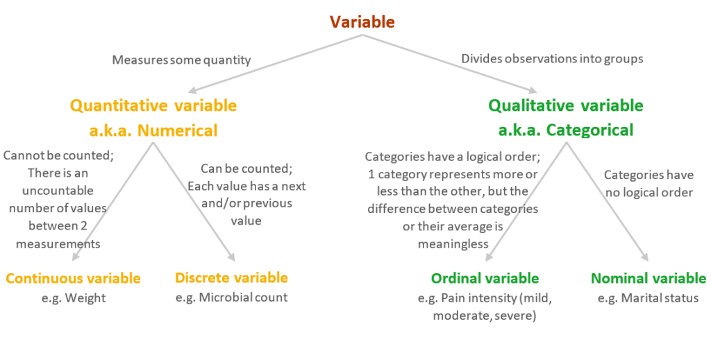{fig-align="center" width="397"}

## A general difference is ...

</br>

- Quantitative variables (discrete or continuous) are those where addition or subtraction makes sense.

- Categorical variables (nominal or ordinal) are those where addition or subtraction does **NOT** make sense.

# One Categorical Variable

## Example 1: Penguins dataset

We will illustrate the concepts using the `penguins.xlsx` dataset. We will focus on visualizing the categorical variable `species`.

```{python}
#| fig-pos: center
#| echo: true
#| output: true

import pandas as pd
penguins_data = pd.read_excel("penguins.xlsx")
penguins_data.filter(["species", "island", "sex"])
```

## Principle 2: Turn data into information

::: {style="font-size: 90%;"}
As a starting point,we compute the frequencies of each category of `species` using the **pandas** functions `.filter()`, `.groupby()` and `.agg()`.

- The `.groupby()` function takes an existing table and converts it into a grouped table where operations are performed "by group".

- The `.size()` function counts the values in a category.
:::

```{python}
#| fig-pos: center
#| echo: true
#| output: false

frequencies_species = (penguins_data 
                      .groupby("species")
                      .size()
                      )
```

## Frequency table

</br>

```{python}
#| fig-pos: center
#| echo: true
#| output: true

frequencies_species
```

</br>

We save the frequency table for further processing with Flourish studio using the command below.

```{r}
#| fig-pos: center
#| echo: true
#| output: true

# frequencies_species.to_excel("PenguinsDataFlourish.xlsx")
```

## Bar chart

Shows frequencies of the categories of a categorical variable.

::: {.flourish-embed .flourish-chart data-src="visualisation/26426128"}
```{=html}
<script src="https://public.flourish.studio/resources/embed.js"></script>
```

<noscript></noscript>
:::

## Construct a bar chart in Flourish

{fig-align="center"}

## 

In the visualization gallery, choose **Bar Chart**.

{fig-align="center"}

## Replace the data with your own

::::: columns
::: {.column width="50%"}
{fig-align="center"}
:::

::: {.column width="45%"}
{fig-align="center"}
:::
:::::

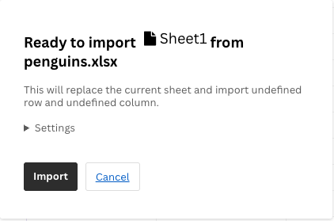{fig-align="center" width="294"}

## Select the correct variables

Make sure that you uploaded the file "PenguinsDataFlourish.xlsx" and not the original one.

Now, we assign the variable `species` to **Labels/time**, and `Frequency` to **Values**.

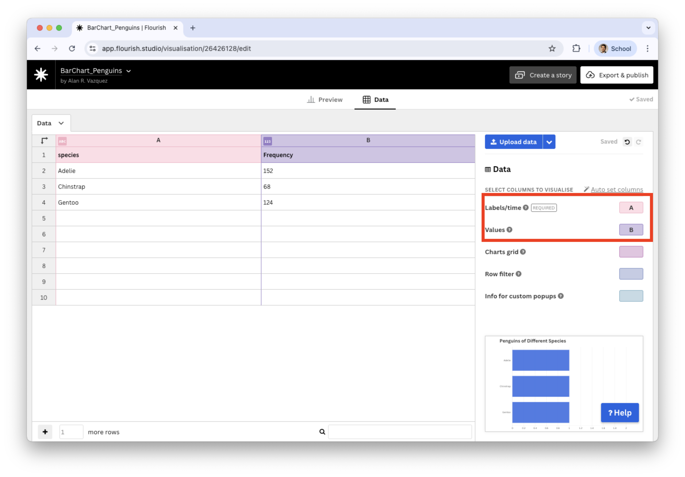{fig-align="center"}

## 

The preview plot has all bars at the same height. To replace the height for the frequencies of the categories, we change the **Agregation mode** to *None*.

::::: columns
::: {.column width="50%"}
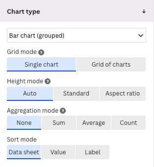{fig-align="center"}
:::

::: {.column width="50%"}
{fig-align="center"}
:::
:::::

We also change the **Height mode** to *Standard* to enhance the visualization.

## Principle 1: Define the message

Following Principle 1 of data visualization, we add a header or title to the plot by going to the section **Header**.

::::: columns
::: {.column width="50%"}
{fig-align="center"}
:::

::: {.column width="50%"}
{fig-align="center"}
:::
:::::

## Final bar chart

{fig-align="center"}

We see that most penguins are Adelie.

## Example 2: Boston Housing Dataset

This dataset contains information collected by the U.S. Census Bureau on housing in the Boston, Massachusetts area. The dataset is in `Boston_dataset.xlsx`.

::::: columns
::: {.column width="60%"}
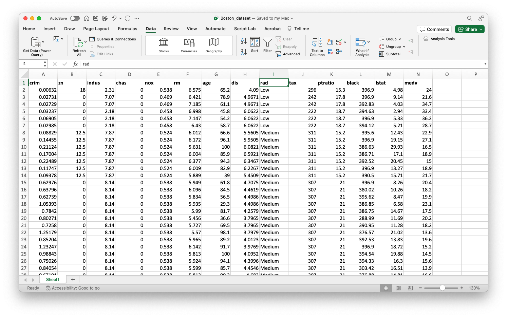
:::

::: {.column width="40%"}

:::
:::::

```{python}
#| fig-pos: center
#| echo: false
#| output: true

Boston_dataset = pd.read_excel("Boston_dataset.xlsx")
```

## 

</br></br>

We concentrate on the following variables:

- `chas` : Whether the house is next to the Charles River (1: Yes and 0: No)

- `rad` : Index of accessibility to radial highways (0: Low, 1: Medium, 2: High).

## Data wrangling with Python

:::::: columns
::: {.column width="60%"}

</br>

To create a effective bar plots in Flourish, we must wrangle the variables `chas` and `rad` a little bit.

Specifically, we must ensure that these variables are categorical and their categories have the appropriate names.
:::
::: {.column width="40%"}
```{python}
#| fig-pos: center
#| echo: true
#| output: true

(Boston_dataset
.filter(["chas", "rad"])
)
```
:::
:::
## 

</br></br>

To this end, we replace the 0 and 1 of `chas` for the label "No" and "Yes", respectively, using `.replace()`.

```{python}
#| fig-pos: center
#| echo: true
#| output: false

Boston_dataset['chas'] = Boston_dataset['chas'].replace(0, 'No')
Boston_dataset['chas'] = Boston_dataset['chas'].replace(1, 'Yes')
```

</br>

Using this function, we replace the 0, 1, and 2 in the variable `rad` by "Low", "Medium", and "High", respectively.

```{python}
#| fig-pos: center
#| echo: true
#| output: false

Boston_dataset['rad'] = Boston_dataset['rad'].replace(0, 'Low')
Boston_dataset['rad'] = Boston_dataset['rad'].replace(1, 'Medium')
Boston_dataset['rad'] = Boston_dataset['rad'].replace(2, 'High')
```

## 

</br>

Now, the columns show the actual category labels instead of the coded (or number) labels.

```{python}
#| fig-pos: center
#| echo: true
#| output: true

Boston_dataset.filter(["chas", "rad"]) 
```

## 

</br></br>

For the bar chart, we compute the frequencies of the categories of `chas` and `rad`.

```{python}
#| fig-pos: center
#| echo: true
#| output: true
frequencies_Boston_chas = (Boston_dataset 
                          .groupby("chas")
                          .size())

frequencies_Boston_rad = (Boston_dataset 
                          .groupby("rad")
                          .size())
```

## 

We save the new datasets using the function `.to_excel()` from the **pandas**.

```{r}
#| fig-pos: center
#| echo: true
#| output: true

#frequencies_Boston_chas.to_excel("BostonDataFlourishChas.xlsx")
#frequencies_Boston_rad.to_excel("BostonDataFlourishRad.xlsx")
```

We then proceed to visualize the processed data using [Flourish](https://flourish.studio/).

{fig-align="center"}

## Let's create a bar chart for `chas`.

We load the dataset "BostonDataFlourishChas.xlsx" into Flourish.

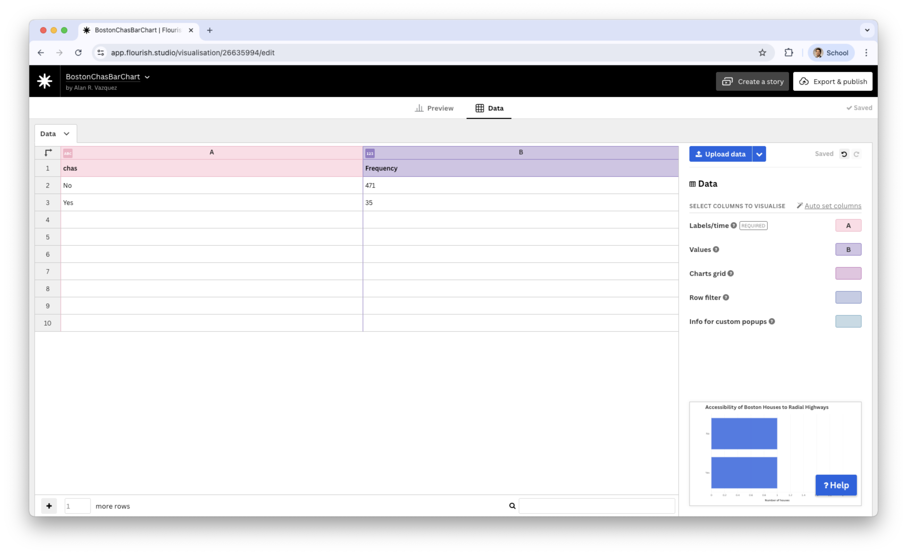{fig-align="center"}

## 

We assign the `chas` variable to the **Labels/time** and `Frequency` to **Values**.

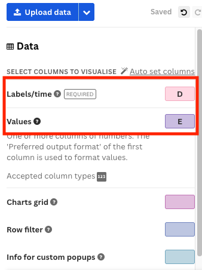{fig-align="center"}

## 

Now, we go back to the **Preview** tab and set **Aggregation mode** to *None*.

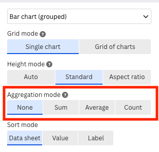{fig-align="center"}

## 

</br>

In the menu of the **Preview** tab, we add a title and a good label for the horizontal axis.

::::: columns
::: {.column width="50%"}
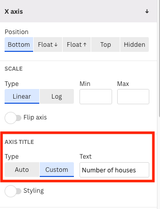{fig-align="center"}
:::

::: {.column width="50%"}
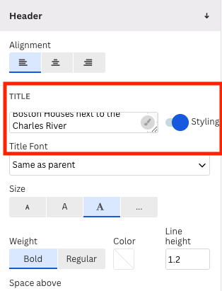{fig-align="center"}
:::
:::::

## Bar chart for `chas`

::: {.flourish-embed .flourish-chart data-src="visualisation/26635994"}
```{=html}
<script src="https://public.flourish.studio/resources/embed.js"></script>
```

<noscript></noscript>
:::

## Similarly, we create a bar chart for `rad`

::: {.flourish-embed .flourish-chart data-src="visualisation/26428955"}
```{=html}
<script src="https://public.flourish.studio/resources/embed.js"></script>
```

<noscript></noscript>
:::

## Collapsing categories

</br>

Some categorical variables tend to have many categories. For example, states in a country or postal codes. In these cases, it can be difficult to visualize all the categories in a single graph.

One strategy for developing an effective visualization is to collapse categories.

For example, in the variable `rad`, we can collapse the categories `Medium` and `High` into a single category called `Other`.

## 

We collapse categories using the function called `.where()`.

```{python}
#| fig-algin: center
#| echo: true
#| output: true

Boston_dataset_simple = Boston_dataset.copy()
Boston_dataset_simple["rad"] = (Boston_dataset_simple
                                .filter(["rad"])
                                .where(Boston_dataset_simple["rad"] == "Low", "Other")
                                )
```

Collapsing categories simplifies the graph and allows us to emphasize a category like `Low` and see how it compares to the other categories (as a whole).

</br>

We save the new dataset using the function `.to_excel()`.

```{python}
#| fig-pos: center
#| echo: true
#| output: true

# Boston_dataset_simple.to_excel("BostonCollapsed.xlsx")
```

We then proceed to visualize the processed data using [Flourish](https://flourish.studio/).

## The resulting bar chart

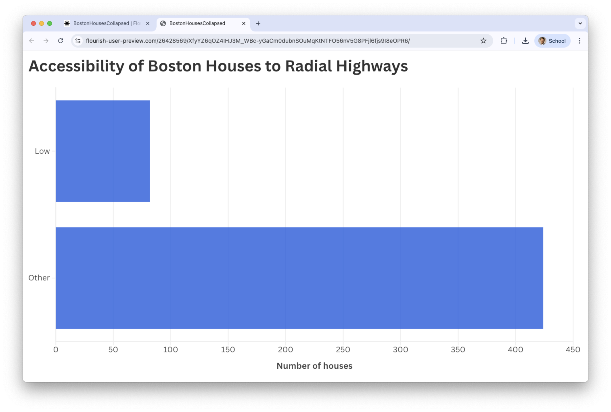{fig-align="center"}

# One Numerical Variable

## Example 3

::::: columns
::: {.column width="70%"}
A piston is a mechanical device found in most engines.
:::

::: {.column width="30%"}
{width="402"}
:::
:::::

One measure of a piston's performance is the time it takes to complete a cycle, which we call "cycle time" and is measured in seconds.

The file "CYLT.xlsx" contains 50 cycle times of a piston operating under fixed conditions.

```{python}
#| fig-pos: center
#| echo: false
#| output: true

piston_data = pd.read_excel("CYCLT.xlsx") 
```

## Beeswarm

</br>

Visualizes the distribution of individual observations along a numeric axis.

. . .

- Each point represents one data value, and the points are arranged to avoid overlapping—similar to bees clustering around a hive.
- This makes it easy to see where observations are dense or sparse, while still showing *every* individual data point.

## 

::: {.flourish-embed .flourish-scatter data-src="visualisation/26426925"}
```{=html}
<script src="https://public.flourish.studio/resources/embed.js"></script>
```

<noscript></noscript>
:::

## 

</br></br></br>

- Unlike histograms, which aggregate counts into bars, **beeswarm plots preserve every point**, giving a more detailed picture of the underlying distribution.

## Beeswarm in Flourish

Beeswarm is in the section **Scatter** of the catalog of visualizations in Flourish.

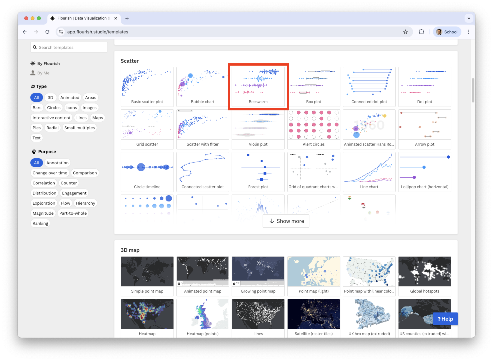{fig-align="center"}

## 

In the Beeswarm plot, we replace the current data with the data in "CYLT.xlsx" in the **Data** tab.

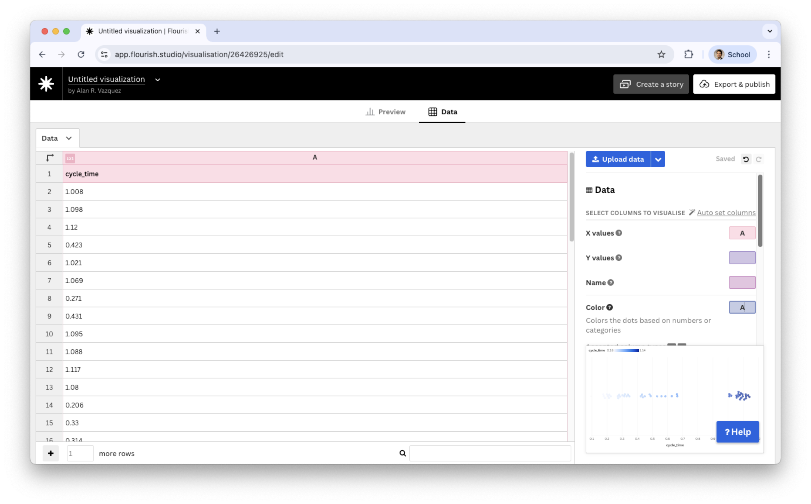{fig-align="center"}

## 

In the **Data** tab, we only assign the `cycle_time` variable to the **X values** section.

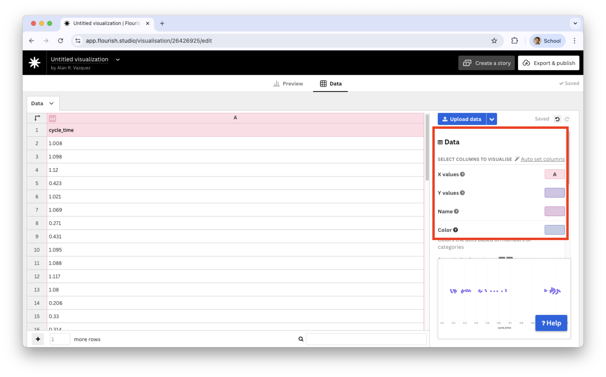{fig-align="center"}

## 

Let's go back to the **Preview** tab.

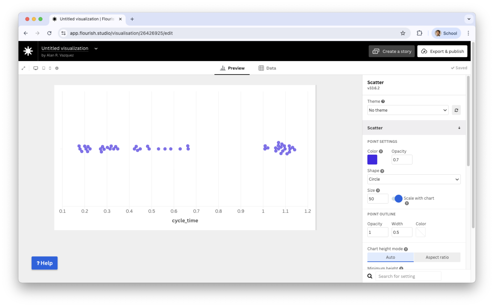{fig-align="center"}

## 

There, we modify the label of the horizontal axis X and header in the sections **X axis** and **Header**.

::::: columns
::: {.column width="70%"}
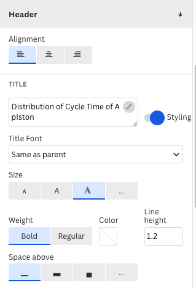{fig-align="center"}
:::

::: {.column width="30%"}
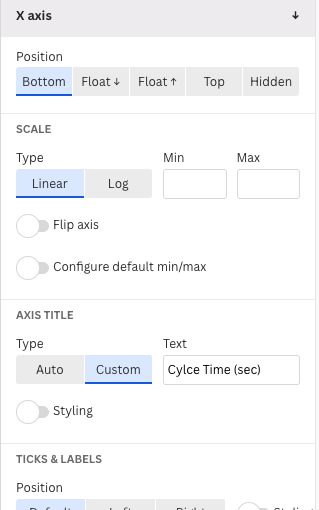{fig-align="center"}
:::
:::::

## Beeswarm plot

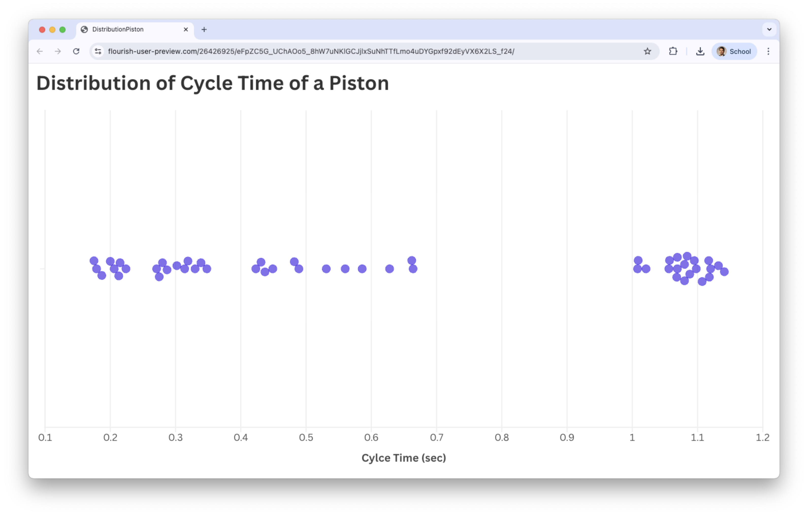{fig-align="center"}

## What to look for in a beeswarm plot?

</br>

- Clusters of points that reveal **dense regions** in the distribution.
- Areas where points are more spread out, indicating **low-frequency** regions.
- **Gaps** along the axis where no observations appear.
- **Outliers**, visible as isolated points far from the main cluster.
- The overall **shape of the distribution** formed by the pattern of points.

# [Return to main page](https://alanrvazquez.github.io/TEC-IN2039-EN/)
