## Agenda

</br>

1.  Introduction to Multivariate Data
2.  Scatter Plots
3.  Line Plots
4.  Plots for Categorical Variables


# Introduction to Multivariate Data

## Multivariate data

</br>

Multivariate data consists of datasets that contain observations of two or more variables.

::: incremental
-   Variables can be numerical or categorical.

-   Variables may or may not depend on each other.
:::

. . .

In fact, the **goal** is to determine whether there is a relationship between the variables and the type of relationship.

## Example 1

Consider data from 392 cars, including miles per gallon, number of cylinders, horsepower, weight, acceleration, year, origin, among other variables. The data is in the file "auto_dataset.xlsx".

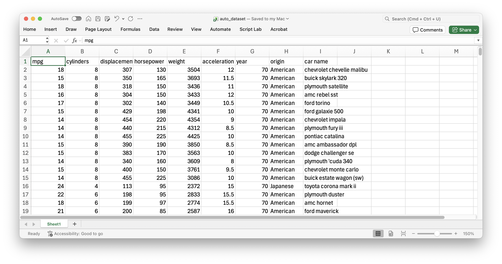{fig-align="center"}

```{r}
#| echo: false
#| output: false

library(readxl)
library(tidyverse)
library(ggformula)
auto_data = read_excel("auto_dataset.xlsx") 
auto_data %>% head()
```

## Principle 1: Define the question

In the context of multiple-variable data, typical questions to study include:

::: incremental
-   How are variable $X$ and variable $Y$ related?

-   Is the distribution of variable $X$ the same across all subgroups defined by variable $Z$?

-   Are there any unusual observations in the combination of values for variables $X$ and $Y$?

-   Are there any unusual observations in $X$ for a subgroup of variable $Z$?
:::

## Principle 2: Turn data into information

There are various types of graphs that help us explore relationships between two or more variables.

</br>

::: center
| Type        | Graph Type                              |
|:------------|:----------------------------------------|
| Numerical   | Scatter plot, line graph                |
| Categorical | Side-by-side bar plot, stacked bar plot |
| Mixed       | Bar Plot                                |
:::

::: notes
For two features, the combination of types (both quantitative, both qualitative, or a mix) matters.
:::

## Independent and dependent variables

When investigating the relationship between two variables (numerical or categorical), we use specific terminology.

. . .

One variable is called the *dependent* or *response variable*, denoted by the letter $Y$.

. . .

The other variable is called the *independent* or *predictor variable*, denoted by the letter $X$.

. . .

> Our goal is to determine whether changes in $X$ are associated with changes in $Y$, and the nature of this association.

# Scatter plot

## Scatter plot

</br>

The most common graph for examining the relationship between two numerical variables is the [***scatter plot***]{style="color:#174062;"}.

. . .

Variables $X$ and $Y$ are placed on the horizontal and vertical axes, respectively. Each point on the graph represents a pair of $X$ and $Y$ values.

. . .

</br>

> The goal is to explore linear or non-linear relationships between variables.

## Scatter plot

::: {.flourish-embed .flourish-scatter data-src="visualisation/26430283"}
```{=html}
<script src="https://public.flourish.studio/resources/embed.js"></script>
```

<noscript></noscript>
:::

## Individual graphs

</br></br>

Individual variable graphs (such as histograms) do not allow us to study the relationship between two variables. They only provide information on the *distribution* of each variable.

::::: columns
::: {.column width="50%"}
```{r}
#| fig-align: center
#| echo: false
#| output: true

histogram_mpg = gf_histogram( ~ mpg, data = auto_data, fill = "darkblue", color = "black") 
histogram_mpg = histogram_mpg + labs(title = "Distribution of MPG", x = "Miles Per Gallon (MPG)", y = "Frequency")
histogram_mpg = histogram_mpg + theme(axis.text=element_text(size=20), axis.title=element_text(size=20),
                                       plot.title=element_text(size=25))
histogram_mpg
```
:::

::: {.column width="50%"}
```{r}
#| fig-align: center
#| echo: false
#| output: true

histogram_weight = gf_histogram( ~ weight, data = auto_data, fill = "darkblue", color = "black") 
histogram_weight = histogram_weight + labs(title = "Distribution of Weight", x = "Weight (lb)", y = "Frequency")
histogram_weight = histogram_weight + theme(axis.text=element_text(size=20), axis.title=element_text(size=20), plot.title=element_text(size=25))
histogram_weight
```
:::
:::::

## Generate scatter plot in Flourish

Select *Scatter* in the catalog of visualizations.

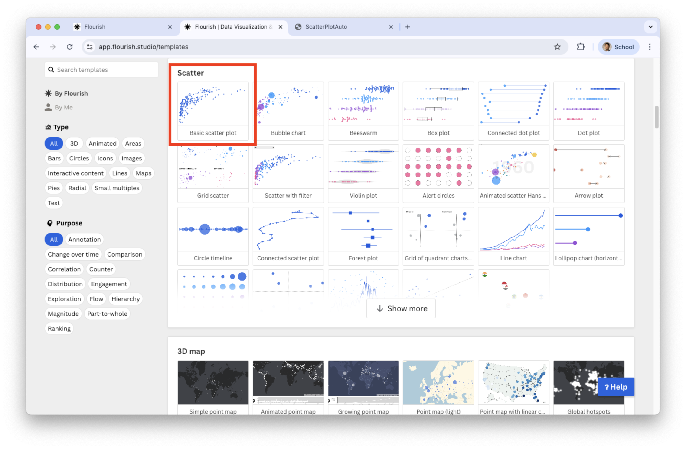{fig-align="center"}

## 

Next, load the "auto_dataset.xlsx" into Flourish. Set the variables under study `mpg` and `weight` and assign them to **Y values** and **X values**, respectively.

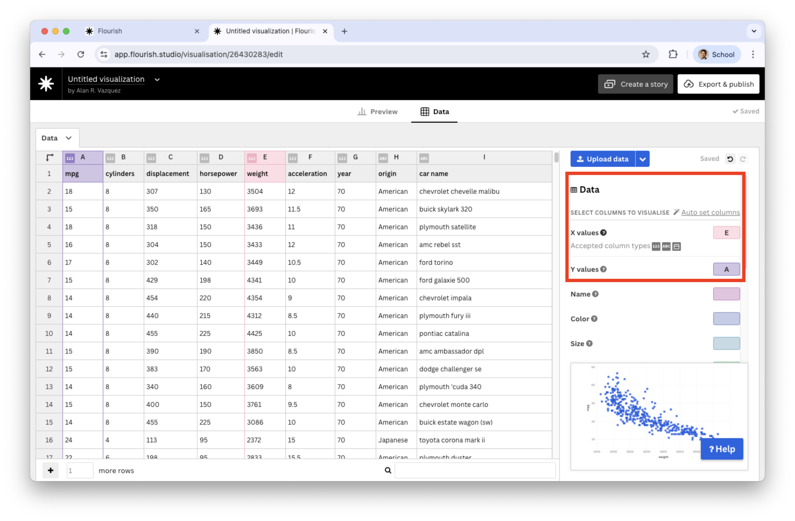{fig-align="center"}

## 

Go back to the **Preview** tab and add text to the axes and title.

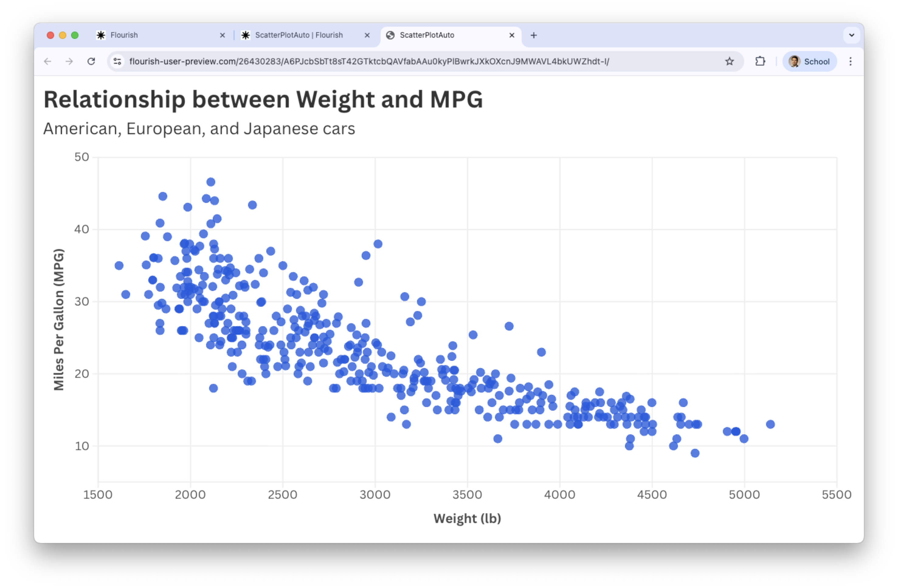{fig-align="center"}

## Plots for three or four variables

</br>

-   When examining a distribution or relationship, we often want to compare it across data subgroups.

-   This process of conditioning on additional variables leads to visualizations involving three or more variables.

-   We now illustrate how to extend the scatter plot to visualize multiple variables.

## Scatter plot by color

::: {.flourish-embed .flourish-scatter data-src="visualisation/26496861"}
```{=html}
<script src="https://public.flourish.studio/resources/embed.js"></script>
```

<noscript></noscript>
:::

## Add color to the scatter plot

We a categorical variable in the **Color** section. For example, let's use `origin`.

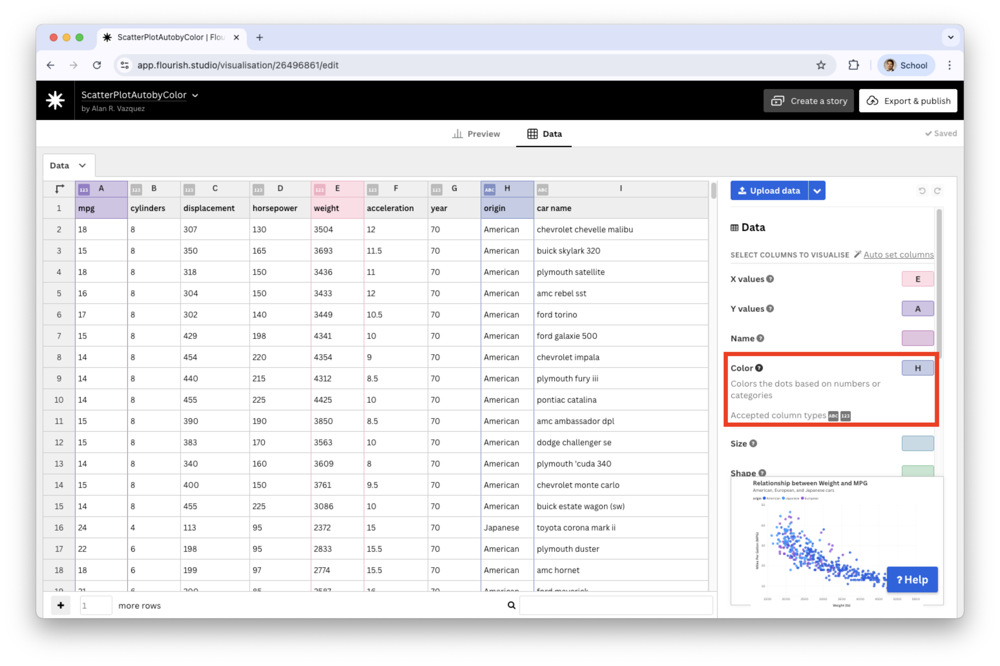{fig-align="center"}

## The result

Scatter plots by color work well when the additional variable $Z$ is categorical with few categories.

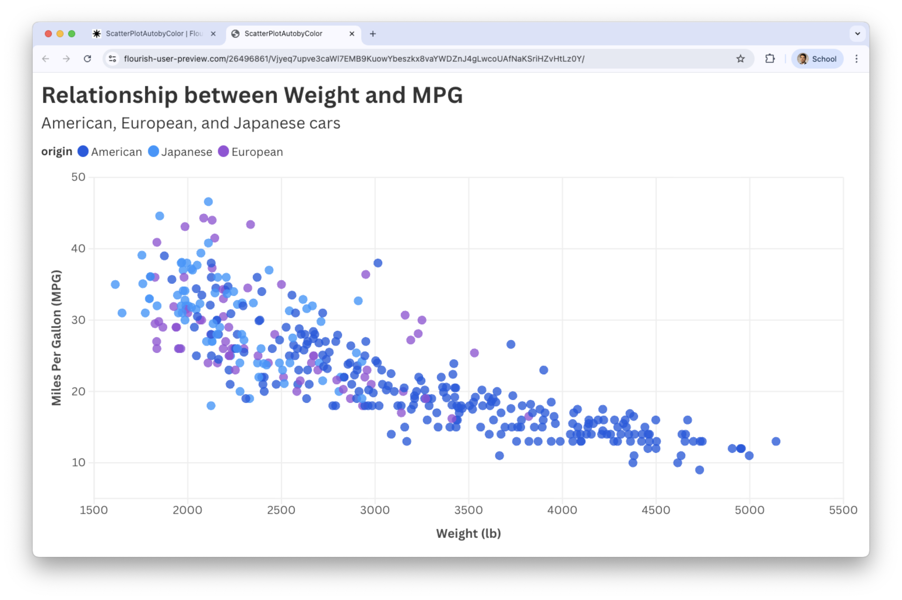{fig-align="center"}

## Bubble Plot: Scatter for 4 variables

::: {.flourish-embed .flourish-scatter data-src="visualisation/26497298"}
```{=html}
<script src="https://public.flourish.studio/resources/embed.js"></script>
```

<noscript></noscript>
:::

## Add bubbles to the scatter plot

We set a variable in the **Size** section, say, `horsepower`.

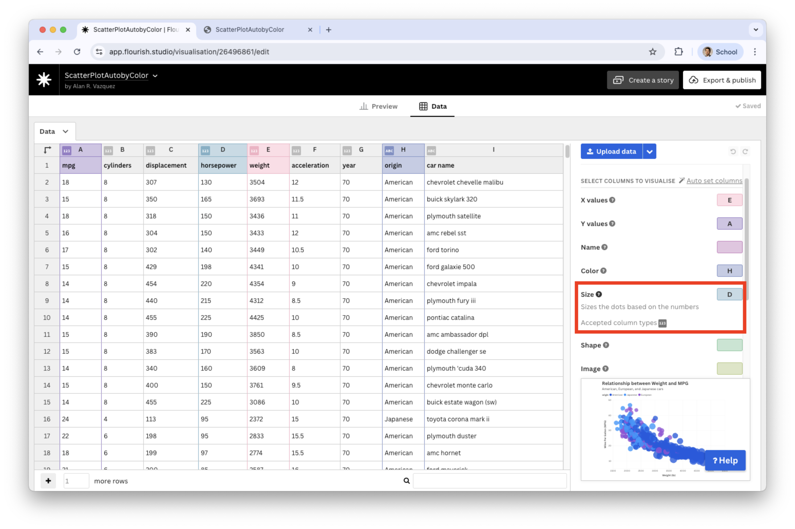{fig-align="center"}

## Resulting bubble plot

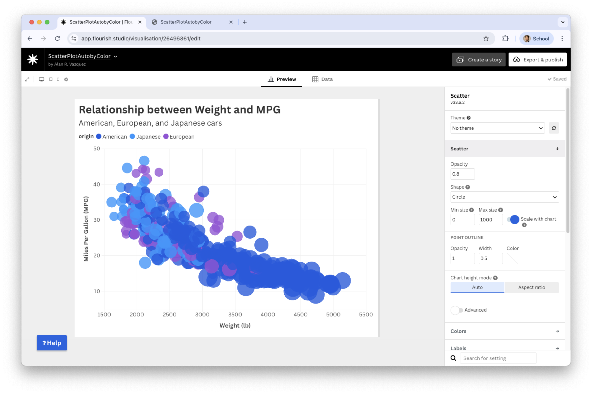{fig-align="center"}

## Improve the bubble plot

We can enhance the plot by reducing the minimum and maximum sizes for the bubbles. Let's set the maximum size to 200.

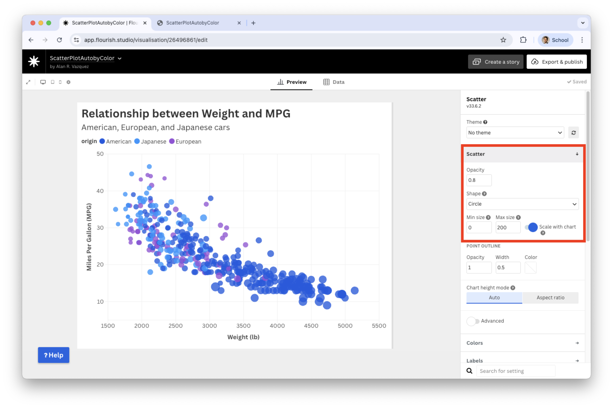{fig-align="center"}

## Final bubble plot

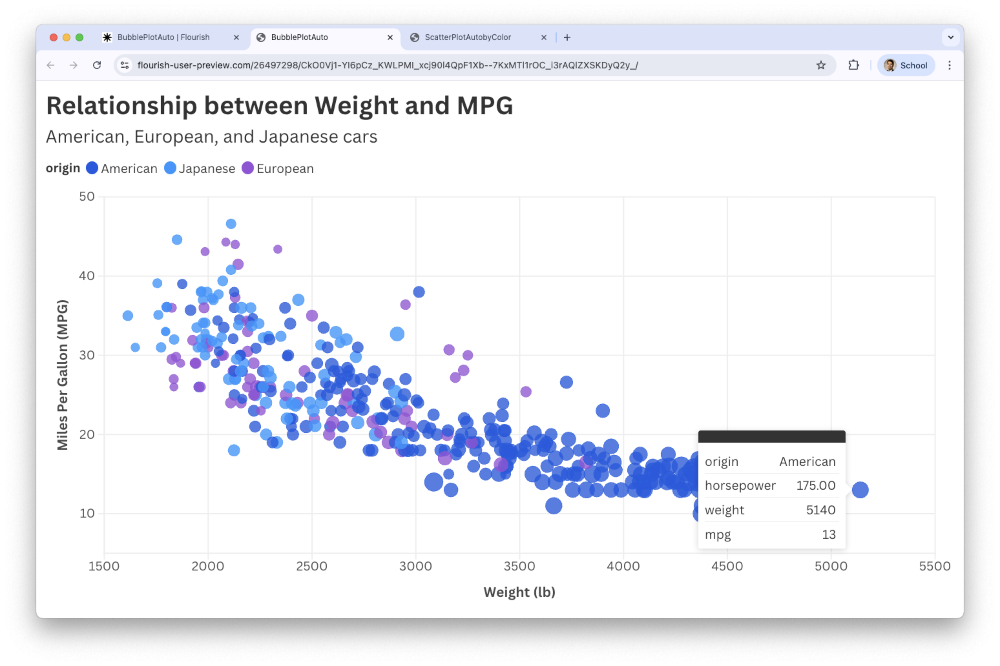{fig-align="center"}

# Line Plots

## Line plot

A line plot is a visual representation of data where data points are connected by a line. Axes:

-   $X$ (horizontal): Represents time or the independent variable.
-   $Y$ (vertical): Represents the dependent variable.

Each point represents a value at a given moment.

. . .

> The objective is to explore trends over time or the evolution of a continuous variable.

## Example 2

Consider the data in the file "spotify.xlsx". This dataset contains the global daily streams of the top five most popular songs on the music streaming service Spotify in 2017.

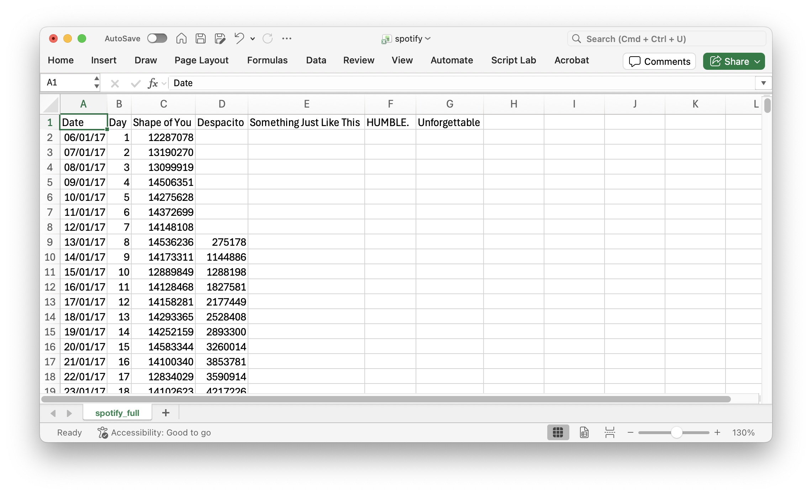{fig-align="center"}

## Line plot

::: {.flourish-embed .flourish-chart data-src="visualisation/26497776"}
```{=html}
<script src="https://public.flourish.studio/resources/embed.js"></script>
```

<noscript></noscript>
:::

## Generate a line plot in Flourish

Select *Line chart* in the catalog of visualizations.

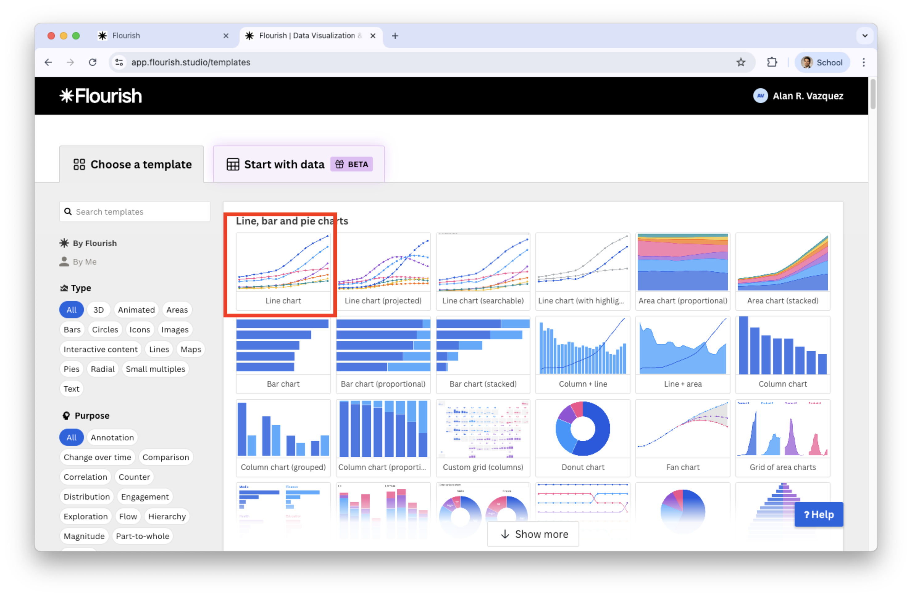{fig-align="center"}

## 

Next, load the "auto_dataset.xlsx" into Flourish. Set the variables under study `Date` and `Despacito` and assign them to **Labels/time** and **Values**, respectively.

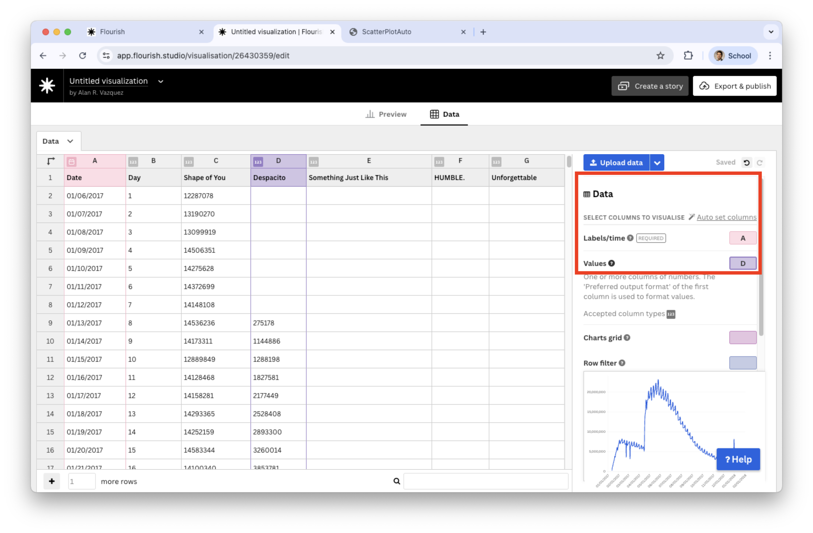{fig-align="center"}

## 

Go back to the **Preview** tab and add text to the axes and title.

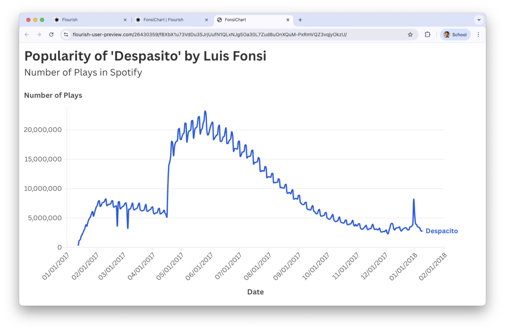{fig-align="center"}

## Multiple line charts

We can visualize multiple variables simultaneously using a line plot. For example, we can show the evolution of play counts for the 5 songs in the file "spotify.xlsx" over time.

To this end, simply go back to the **Data** tab and set a range of variables in **Values**.

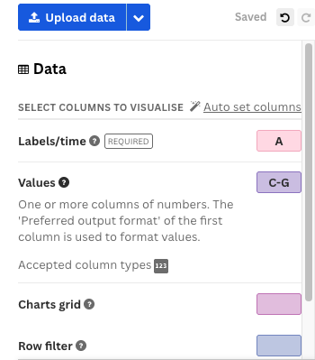{fig-align="center"}

## 

::: {.flourish-embed .flourish-chart data-src="visualisation/26430359"}
```{=html}
<script src="https://public.flourish.studio/resources/embed.js"></script>
```

<noscript></noscript>
:::

# Plots for Categorical Variables

## Plotting the average by groups

-   We can summarize the values of the numerical variable $Y$ for each category of a categorical variable $X$ using the *mean* or *average*.

-   For example, let's plot the average miles per gallon of cars produced in America, Europe, and Japan.

-   A common visualization for plotting a numerical and a discrete variable when there is only one value per category is the **bar plot**.

-   The bar plot encodes quantitative data across different categories.

## Bar plot for averages

::: {.flourish-embed .flourish-chart data-src="visualisation/26430455"}
```{=html}
<script src="https://public.flourish.studio/resources/embed.js"></script>
```

<noscript></noscript>
:::

## Generate bar plot in Flourish

Select *Bar chart* in the catalog of visualizations.

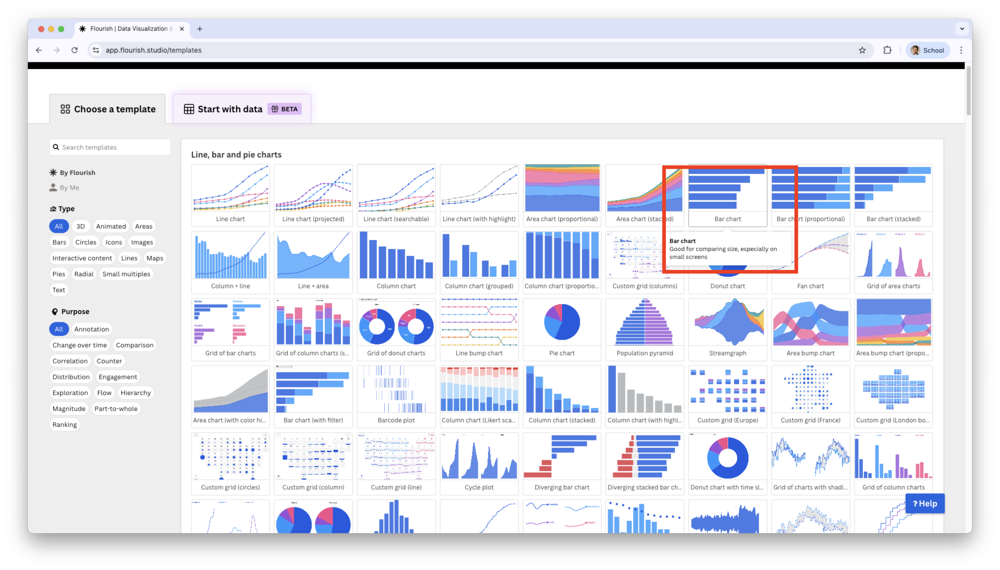{fig-align="center"}

## 

Load the "auto_dataset.xlsx" into Flourish. Set the variables under study `origin` and `mpg` and assign them to **Labels/time** and **Values**, respectively.

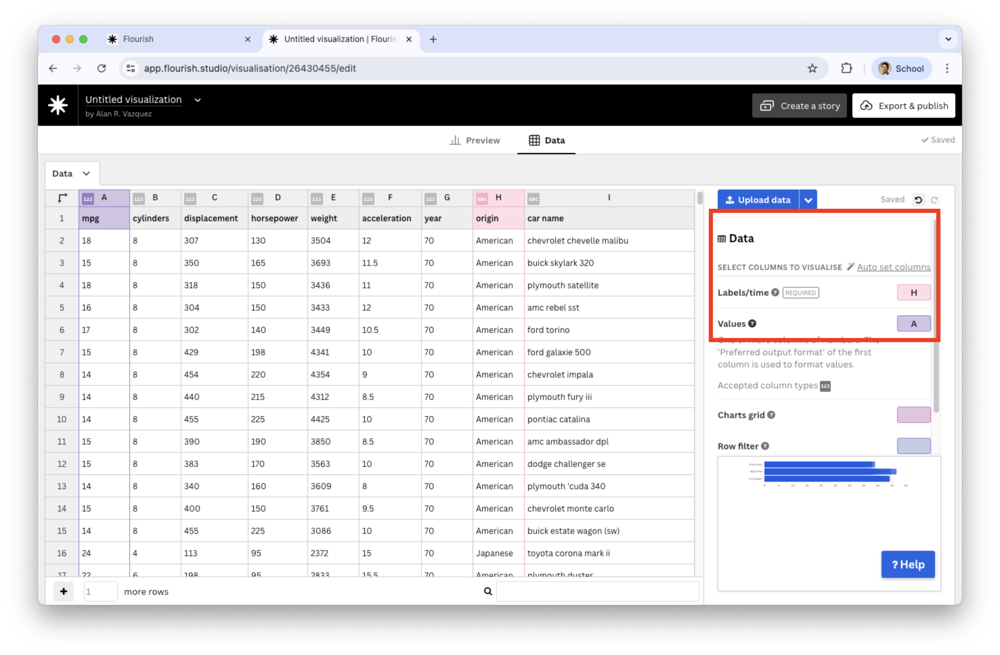{fig-align="center"}

## 

Go to the **Preview** tab and set *Average* in **Aggregation mode**.

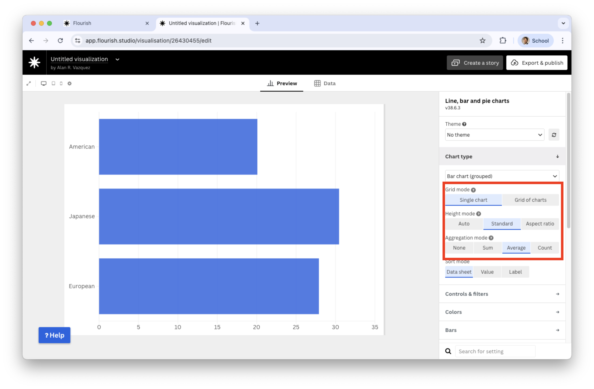{fig-align="center"}

## Two Categorical Variables

With two categorical variables, we compare the distribution of one variable across subgroups defined by the other variable.

In fact, we keep one variable constant and plot the distribution of the other.

. . .

To do this, there are old and new plots:

-   Hierarchical bar plot
-   Tree map plot
-   Circle packing plot

## Example 3

As an example, let's consider the data in the file "penguins.xlsx" again.

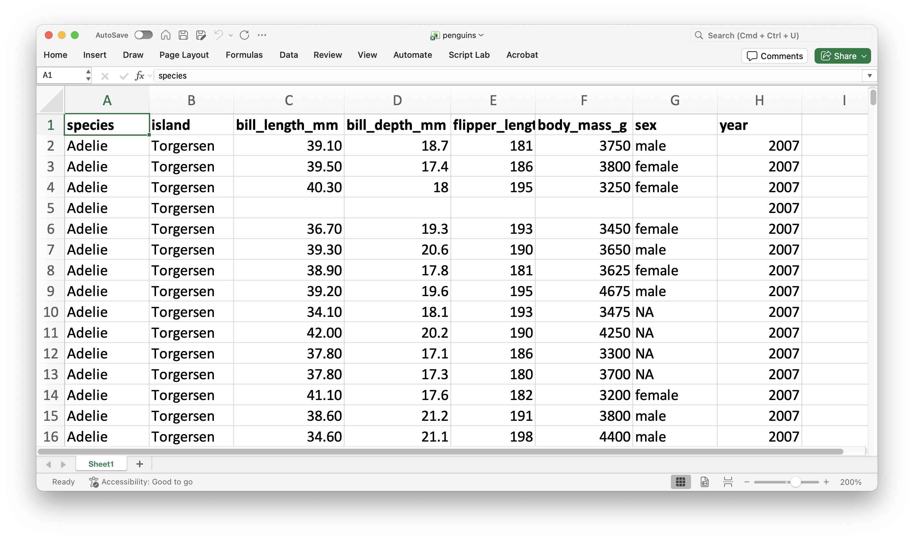{fig-align="center"}

For instance, let's study the distribution of penguin species across the three different islands using an stacked bar chart.

## Hierarchical bar plot

::: {.flourish-embed .flourish-hierarchy data-src="visualisation/26498177"}
```{=html}
<script src="https://public.flourish.studio/resources/embed.js"></script>
```

<noscript></noscript>
:::

## Create a hierarchical plot in Flourish

Search and select the plot in the catalog of visualizations.

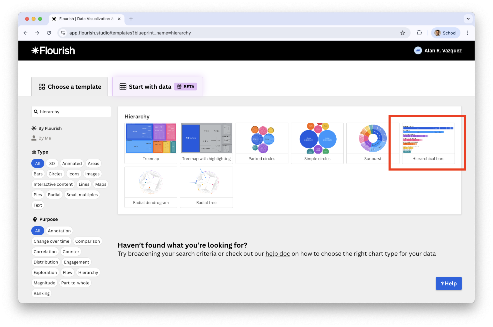{fig-align="center"}

## 

After you load the "penguins.xlsx" data, select two categorical variables in the **Categories/nesting** section.

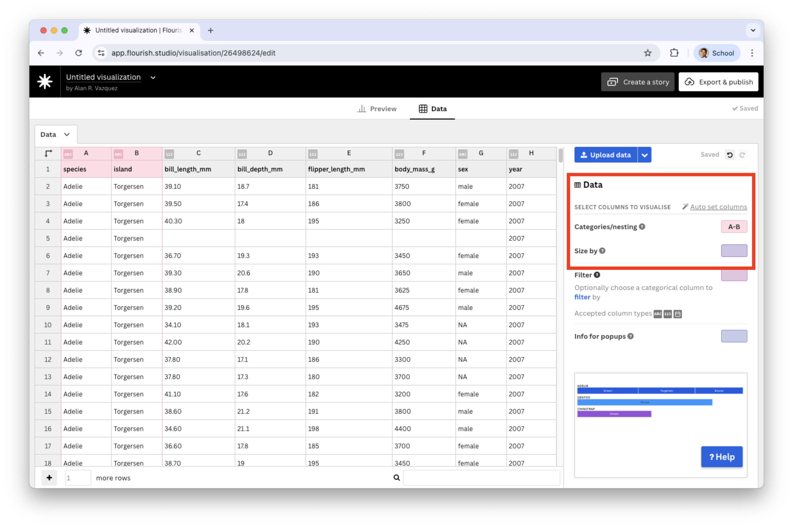{fig-align="center"}

## 

To enhance the plot, switch off the automatic height

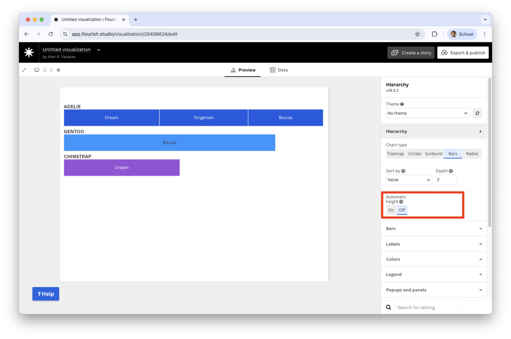{fig-align="center"}

## Final hierarchical bar plot with titles

The chart shows the frequency of species and island name.

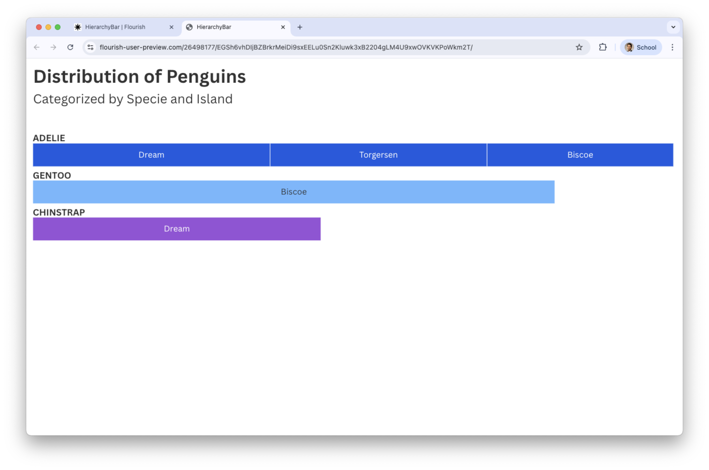{fig-align="center"}

## If you change hierarchy to tree

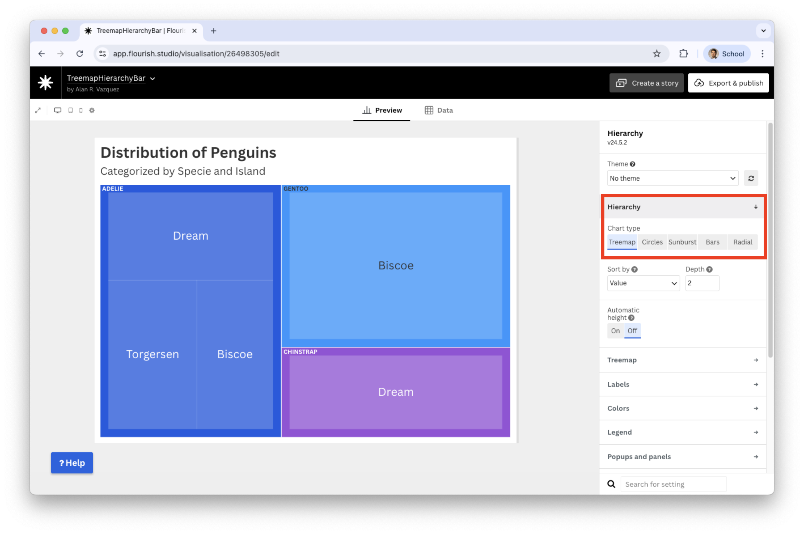{fig-align="center"}

## Tree map plot

::: {.flourish-embed .flourish-hierarchy data-src="visualisation/26498305"}
```{=html}
<script src="https://public.flourish.studio/resources/embed.js"></script>
```

<noscript></noscript>
:::

## If you change hierarchy to circles

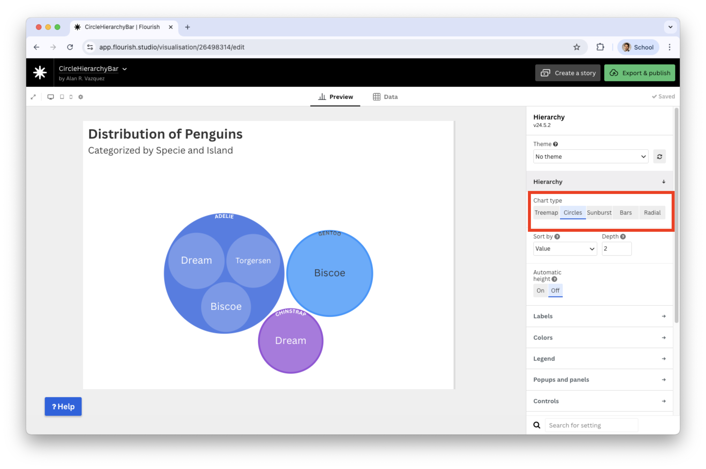{fig-align="center"}

## Circle packing plot

::: {.flourish-embed .flourish-hierarchy data-src="visualisation/26498314"}
```{=html}
<script src="https://public.flourish.studio/resources/embed.js"></script>
```

<noscript></noscript>
:::

## Discussion

Visualizations such as hierarchy bars, tree maps, and circle packing plots help us explore how two categorical variables relate through *nested structure*.

-   **Hierarchy bar charts** are easy to read when one category has only a few levels. The show a clear sense of order from parent → child categories.

-   **Tree maps** are excellent use of space when there are many subcategories. The area encodes quantity, helping highlight dominant groups.

## 

</br></br></br>

-   **Circle packing plots** are more visually appealing and intuitive for showing nested groups. They are helpful when emphasizing *clusters* rather than exact magnitudes.

# [Return to main page](https://alanrvazquez.github.io/TEC-IN2039-EN/)
