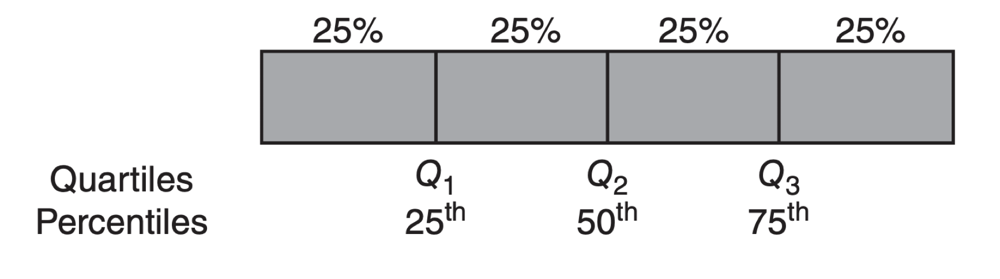
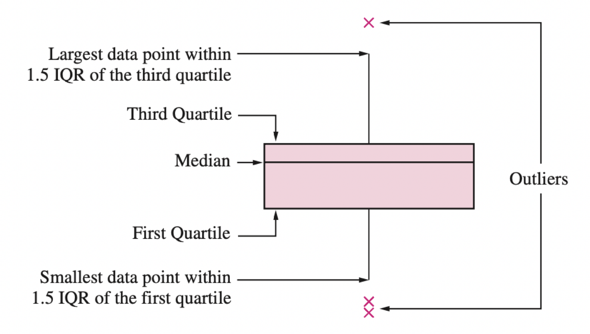

## Agenda

</br>

1.  One Numerical Variable
2.  Multiple Variables
  - Side-by-Side Box Plots
  - Regression Plots

# One Numerical Variable

## Example 1

::::: columns
::: {.column width="70%"}
A piston is a mechanical device found in most engines.
:::

::: {.column width="30%"}
{width="402"}
:::
:::::

One measure of a piston's performance is the time it takes to complete a cycle, which we call "cycle time" and is measured in seconds.

The file "CYLT.xlsx" contains 50 cycle times of a piston operating under fixed conditions.

```{r}
#| fig-pos: center
#| echo: false
#| output: true

library(tidyverse)
library(readxl)
piston_data = read_excel("CYCLT.xlsx") 
```

## Summary statistic

> Helps us to summarize a list of observations in a simple way.

For **numerical** data, the most popular summary statistics are:

::: incremental
-   [Mean]{style="color:darkblue;"}
-   [Variance]{style="color:darkblue;"} and [standard deviation]{style="color:darkblue;"}
-   [Quartiles]{style="color:darkgreen;"}
-   Maximum and minimum
:::

## Mean

> Indicates the center of the data.

</br>

Let $y_1, y_2, \ldots, y_n$ be an observed sample of size $n$.

The mean is

$$\bar{y} = \frac{1}{n}\sum_{i=1}^{n} y_i = \frac{y_1 + y_2 + \cdots + y_n}{n}.$$

## 

</br>

In r, we can calculate the mean using chaining. To this end, we use the function `.agg()` with "mean".

```{r}
#| echo: true
#| output: true

piston_data_mean = (piston_data
                    .agg("mean")
                   )
piston_data_mean
```

## 

</br>

You can also round the result to, say, two decimals using the function `round()`.

```{r}
#| echo: true
#| output: true

piston_data_mean = (piston_data
 .agg("mean")
)
round(piston_data_mean, 2)
```

</br>

[*Interpretation:*]{style="color:darkgray;"} On average, the piston takes 0.652 seconds to complete a cycle.

## Variance

> Indicates how spread out the data are around the mean.

</br>

Let $y_1, y_2, \ldots, y_n$ be an observed sample of size $n$. The variance is

$$
s^2 = \frac{1}{n-1} \sum_{i=1}^{n} (y_i - \bar{y})^2 = \frac{(y_1 - \bar{y})^2  + \cdots + (y_n - \bar{y})^2}{n-1}
$$

. . .

*The variance is like an average of the squared differences between each observation and the mean.*

## 

</br>

In r, the variance is calculated using `.agg()` with "var".

```{r}
#| echo: true
#| output: true

piston_data_var = (piston_data
                  .agg("var")
                  )
round(piston_data_var, 3)
```

</br>

[*Interpretation:*]{style="color:darkgray;"} The variance of the piston cycle times is 0.139. *A larger variance means greater dispersion of the data around the mean.*

## Standard deviation

A drawback of the variance is that it is not on the same scale as the actual observations.

To obtain a measure of spread whose units are the same as those of the sample, we simply take the squared root of the variance

$$
s = \left(\frac{1}{n-1} \sum_{i=1}^{n} (y_i - \bar{y})^2 \right)^{1/2}
$$

This quantity is known as the standard deviation. [*It is in the same units as the observations*]{style="color:purple;"}.

## 

</br>

In r, the standard deviation is calculated using the the function `.agg()` and with "std".

```{r}
#| echo: true
#| output: true

piston_data_sd = (piston_data
                  .agg("std")
                 )
round(piston_data_sd, 3)
```

</br>

[*Interpretation:*]{style="color:darkgray;"} On average, a piston takes 0.652 seconds to complete a cycle, with a variation of $\pm$ 0.373 seconds.

## Quartiles

The [**median**]{style="color:darkgreen;"} is the middle number of the ordered data values.

. . .

[**Quartiles**]{style="color:darkgreen;"} divide the data as nearly as possible into quarters:

::: incremental
-   First quartile ($Q_1$) is the median of the lower half of the data.

-   Second quartile ($Q_2$) is the median of the data.

-   Third quartile ($Q_3$) is the median of the upper half of the data.
:::

## 

</br></br>



</br>

The generalization of quartiles are percentiles or **quantiles**.

## 

In r, the quartiles are calculated using the function `.agg()` with "quantile".

::::: columns
::: {.column width="60%"}
```{r}
#| echo: true
#| output: true

# Set the quantiles.
set_quantiles = [0.25, 0.5, 0.75]
# Compute the quantiles.
(piston_data
 .agg("quantile", q = set_quantiles)
)
```
:::

::: {.column width="40%"}
[*Interpretation:*]{style="color:darkgray;"}

-   25% of cycle times are below 0.305 sec.

-   50% of cycle times are below 0.546 sec.

-   75% of cycle times are below 1.07 sec.
:::
:::::

## Maximum and minimum

We compute the **maximum** and **minimum** using `.agg()` with "max" and "min", respectively.

```{r}
#| echo: true
#| output: true

(piston_data
 .agg("max")
)
```

[*Interpretation:*]{style="color:darkgray;"} The maximum cycle time is 1.14 seconds.

```{r}
#| echo: true
#| output: true

(piston_data
 .agg("min")
)
```

[*Interpretation:*]{style="color:darkgray;"} The minimum cycle time is 0.175 seconds.

## Mean vs. Median

</br>

The mean and median estimate the central value of the data in different ways.

-   The mean is the sum of the values divided by the total.

-   The median is the central value of an ordered set of data.

## When do we use the mean?

</br>

The mean is used when the data is symmetrically or evenly distributed and there are no significant outliers.

</br>

For example, the height of a large sample of people in a homogeneous population.

## When do we use the median?

</br>

The median is used when there are outliers that could skew the mean.

For example:

-   Annual household income in a country (where there are a few billionaires who distort the mean).

-   House prices in a city (where a few very expensive properties can inflate the mean).

## Activity (*solo* mode) Part 1

A company that manufactures capacitor retaining bolts for automobile engines implemented a quality control system. As part of this quality control system, a team of engineers decided to record the number of nonconforming bolts produced each shift.

The file `bolts.xlsx` contains the number of non-conforming bolts during the last 45 shifts.

-   Calculate and interpret the mean, variance, standard deviation, quartiles, minimum and maximum.

## Boxplot

</br>

A boxplot helps us visualize the distribution of observations using quartiles.

. . .

> It is very effective for detecting "outliers."

. . .

An important component of the boxplot is the **interquartile range** (*IQR*), which is the difference between the third quartile and the first quartile ($Q_3 - Q_1$).

. . .

The interquartile range is the distance needed to encompass the middle half of the data.

## Anatomy of a Box Plot

{fig-align="center"}

Learn more here <https://builtin.com/articles/1-5-iqr-rule>

## Outliers

</br>

-   Outliers are points that are much larger or smaller than the rest of the sample points.

-   Outliers may be data entry errors or they may be points that really are different from the rest.

-   Outliers should not be deleted without considerable thought—sometimes calculations and analyses will be done with and without outliers and then compared.

## Boxplot in r

</br>

To create a boxplot in **seaborn**, use the `boxplot()` function.

```{r}
#| fig-align: center
#| output: true
#| echo: true

plt.figure(figsize=(5, 4))
sns.boxplot(piston_data, y = "cycle_time")
plt.show()
```

## 

</br>

If we specify the variable in the `x` argument, we get a horizontal boxplot.

```{r}
#| fig-align: center
#| output: true
#| echo: true

plt.figure(figsize=(5, 4))
sns.boxplot(piston_data, x = "cycle_time")
plt.show()
```


# Multiple Variables

## Multivariate data

</br>

Multivariate data consists of datasets that contain observations of two or more variables.

::: incremental
-   Variables can be numerical or categorical.

-   Variables may or may not depend on each other.
:::

. . .

In fact, the **goal** is to determine whether there is a relationship between the variables and the type of relationship.

## Example 2

</br>

Consider data from 392 cars, including miles per gallon, number of cylinders, horsepower, weight, acceleration, year, origin, among other variables. The data is in the file "auto_dataset.xlsx".

```{r}
#| echo: false
#| output: true

auto_data = read_excel("auto_dataset.xlsx") 
auto_data %>% head()
```

## Principle 1: Define the question

In the context of multiple-variable data, typical questions to study include:

::: incremental
-   How are variable $X$ and variable $Y$ related?

-   Is the distribution of variable $X$ the same across all subgroups defined by variable $Z$?

-   Are there any unusual observations in the combination of values for variables $X$ and $Y$?

-   Are there any unusual observations in $X$ for a subgroup of variable $Z$?
:::

## Principle 2: Turn data into information

There are various types of graphs that help us explore relationships between two or more variables.

</br>

::: center
| Type        | Graph Type                                |
|:------------|:------------------------------------------|
| Numerical   | Regression plot                           |
| Mixed       | Side-by-side box plot                     |
:::

::: notes
For two features, the combination of types (both quantitative, both qualitative, or a mix) matters.
:::

## Independent and dependent variables

When investigating the relationship between two variables (numerical or categorical), we use specific terminology.

. . .

One variable is called the *dependent* or *response variable*, denoted by the letter $Y$.

. . .

The other variable is called the *independent* or *predictor variable*, denoted by the letter $X$.

. . .

> Our goal is to determine whether changes in $X$ are associated with changes in $Y$, and the nature of this association.

## A Categorical and a Numerical Variable

To examine the relationship between a numerical and a categorical variable, we use the categorical variable to divide the data into groups. This way, we **compare the distribution** of the numerical variable among these groups.

. . .

In this context:

-   $X$ is the categorical variable.
-   $Y$ is the numerical variable.

. . .

The [side-by-side boxplot]{style="color:#D70040;"} is the most effective way to study the relationship between a categorical and a numerical variable.

## Boxplot by groups

</br>

The side-by-side boxplot compares the distribution of a variable across different groups.

</br>

In **seaborn**, the plot is obtained using the function:

`sns.boxplot(data = data_set, x = X, y = Y)`.

## 

For example, if we want to compare the distributions of miles per gallon of cars built in America, Europe, or Japan, we use the following command:

```{r}
#| fig-align: center
#| echo: true

plt.figure(figsize=(7, 5))
sns.boxplot(data = auto_data, x = "origin", y = "mpg")
plt.show() 
```

## Applying Principle 3

```{r}
#| fig-align: center
#| echo: true
#| code-fold: true

plt.figure(figsize=(7, 5))
sns.boxplot(data=auto_data, x="origin", y="mpg", color="lightblue")
plt.title("Miles per Gallon Distribution by Origin", fontsize=17)
plt.xlabel("Origen", fontsize=15)
plt.ylabel("Miles per gallon", fontsize=15)
plt.yticks(fontsize=12)
plt.xticks(fontsize=12)
plt.show()
```

## 

We can also change the format of outlier points using the arguments `marker`, `markersize`, and `markerfacecolor` inside the argument `flierprops` in `sns.boxplot`.

```{r}
#| fig-align: center
#| echo: true
#| code-fold: true

plt.figure(figsize=(6, 4))
sns.boxplot(data=auto_data, x="origin", y="mpg", color="lightblue",  
            flierprops=dict(marker="o", markerfacecolor="purple", markersize=8))
plt.title("Miles per Gallon Distribution by Origin", fontsize=17)
plt.xlabel("Origen", fontsize=15)
plt.ylabel("Miles per gallon", fontsize=15)
plt.yticks(fontsize=12)
plt.xticks(fontsize=12)
plt.show()
```

## Example

</br>

We will use data from 392 cars, including miles per gallon, number of cylinders, horsepower, weight, acceleration, year, origin, and other variables.

The data is in the file "auto_dataset.xlsx".

```{r}
#| echo: true
#| output: false

auto_data = pd.read_excel("auto_dataset.xlsx")
# Set categorical variable.
auto_data[['origin']] = auto_data[['origin']].astype('category')
```

## 

```{r}
#| echo: false
#| output: true

auto_data.head(4)
```

# Relationship Between Two Numerical Variables

## Principle 1: Formulate the question or message

</br>

Questions we can answer with simple linear regression:

::: incremental
-   Is there a relationship between a response variable and predictors?

-   How strong is the relationship?

-   What is the uncertainty?

-   How precisely can we predict a future outcome?
:::

## 

Is there a relationship between a car's weight and its miles per gallon?

```{r}
#| fig-align: center
#| echo: false
#| code-fold: true

plt.figure(figsize=(8, 6))
sns.scatterplot(data=auto_data, x="weight", y="mpg", color="darkblue", s=50)
plt.xlabel("Weight (lb)", fontsize=15)
plt.ylabel("Miles per Gallon", fontsize=15)
plt.xticks(fontsize=10)
plt.yticks(fontsize=10)
plt.show()
```

## Regression problem

</br>

**Objetive**: Find the best function $f(X)$ of the predictor $X$ that describes the response $Y$.

. . .

Mathematically, we want to establish the following relationship:

$$
Y = f(X) + \epsilon,
$$

where $\epsilon$ is a natural (random) error.

## 

</br>

-   In practice, it is very difficult to know the true structure of the function $f(X)$.

::: incremental
-   The best we can do is construct an approximation (function) $\hat{f}(X)$.

-   There are several strategies to build $\hat{f}(X)$, one of the most common is:

    1.  Define a simple "structure" or "formula."
    2.  Estimate the elements of the "formula" using the data.
:::

# Simple linear regression

## Linear regression model

A very common function $f(X)$ to predict a response $Y$ is the **linear regression model**.

Its mathematical form is:

$$
\hat{Y}_i = \hat{\beta}_0 + \hat{\beta}_1 X_i,
$$

::: incremental
-   Where $i$ is the index of the $n$ observations, and
-   $\hat{Y}_i$ is the predicted value of the actual response $Y_i$ associated with a predictor value $X_i$.
-   The values $\hat{\beta}_0$ and $\hat{\beta}_1$ are called [coefficients]{style="color:darkblue;"} of the model.
:::

## Principle 2: Turn data into information

The values of $\hat{\beta}_0$ and $\hat{\beta}_1$ are obtained using the data. Specifically, the formulas for the coefficients are:

$$\hat{\beta}_1 = \frac{ \sum_{i=1}^{n} (Y_i - \bar{Y}) (X_i - \bar{X}) }{\sum_{i=1}^{n} (X_i - \bar{X})^2} \text{  y  } \hat{\beta}_0 = \bar{Y} - \hat{\beta}_1 \bar{X},$$

where $\bar{X} = \sum_{i=1}^n X_i/n$ and $\bar{Y} = \sum_{i=1}^n Y_i/n$.

These formulas are derived from the method of [*least squares*]{style="color:orange;"}.

## Fitting regression models in r

To fit a linear regression model, we use the `regplot()` in **seaborn**.

```{r}
#| fig-align: center
#| echo: true
#| output: true

plt.figure(figsize=(5.8, 3.8))
sns.regplot(data=auto_data, x="weight", y="mpg")
plt.xlabel("Weight (lb)")
plt.ylabel("Miles per Gallon (mpg)")
plt.show()
```

## 

</br>

We can modify the line type, thickness, and color using the arguments `linestyle`, `linewidth`, and `color`, respectively, in the `line_kws` argument of the function.

```{r}
#| echo: true
#| output: false

plt.figure(figsize=(8, 6))
sns.regplot(data=auto_data, x="weight", y="mpg",  
            scatter_kws={"color": "blue"},
            line_kws={"linestyle": "-", "linewidth": 3, "color": "red", 
                      "label": "Linear Fit"})
plt.xlabel("Weight (lb)")
plt.ylabel("Miles per Gallon (mpg)")
plt.legend()
plt.show()
```

## For our example

$\hat{Y}_i = 46.32 -0.0076 X_i$

```{r}
#| fig-align: center
#| echo: false

plt.figure(figsize=(8, 6))
sns.regplot(data=auto_data, x="weight", y="mpg",  
            scatter_kws={"color": "blue"},
            line_kws={"linestyle": "-", "linewidth": 3, "color": "red", 
                      "label": "Linear Fit"})
plt.xlabel("Weight (lb)")
plt.ylabel("Miles per Gallon (mpg)")
plt.legend()
plt.show()
```

## The formula

$\text{mpg}_i = 46.32 - 0.0076 \times \text{weight}_i$

```{r}
#| fig-align: center
#| echo: false

plt.figure(figsize=(8, 6))
sns.regplot(data=auto_data, x="weight", y="mpg",  
            scatter_kws={"color": "blue"},
            line_kws={"linestyle": "-", "linewidth": 3, "color": "red", 
                      "label": "Linear Fit"})
plt.xlabel("Weight (lb)")
plt.ylabel("Miles per Gallon (mpg)")
plt.legend()
plt.show()
```

## Interpretation of the coefficients

[What does $\hat{\beta}_0 = 46.32$ mean?]{style="color:darkblue;"}

. . .

$\hat{\beta}_0$ is the average response value when $X_i = 0$.

```{r}
#| fig-align: center
#| echo: false
#| out-width: 80%

import numpy as np

fig, ax = plt.subplots()
sns.scatterplot(data=auto_data, x="weight", y="mpg", color="blue", s=50)
# Define the regression line
x_vals = np.linspace(0, 6000, 100)
y_vals = 46.32 + (-0.0076 * x_vals)

# Add the regression line
plt.plot(x_vals, y_vals, color="red", linestyle="-", label="y = 46.32 - 0.0076x")

ax.set_ylim(0, 50)
ax.set_xlim(0, 5500)

ax.axhline(y=46.317364, linestyle="dashed", color="black")
ax.axvline(x=0, linestyle="dashed", color="black")

plt.xlabel("Weight (lb)", fontsize=15)
plt.ylabel("Miles per Gallon", fontsize=15)
plt.xticks(fontsize=10)
plt.yticks(fontsize=10)

plt.show()
```

## 

Does $\hat{\beta}_0 = 46.32$ make sense?

```{r}
#| fig-align: center
#| echo: false

fig, ax = plt.subplots()
sns.scatterplot(data=auto_data, x="weight", y="mpg", color="blue", s=50)
# Define the regression line
x_vals = np.linspace(0, 6000, 100)
y_vals = 46.32 + (-0.0076 * x_vals)

# Add the regression line
plt.plot(x_vals, y_vals, color="red", linestyle="-", label="y = 46.32 - 0.0076x")

ax.set_ylim(0, 50)
ax.set_xlim(0, 5500)

ax.axhline(y=46.317364, linestyle="dashed", color="black")
ax.axvline(x=0, linestyle="dashed", color="black")

plt.xlabel("Weight (lb)", fontsize=15)
plt.ylabel("Miles per Gallon", fontsize=15)
plt.xticks(fontsize=10)
plt.yticks(fontsize=10)

plt.show()
```

. . .

No! Because there are no cars with a weight of 0.

## 

[What does $\hat{\beta}_1 = - 0.0076$ mean?]{style="color:darkblue;"}

. . .

$\hat{\beta}_1$ is the average change in the response when $X_i$ increases by one unit.

```{r}
#| fig-align: center
#| echo: false
#| out-width: 80%

plt.figure(figsize=(7.5, 5.5))
sns.regplot(data=auto_data, x="weight", y="mpg",  
            scatter_kws={"color": "blue"},
            line_kws={"linestyle": "-", "linewidth": 3, "color": "red", 
                      "label": "Linear Fit"})
plt.xlabel("Weight (lb)")
plt.ylabel("Miles per Gallon (mpg)")
plt.legend()
plt.show()
```

## Interpretation of $\hat{\beta}_1$

</br>

</br>

*For every extra pound in a car's weight, the car has an average reduction of 0.0076 miles per gallon.*

## Do all points fall exactly on the line?

</br>

. . .

No! The model has [**errors**]{style="color:darkgreen;"}.

. . .

</br>

Technically, the error of the *i*-th observation is given by: $e_i = Y_i - \hat{Y}_i = Y_i - \hat{\beta}_0 - \hat{\beta}_1 X_i$.

## In fact ...

</br>

The formulas for $\hat{\beta}_0$ and $\hat{\beta}_1$ are obtained by minimizing the sum of squared errors.

Specifically, the [least squares method]{style="color:orange;"} finds $\hat{\beta}_0$ and $\hat{\beta}_1$ by minimizing the function:

\begin{align}
g(\hat{\beta}_0, \hat{\beta}_1) & = \sum_{i=1}^{n} (e_{i})^2 = \sum_{i=1}^{n} (Y_i - (\hat{\beta}_0 + \hat{\beta}_1 X_i ))^2. 
\end{align}

## Inspecting the errors

The behavior of the errors ($e_i$'s) indicates whether the model is correct or not. If the model is correct, the errors should behave as follows:

::: incremental
1.  On average, they should **be around 0** for each predicted value $\hat{Y}_i$.
2.  They should have **constant dispersion** around each predicted value $\hat{Y}_i$.
3.  They should be **independent** of each other, meaning they should not be related.
:::

## Graphical analysis of errors

</br>

To evaluate these behaviors, we use two scatter plots of the errors:

-   **Vertical Axis** = Errors and **Horizontal Axis** = Predictions. This plot helps validate the first two assumptions (**errors around 0 and constant dispersion**).

-   **Vertical Axis** = Errors and **Horizontal Axis** = time in which the observation was taken. This graph allows us to validate the third assumption (**independencia**).

## statsmodels library

-   **statsmodels** is a powerful r library for statistical modeling, data analysis, and hypothesis testing.
-   It provides classes and functions for estimating statistical models.
-   It is built on top of libraries such as **NumPy**, **SciPy**, and **pandas**
-   <https://www.statsmodels.org/stable/index.html>

{fig-align="center"}

## Load the library

</br>

Let's import **statsmodels** into r

```{r}
#| echo: true
#| output: false

import statsmodels.api as sm
```

## Fit a linear model

</br>

To fit a linear model in **statsmodels**, we first split the data set into a vector with the values of the predictor only, and a vector with the response values.

```{r}
#| echo: true
#| output: true

# Matrix with predictors.
X = auto_data['weight']

# Add intercept.
X = sm.add_constant(X)  

# Matrix with response.
Y = auto_data['mpg']
```

We also must include a vector of ones to the predictors to account for the intercept.

## 

</br></br>

Next, we use the functions `OLS()` and `fit()` from **statsmodels**.

```{r}
#| echo: true
#| output: false

# Create linear regression object
regr = sm.OLS(Y, X)

# Train the model using the training sets
linear_model = regr.fit()
```

## 

</br>

To show the estimated coefficients, we use the argument `params` of the `linear_model` object created previously.

```{r}
#| echo: true
#| output: true

# The estimated coefficients.
print(linear_model.params)
```

</br>

The elements in the vector above are the estimates $\hat{\beta}_0 = 46.317$ and $\hat{\beta}_1 = -0.00767$.

## Residuals and fitted values

</br>

To create the plots for the residuals, we need the predicted (fitted) values ($\hat{Y}_i$'s) of the response and the residuals ($e_i$'s) first. To this end, we use the commands below.

```{r}
#| echo: true

# Make predictions using the the model
Y_pred = linear_model.fittedvalues

# Calculate residuals.
residuals = linear_model.resid
```

## Constant dispersion

```{r}
#| echo: true
#| code-fold: true
#| fig-align: center

# Residual vs Fitted Values Plot
plt.figure(figsize=(7.5, 5.5))
sns.scatterplot(x = Y_pred, y = residuals, color="darkblue", s = 50)
plt.axhline(y=0, color='red', linestyle='--')
plt.xlabel('Fitted (predicted) Values', fontsize=15)
plt.ylabel('Residuals', fontsize=15)
plt.yticks(fontsize=12)
plt.xticks(fontsize=12)
plt.show()
```

## Independent errors

```{r}
#| echo: true
#| code-fold: true
#| fig-align: center

# Residuals vs Time (Case) Plot
plt.figure(figsize=(7.5, 5.5))
sns.scatterplot(x = range(len(auto_data)), y = residuals, 
                color="darkblue", s = 50)
plt.axhline(y=0, color='red', linestyle='--')
plt.xlabel('Time', fontsize=15)
plt.ylabel('Residuals', fontsize=15)
plt.yticks(fontsize=12)
plt.xticks(fontsize=12)
plt.show()
```

## Comments

</br>

-   The two plots **do not** validate the assumptions of the linear regression model.

-   There are methods to correct this, but we will not cover them here.

-   If both assumptions are not validated, then the linear regression model is used only as a trend line or a reference for the data.

## 

</br>

-   If both assumptions are validated, then the model can be used to predict the response for new observations and to check if there is a significant relationship between $Y$ and $X$.

-   You have explored about linear regression in IN1002B.

# Local Regression

## Local regression

This is a modern alternative to the simple linear regression model for capturing complex relationships between two variables.

[**Basic Idea**]{style="color:darkgray;"}: It fits linear regression models to small subsets of the data. These subsets consist of observations that are close to each other.

The most common method for fitting a local regression model is **LOESS**. We will omit the details of this method here since they require advanced statistical concepts.

## 

In r, we fit a local regression by setting the `lowess` argument to `True` in the `regplot()` function.

```{r}
#| fig-align: center
#| echo: true

plt.figure(figsize=(7, 5))
sns.regplot(data=auto_data, x="weight", y="mpg", lowess=True)
plt.show()
```

## 

We can change the color, thickness, and line type using the `color`, `linewidth`, and `linestyle`,arguments in the `line_kws` argument function.

```{r}
#| fig-align: center

plt.figure(figsize=(6, 4))
sns.regplot(data=auto_data, x="weight", y="mpg", scatter=True, lowess=True,
            line_kws={"color": "red", "linewidth": 2, "linestyle": "--"})
plt.show()
```

## Another example

Let's consider the relationship between car acceleration (`acceleration`) and the total volume of all engine cylinders (`displacement`).

```{r}
#| fig-align: center
#| echo: true

plt.figure(figsize=(5.5, 3.5))
sns.scatterplot(data=auto_data, x="displacement", y="acceleration")
plt.show()
```

## Linear regression

```{r}
#| echo: true
#| fig-align: center

plt.figure(figsize=(7, 5))
sns.regplot(data=auto_data, x="displacement", y="acceleration", 
            scatter=True)
plt.show()
```

## Local regression

```{r}
#| echo: true
#| fig-align: center

plt.figure(figsize=(7, 5))
sns.regplot(data=auto_data, x="displacement", y="acceleration", 
            scatter=True, lowess = True)
plt.show()
```

## Discussion

</br>

-   The simple linear regression model is easy to interpret due to its structure:

$$
\hat{Y}_i = \hat{\beta}_0 + \hat{\beta}_1 X_i.
$$

-   However, it may be too rigid to capture complex relationships between two variables.

## 

</br>

-   Local regression is flexible and allows capturing complex relationships between two variables.

-   However, it has a low level of interpretability because it does not provide an explicit equation to relate the predictor $X$ to the response $Y$.


# [Return to main page](https://alanrvazquez.github.io/TEC-IN2039-EN/)
